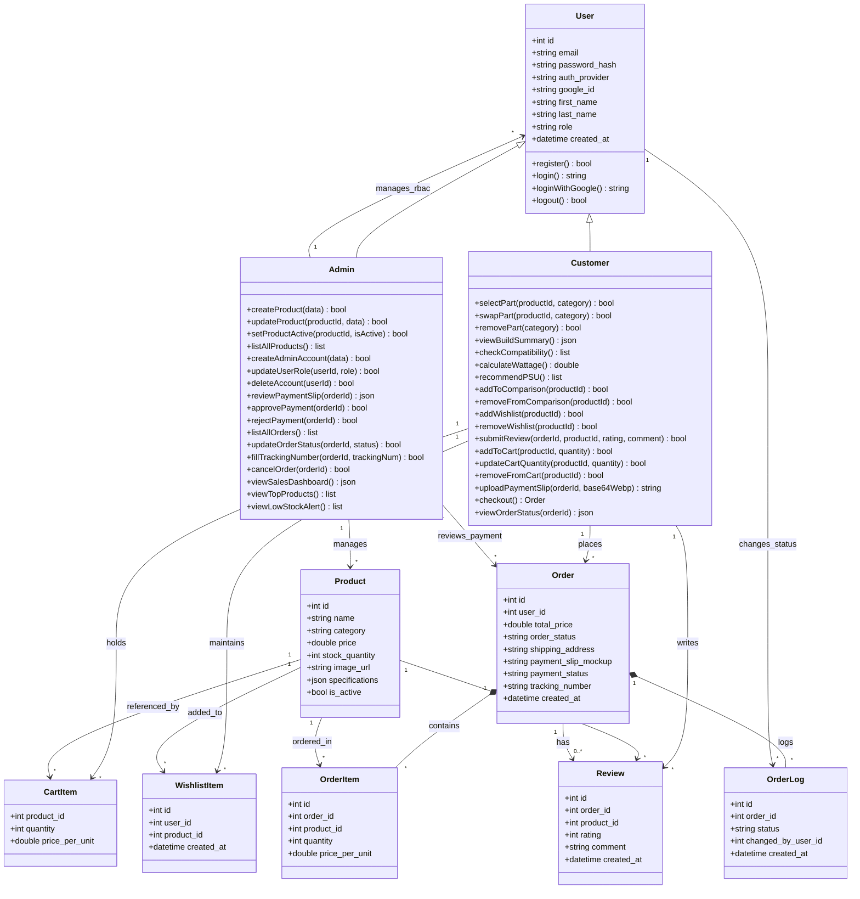

## 📌 1. ข้อมูลกลุ่ม (Group Information)

|                                  | รายละเอียด                                                |
| :------------------------------- | :------------------------------------------------------------------ |
| **ชื่อกลุ่ม**     | ComHub (คอมฮับ)                                               |
| **รายวิชา**         | CSI204 — วิศวกรรมซอฟต์แวร์ (Software Engineering) |
| **จำนวนสมาชิก** | 2 คน                                                              |

| ลำดับ | รหัสนักศึกษา | ชื่อ-สกุล                   | หน้าที่รับผิดชอบ |
| :--------: | :----------------------- | :---------------------------------- | :------------------------------- |
|     1     | 65007905                 | นายธนกร สิงห์ก้อม   | Full-Stack Developer             |
|     2     | 65057638                 | นายหาญณรงค์ บุญยืน | Full-Stack Developer             |

---

## 📌 2. ชื่อโครงงาน (Project Title)

|                                                         | รายละเอียด                                                                                                                                     |
| :------------------------------------------------------ | :------------------------------------------------------------------------------------------------------------------------------------------------------- |
| **Domain**                                        | e-Commerce                                                                                                                                               |
| **ชื่อโครงงาน (ภาษาไทย)**       | คอมฮับ — แพลตฟอร์มอีคอมเมิร์ซสำหรับจัดสเปคและจำหน่ายอุปกรณ์คอมพิวเตอร์ครบวงจร |
| **ชื่อโครงงาน (ภาษาอังกฤษ)** | ComHub — E-Commerce Platform for Custom PC Building and IT Accessories                                                                                  |

### 🔗 ลิงก์โครงการ (Project Links)

| รายการ                                                | ลิงก์                               |
| :---------------------------------------------------------- | :--------------------------------------- |
| 📂 Repository URL                                           | https://github.com/Tnk2209/ComHub-Csi204 |
| 🌐 GitHub Pages (Live Document)                             | https://tnk2209.github.io/ComHub-Csi204/ |
| 📄 เอกสารข้อกำหนดระบบเชิงลึก (SRS) | [SRS.md](./SRS.md)                        |

---

## 📌 3. หลักการและเหตุผล (Rationale)

ในปัจจุบันความต้องการใช้งานคอมพิวเตอร์ประสิทธิภาพสูง ทั้งสำหรับกลุ่มเกมเมอร์ (Gaming) และคนทำงานเฉพาะทาง (Creators / Office) มีการเติบโตอย่างก้าวกระโดด อย่างไรก็ตาม ผู้ซื้อส่วนใหญ่ยังคงประสบปัญหาดังนี้:

- **ปัญหาจากมุมมองลูกค้า:** ลูกค้าไม่ทราบความเข้ากันได้ทางเทคนิคของฮาร์ดแวร์ (เช่น Socket CPU ไม่ตรงกับ Mainboard, กำลังวัตต์ PSU ไม่เพียงพอ, การ์ดจอยาวเกินเคส) ส่งผลให้ซื้อของผิดพลาด ใช้งานร่วมกันไม่ได้ และไม่สามารถเปรียบเทียบสเปคเชิงลึกและราคาได้สะดวก
- **ปัญหาจากมุมมอง Admin:** ผู้ดูแลระบบต้องการเครื่องมือหลังบ้านที่จัดการสินค้า/สต็อก, ตรวจสอบสลิปโอนเงิน, อัปเดตสถานะออเดอร์ 5 ขั้น, และดูภาพรวมยอดขาย/สต็อกในหน้าเดียว โดยไม่ต้องแก้ SQL โดยตรง

โครงการ **ComHub (MVP)** จึงพัฒนาขึ้นเพื่อสร้างเว็บแอปพลิเคชันอีคอมเมิร์ซที่รวมอุปกรณ์คอมพิวเตอร์ครบวงจร พร้อมระบบจัดสเปคอัจฉริยะ (Advanced PC Builder) ที่ตรวจจับความเข้ากันได้ของชิ้นส่วนและคำนวณกำลังไฟอัตโนมัติ พร้อมระบบหลังบ้าน Admin สำหรับจัดการสินค้า อนุมัติสลิปโอนเงิน อัปเดตสถานะออเดอร์ และ Dashboard ภาพรวมธุรกิจ

---

## 📌 4. วัตถุประสงค์ของโครงงาน (Objectives)

1. เพื่อพัฒนาระบบอีคอมเมิร์ซสำหรับซื้อขายและเปรียบเทียบสเปคอุปกรณ์คอมพิวเตอร์ที่ตอบโจทย์กลุ่มผู้ใช้ทั้ง **2 บทบาท** (Customer, Admin) ตามขอบเขต MVP
2. เพื่อสร้างระบบจัดสเปคคอมพิวเตอร์ (PC Builder) ที่มี Compatibility Checker ตรวจสอบ Socket, ขนาดเคส/การ์ดจอ, ชนิด RAM และระบบ Wattage Calculator คำนวณกำลังไฟ TDP อัตโนมัติพร้อมเผื่อ 20%
3. เพื่อพัฒนาระบบหลังบ้าน Admin ครบวงจร: จัดการสินค้า (CRUD + Soft Delete), อนุมัติสลิปโอนเงิน, อัปเดตสถานะออเดอร์ 5 ขั้น (Pending Payment → Delivered), Dashboard ภาพรวมยอดขาย + สต็อกต่ำ และระบบจัดการสิทธิ์ผู้ใช้ (RBAC 2 role)

---

## 📌 5. ขอบเขตของระบบ (System Scope) - MVP Version

> **📝 หมายเหตุ MVP Scope:** ปรับให้เหลือ **2 บทบาท** (Customer, Admin) และตัดฟีเจอร์เหล่านี้ออก: Pre-built Templates, PC Build Gallery, Staff/Manager workflows, Assembly & Burn-in Testing, Coupon, Stock Alert, Review Photos — ดูรายละเอียดเต็มที่ [markdown/project-scope.md](./markdown/project-scope.md)

### 5.1 ผู้ใช้งานและสิทธิ์การเข้าถึง (Actors & Role-Based Access Control)

#### 👤 ลูกค้า (Customer)

- **สมัครสมาชิก (Register) & ล็อกอิน (Login)**
  - สมัครบัญชีใหม่แบบ Native (email + password) ตรวจสอบสิทธิ์ด้วย JWT Token
- **จัดสเปคคอมพิวเตอร์ (PC Builder)**
  - เลือก/เปลี่ยน/ลบชิ้นส่วนจาก **7 หมวดหมู่หลัก** (CPU, Mainboard, GPU, RAM, SSD, Case, PSU) ผ่าน Bento Grid
  - ดูสรุปสเปคทั้งหมดพร้อมราคารวม
- **ตรวจสอบความเข้ากันได้ (Compatibility Checker)**
  - ตรวจ Socket CPU ↔ Mainboard, ขนาด Mainboard ↔ เคส, ความยาว GPU ↔ เคส
  - บล็อกการเลือก RAM ที่ชนิดไม่ตรงกับ Mainboard (DDR4/DDR5)
- **คำนวณกำลังไฟ (Wattage Calculator)**
  - แสดงกำลังไฟรวม TDP และแนะนำเฉพาะ PSU ที่จ่ายไฟ ≥ TDP × 1.2 (เผื่อ 20%)
- **เปรียบเทียบสินค้า (Product Comparison)**
  - เพิ่ม/ลบสินค้าประเภทเดียวกันได้สูงสุด 3 ชิ้น (จัดเก็บฝั่ง Client)
- **บันทึกสินค้าโปรด (Wishlist)** — MVP: **ไม่มี Stock Alert**
  - เพิ่ม/ลบชิ้นส่วนที่สนใจไว้ในรายการโปรด
- **เขียนรีวิว (Review)** — MVP: **ไม่มีการอัปโหลดรูป**
  - ให้คะแนน 1-5 ดาว พร้อมข้อความ (ผูก `order_id` เพื่อยืนยันว่าซื้อจริง)
- **ตะกร้าสินค้าและสั่งซื้อ (Cart & Checkout)** — **Shopee-style 2-Step Flow**
  - **Step 1 (Cart):** เลือก/ยกเลิกรายการสินค้าด้วย Checkbox (มี "เลือกทั้งหมด"), ปรับจำนวน, ลบรายการที่เลือก, สรุปราคารวมสินค้าที่เลือก
  - **Step 2 (Checkout):** สรุปรายการสินค้าที่จะซื้อ, กรอกที่อยู่จัดส่ง, อัปโหลดสลิปโอนเงิน **Mockup** (บีบอัดเป็น WebP 80% แปลงเป็น Base64 ที่ฝั่ง Client)
- **ติดตามสถานะออเดอร์ (Order Tracking)** — **5 ขั้นตอน MVP**
  - `[Pending Payment] → [Paid] → [Processing] → [Shipped] → [Delivered]`
  - ดูประวัติล็อกไทม์ไลน์ และหมายเลข Tracking Number

#### 🔐 ผู้ดูแลระบบ (Admin)

- **ล็อกอินเข้าสู่ระบบแอดมิน**
- **จัดการคลังสินค้า (Product CRUD — A-01)**
  - เพิ่ม/แก้ไข/ปิดขาย (Soft Delete `is_active`)/เปิดขายใหม่/ดูรายการสินค้าทั้งหมด
  - อัปโหลดรูปสินค้าเป็น WebP
- **อนุมัติสลิปโอนเงิน (Payment Review — A-02)**
  - ดูสลิปรอตรวจ → กดอนุมัติ (`payment_status = 'approved'`, `order_status = 'paid'`) หรือปฏิเสธ (`rejected`)
  - *Stock Rollback ยังไม่ implement อัตโนมัติ — gap feature ดู [prd.md](./markdown/prd.md) §7*
- **จัดการออเดอร์ (Order Management — A-03)**
  - ดูรายการออเดอร์ทั้งหมด, อัปเดตสถานะ (Paid → Processing → Shipped → Delivered), กรอก Tracking Number, ยกเลิกออเดอร์
- **จัดการสิทธิ์ผู้ใช้ (Role & Access Control — A-04)**
  - สร้างบัญชี Admin เพิ่มเติม, แก้ไขสิทธิ์ระหว่าง `Customer` ↔ `Admin`, ลบบัญชี
- **Dashboard & Reports (A-05)**
  - ดูยอดขายรวม, สินค้ายอดนิยม, เตือนสต็อกต่ำ (≤ 3 ชิ้น)

### 5.2 ตารางฟังก์ชันระบบทั้งหมด (Functional Requirements Matrix)

|     รหัส     | ฟังก์ชันระบบ     | รายละเอียด                                                                                    | สิทธิ์ผู้ใช้ |
| :--------------: | :--------------------------- | :------------------------------------------------------------------------------------------------------ | :----------------------: |
| **SYS-01** | Authentication                 | สมัครสมาชิก/ล็อกอิน Native, JWT Token Verification  |     ทุกบทบาท     |
| **SYS-02** | RBAC (Role-Based Access Control) | แยกสิทธิ์ 2 บทบาท: Customer และ Admin ด้วย JWT + Middleware |     ทุกบทบาท     |
| **SYS-03** | Cart & Checkout Flow         | จัดการตะกร้า (LocalStorage), เลือกรายการสินค้า (Shopee-style 2-Step), กรอกที่อยู่, อัปโหลดสลิป (Mockup)                 |     Customer, Admin     |
| **SYS-04** | Client-side WebP Compression | บีบอัดรูปภาพสลิปเป็น WebP 80% ผ่าน Canvas API, แปลงเป็น Base64        | Customer, Admin |
|  **C-01**  | PC Builder Page              | เลือกชิ้นส่วน 7 หมวดหมู่ พร้อม Bento Grid UI                                  |         Customer         |
|  **C-02**  | Compatibility Checker        | กรอง Socket, ขนาดเคส/GPU, ชนิด RAM (DDR4/DDR5)                                           |     Customer, Admin     |
|  **C-03**  | Wattage Calculator           | คำนวณ TDP รวม, แนะนำ PSU ที่จ่ายไฟ ≥ 1.2x                                        |         Customer         |
|  **C-05**  | Product Comparison           | เปรียบเทียบสเปคเชิงเทคนิค สูงสุด 3 ชิ้น                              |         Customer         |
|  **C-06**  | Wishlist                     | บันทึกของโปรด (ตัด Stock Alert ออก)                          |         Customer         |
|  **C-07**  | Review (No Photos)           | รีวิว 1-5 ดาว พร้อมข้อความ (ไม่มีการอัปโหลดรูป)                             |         Customer         |
|  **C-09**  | Order Tracking UI            | ติดตาม 5 ขั้นตอน: Pending Payment → Paid → Processing → Shipped → Delivered                                        |     Customer, Admin     |
|  **A-01**  | Product Management CRUD      | เพิ่ม/ลบ/แก้ไข/Soft Delete (is_active) สินค้า พร้อมอัปโหลดรูป WebP                                         |          Admin          |
|  **A-02**  | Payment Review               | อนุมัติ/ปฏิเสธสลิปโอนเงิน (Mockup Base64)                                        |          Admin          |
|  **A-03**  | Order Management             | ดู/อัปเดตสถานะออเดอร์, กรอก Tracking Number                                        |          Admin          |
|  **A-04**  | Role & Access Control        | สร้างบัญชี Admin, กำหนดสิทธิ์ RBAC                                         |          Admin          |
|  **A-05**  | Dashboard & Reports          | ยอดขาย, สินค้ายอดนิยม, เตือนสต็อกต่ำ                                         |          Admin          |

### 5.3 ความต้องการที่ไม่ใช่ฟังก์ชัน (Non-Functional Requirements)

- **ประสิทธิภาพการทำงาน (Performance):** การประมวลผลของเงื่อนไข Compatibility Checker และระบบ Wattage Calculator ในหน้าจอจัดสเปคต้องตอบสนองภายในเวลาไม่เกิน **500 มิลลิวินาที (Sub-second response)** หลังลูกค้ากดเลือกสินค้า
- **ความปลอดภัยและการแยกสิทธิ์ (Security & Access Control):** มีระบบ Role-Based Access Control (RBAC) ควบคุมที่ Backend API, มีการเข้ารหัสพาสเวิร์ด (Password Hashing) ด้วย bcrypt และใช้ JWT Verification
- **ความน่าเชื่อถือและการรักษาข้อมูล (Reliability & State Preservation):** ข้อมูลการจัดสเปคที่ยังจัดค้างและสินค้าในตะกร้าชั่วคราวต้องบันทึกลงใน **LocalStorage** ป้องกันข้อมูลหาย และมีระบบตรวจสอบจำนวนสต็อกแม่นยำ (Overselling Prevention)
- **มาตรฐานอินเตอร์เฟสและฟอนต์ (UI/UX & Design Standards):** แสดงผลแบบ Fullscreen Responsive รองรับ Desktop และ Mobile ใช้ฟอนต์คู่ `'IBM Plex Sans Thai'` (ภาษาไทย) และ `'Inter'` (ตัวเลข/ภาษาอังกฤษ) ภายใต้ธีม Dark Mode ที่ห้ามใช้สีม่วง (Purple Ban)
- **การใช้พื้นที่คลาวด์อย่างคุ้มค่า (Cloud Optimization):** บีบอัดและแปลงรูปภาพสลิป/รีวิวเป็นไฟล์ **WebP คุณภาพ 80%** ที่ฝั่ง Client ก่อนทำการอัปโหลดขึ้นสู่ Supabase Storage

### 5.4 แผนภาพสิทธิ์การเข้าใช้งานฟังก์ชัน (Use Case Diagram - MVP)

```mermaid
%% ComHub - Use Case Diagram (MVP Version)
%% MVP Scope: 2 Actors (Customer, Admin)
graph LR
    classDef actor fill:#0f172a,stroke:#38bdf8,stroke-width:2px,color:#fff;
    classDef baseUC fill:#0369a1,stroke:#bae6fd,stroke-width:1.5px,color:#fff;
    classDef subUC fill:#0f172a,stroke:#10b981,stroke-width:1.2px,color:#fff;
    classDef adminUC fill:#b91c1c,stroke:#fecaca,stroke-width:1.5px,color:#fff;

    Customer["ลูกค้า<br>(Customer)"]:::actor
    Admin["ผู้ดูแลระบบ<br>(Admin)"]:::actor

    subgraph ComHub_System ["ระบบ ComHub (System Boundary)"]

        subgraph Customer_Flow ["1. ลูกค้า (Customer)"]
            C_Register("สมัครสมาชิก<br>(Register)"):::baseUC
            C_Login("ล็อกอินเข้าสู่ระบบ<br>(Login)"):::baseUC
            C_Builder("จัดสเปคคอมพิวเตอร์<br>(PC Builder)"):::baseUC
            C_Compat("ตรวจสอบความเข้ากันได้<br>(Compatibility Checker)"):::baseUC
            C_Wattage("คำนวณกำลังไฟ<br>(Wattage Calculator)"):::baseUC
            C_Compare("เปรียบเทียบสินค้า<br>(Product Comparison)"):::baseUC
            C_Wishlist("บันทึกสินค้าโปรด<br>(Wishlist)"):::baseUC
            C_Review("เขียนรีวิว<br>(Review 1-5 ดาว)"):::baseUC
            C_Cart("ตะกร้าสินค้าและสั่งซื้อ<br>(Cart & Checkout)"):::baseUC
            C_Track("ติดตามสถานะออเดอร์<br>(Order Tracking)"):::baseUC

            C_SelectPart("เลือกชิ้นส่วน (7 หมวด)"):::subUC
            C_SwapPart("เปลี่ยนชิ้นส่วน"):::subUC
            C_RemovePart("ลบชิ้นส่วน"):::subUC
            C_ViewSummary("ดูสรุปสเปค"):::subUC

            C_CheckSocket("ตรวจสอบ Socket"):::subUC
            C_CheckCaseSize("ตรวจสอบขนาดเคส"):::subUC
            C_CheckGpuSize("ตรวจสอบขนาดการ์ดจอ"):::subUC
            C_CheckRamType("ตรวจสอบชนิด RAM (DDR4/DDR5)"):::subUC

            C_ViewTDP("ดูผลคำนวณ TDP"):::subUC
            C_RecommendPSU("แนะนำ PSU (TDP × 1.2)"):::subUC

            C_AddCompare("เพิ่มสินค้าเข้าเปรียบเทียบ"):::subUC
            C_ViewCompareTable("ดูตารางเปรียบเทียบ"):::subUC
            C_RemoveCompare("ลบสินค้าจากการเปรียบเทียบ"):::subUC

            C_AddWishlist("เพิ่มสินค้าเข้า Wishlist"):::subUC
            C_RemoveWishlist("ลบสินค้าจาก Wishlist"):::subUC

            C_WriteReview("เขียนรีวิวใหม่ (1-5 ดาว + ข้อความ)"):::subUC
            C_ViewReview("ดูรีวิวสินค้า"):::subUC

            C_AddCart("เพิ่มสินค้าลงตะกร้า (LocalStorage)"):::subUC
            C_EditQty("แก้ไขจำนวน"):::subUC
            C_RemoveCart("ลบสินค้าจากตะกร้า"):::subUC
            C_FillAddress("กรอกที่อยู่จัดส่ง"):::subUC
            C_UploadSlip("อัปโหลดสลิปโอนเงิน (WebP + Base64)"):::subUC

            C_ViewStatus("ดูสถานะ 5 ขั้น"):::subUC
            C_ViewLogHistory("ดูประวัติล็อก"):::subUC
            C_ViewTrackingNo("ดูเลข Tracking"):::subUC

            C_Builder -.->|"«include»"| C_SelectPart
            C_SwapPart -.->|"«extend»"| C_Builder
            C_RemovePart -.->|"«extend»"| C_Builder
            C_Builder -.->|"«include»"| C_ViewSummary

            C_Compat -.->|"«include»"| C_CheckSocket
            C_Compat -.->|"«include»"| C_CheckCaseSize
            C_Compat -.->|"«include»"| C_CheckGpuSize
            C_Compat -.->|"«include»"| C_CheckRamType
            C_Builder -.->|"«include»"| C_Compat

            C_Wattage -.->|"«include»"| C_ViewTDP
            C_Wattage -.->|"«include»"| C_RecommendPSU
            C_Builder -.->|"«include»"| C_Wattage

            C_Compare -.->|"«include»"| C_AddCompare
            C_Compare -.->|"«include»"| C_ViewCompareTable
            C_Compare -.->|"«extend»"| C_RemoveCompare

            C_Wishlist -.->|"«include»"| C_AddWishlist
            C_Wishlist -.->|"«extend»"| C_RemoveWishlist

            C_Review -.->|"«include»"| C_WriteReview
            C_Review -.->|"«include»"| C_ViewReview

            C_Cart -.->|"«include»"| C_AddCart
            C_EditQty -.->|"«extend»"| C_Cart
            C_RemoveCart -.->|"«extend»"| C_Cart
            C_Cart -.->|"«include»"| C_FillAddress
            C_Cart -.->|"«include»"| C_UploadSlip

            C_Track -.->|"«include»"| C_ViewStatus
            C_Track -.->|"«extend»"| C_ViewLogHistory
            C_Track -.->|"«extend»"| C_ViewTrackingNo
        end

        subgraph Admin_Flow ["2. ผู้ดูแลระบบ (Admin)"]
            A_Login("ล็อกอินเข้าสู่ระบบแอดมิน<br>(Login)"):::baseUC
            A_Database("จัดการคลังสินค้า<br>(Product CRUD)"):::adminUC
            A_Access("จัดการสิทธิ์ผู้ใช้<br>(Role & Access Control)"):::adminUC
            A_Payment("อนุมัติสลิปโอนเงิน<br>(Payment Review)"):::adminUC
            A_Order("จัดการออเดอร์<br>(Order Management)"):::adminUC
            A_Dashboard("แดชบอร์ดยอดขาย<br>(Dashboard & Reports)"):::adminUC

            A_AddProduct("เพิ่มสินค้า"):::subUC
            A_EditProduct("แก้ไขสินค้า"):::subUC
            A_SoftDelete("ปิดขายสินค้า (Soft Delete)"):::subUC
            A_ReEnable("เปิดขายสินค้าอีกครั้ง"):::subUC
            A_ViewAll("ดูรายการสินค้าทั้งหมด"):::subUC
            A_UploadImg("อัปโหลดรูป WebP"):::subUC

            A_ManageAccounts("สร้างบัญชี Admin"):::subUC
            A_EditPermission("แก้ไขสิทธิ์ (Customer ↔ Admin)"):::subUC
            A_DeleteAccount("ลบบัญชี"):::subUC

            A_ViewPending("ดูสลิปรอตรวจ"):::subUC
            A_ApprovePay("อนุมัติการชำระเงิน (Approved)"):::subUC
            A_RejectPay("ปฏิเสธการชำระเงิน (Rejected)"):::subUC

            A_ViewOrders("ดูรายการออเดอร์ทั้งหมด"):::subUC
            A_UpdateStatus("อัปเดตสถานะ (Paid → Shipped)"):::subUC
            A_FillTracking("กรอก Tracking Number"):::subUC
            A_CancelOrder("ยกเลิกออเดอร์"):::subUC

            A_SalesChart("ดูยอดขายรวม"):::subUC
            A_TopProduct("ดูสินค้ายอดนิยม"):::subUC
            A_LowStock("ดูเตือนสต็อกต่ำ (≤ 3)"):::subUC

            A_Database -.->|"«include»"| A_ViewAll
            A_Database -.->|"«extend»"| A_AddProduct
            A_Database -.->|"«extend»"| A_EditProduct
            A_Database -.->|"«extend»"| A_SoftDelete
            A_Database -.->|"«extend»"| A_ReEnable
            A_AddProduct -.->|"«include»"| A_UploadImg
            A_EditProduct -.->|"«extend»"| A_UploadImg

            A_Access -.->|"«include»"| A_ManageAccounts
            A_Access -.->|"«extend»"| A_EditPermission
            A_Access -.->|"«extend»"| A_DeleteAccount

            A_Payment -.->|"«include»"| A_ViewPending
            A_Payment -.->|"«extend»"| A_ApprovePay
            A_Payment -.->|"«extend»"| A_RejectPay

            A_Order -.->|"«include»"| A_ViewOrders
            A_Order -.->|"«extend»"| A_UpdateStatus
            A_Order -.->|"«extend»"| A_FillTracking
            A_Order -.->|"«extend»"| A_CancelOrder

            A_Dashboard -.->|"«include»"| A_SalesChart
            A_Dashboard -.->|"«include»"| A_TopProduct
            A_Dashboard -.->|"«include»"| A_LowStock
        end
    end

    Customer ~~~ Admin

    Customer ---> C_Register
    Customer ---> C_Login
    Customer ---> C_Builder
    Customer ---> C_Compat
    Customer ---> C_Wattage
    Customer ---> C_Compare
    Customer ---> C_Wishlist
    Customer ---> C_Review
    Customer ---> C_Cart
    Customer ---> C_Track

    Admin ---> A_Login
    Admin ---> A_Database
    Admin ---> A_Access
    Admin ---> A_Payment
    Admin ---> A_Order
    Admin ---> A_Dashboard
```



---

## 📌 6. แนวทางการพัฒนาตาม SDLC (System Development Life Cycle)

### 6.1 ตาราง SDLC 7 ขั้นตอน

| ลำดับ | ขั้นตอน (Phase) | รายละเอียดโดยย่อ (Brief Description)                                                                          | ผลลัพธ์ (Deliverables)                                                                  | ระยะเวลา |
| :--------: | :--------------------- | :---------------------------------------------------------------------------------------------------------------------------- | :--------------------------------------------------------------------------------------------- | :--------------: |
|     1     | **Planning**     | กำหนดขอบเขตโครงการ เป้าหมายทางธุรกิจ แผนบริหารความเสี่ยง                | เอกสารแผนงานโครงการ, แผนความเสี่ยง                             |     3 วัน     |
|     2     | **Analysis**     | วิเคราะห์ FR/NFR, จัดทำ Data Dictionary, เขียน UML Use Case & Class Diagram                                | เอกสาร SRS, แผนภาพ UML                                                             |     4 วัน     |
|     3     | **Design**       | ออกแบบ UI/UX (Figma Wireframe), API JSON Schema, UML Sequence & Activity Diagram                                        | Wireframe, API Specs, UML                                                                      |     4 วัน     |
|     4     | **Development**  | ติดตั้ง PostgreSQL (Supabase), พัฒนา Backend (Node.js/Express + JWT), พัฒนา Frontend (React/Vite + Tailwind) | เผยแพร่โปรเจกต์สู่สาธารณะ และ สามารถใช้งานได้จริง |    10 วัน    |
|     5     | **Testing**      | Functional Testing ตาม UAT Flow ทุก Actor, Security Testing (RBAC + JWT), Performance Testing (< 500ms)                 | เอกสารผลทดสอบ, Bug List                                                           |     3 วัน     |
|     6     | **Deployment**   | Deploy Frontend/Backend ขึ้น Vercel, ตั้งค่า Environment Variables                                                 | URL เว็บจริงพร้อมนำเสนอ                                                     |     2 วัน     |
|     7     | **Maintenance**  | บันทึก Known Bugs/Issues, วางแผน Future Roadmap, แก้ไขโค้ดที่ผิดพลาด                           | เอกสารบำรุงรักษา                                                               |     2 วัน     |

### 6.2 รายละเอียดขั้นตอน Development

| งาน                         | รายละเอียด                                                                           |
| :----------------------------- | :--------------------------------------------------------------------------------------------- |
| **Database Setup**       | ติดตั้ง PostgreSQL บน Supabase Cloud, รัน SQL DDL สร้าง **7 ตาราง** (MVP)         |
| **Backend Development**  | เขียน API Server ด้วย Node.js + Express (TypeScript), ระบบ JWT Auth/Authorization |
| **Frontend Development** | พัฒนาหน้าจอด้วย React (Vite) + Tailwind CSS, Fullscreen Responsive              |

---

## 📌 7. เครื่องมือและเทคโนโลยีที่ใช้ (Tools & Technologies)

### 💻 Frontend

| เทคโนโลยี | หน้าที่                                                                                          |
| :----------------- | :------------------------------------------------------------------------------------------------------ |
| React + Vite       | สร้าง SPA, Hot Module Replacement, คอมไพล์เร็ว                                          |
| Tailwind CSS       | จัดแต่ง UI, Responsive Design, Dark Mode Theme                                                   |
| LocalStorage       | เก็บข้อมูลตะกร้าสินค้าและสเปคจัดค้างชั่วคราวฝั่ง Client |
| HTML5 Canvas API   | บีบอัดรูปภาพเป็น WebP ก่อนอัปโหลด                                            |

### ⚙️ Backend

| เทคโนโลยี   | หน้าที่                                                  |
| :------------------- | :-------------------------------------------------------------- |
| Node.js + Express    | เขียน REST API Server                                      |
| TypeScript           | เพิ่ม Type Safety ให้ API                               |
| JWT (JSON Web Token) | ระบบยืนยันตัวตนและจัดการ Session        |
| bcrypt               | เข้ารหัสรหัสผ่านผู้ใช้ (Password Hashing) |

### 🗄️ Database

| เทคโนโลยี          | หน้าที่                                                                                                                                                             |
| :-------------------------- | :------------------------------------------------------------------------------------------------------------------------------------------------------------------------- |
| PostgreSQL (Supabase Cloud) | ฐานข้อมูลหลัก **7 ตาราง MVP** (users, products, orders, order_items, reviews, wishlist_items, order_logs) |
| JSONB Column                | เก็บสเปคเทคนิคของสินค้าแบบยืดหยุ่น (socket, form_factor, tdp, supported_ram)                                                             |
| Base64 (in TEXT column)     | เก็บสลิปโอนเงินแบบ Mockup (บีบอัด WebP 80% ที่ฝั่ง Client) โดยตรงในคอลัมน์ `orders.payment_slip_mockup` — ไม่ใช้ Cloud Storage ใน MVP     |

### 🎨 Design Tool

| เครื่องมือ | หน้าที่                                                                     |
| :------------------- | :--------------------------------------------------------------------------------- |
| Google Stitch        | ใช้ออกแบบหน้า UI / Wireframe                                          |
| Figma                | ใช้สำหรับการ Customize Wireframe ที่ import มาจาก Google Stich |
| mermaid              | ใช้ออกแบบ Diagram ต่างๆ                                              |

### 🔀 Version Control

| เครื่องมือ | หน้าที่                                  |
| :------------------- | :---------------------------------------------- |
| Git                  | ระบบควบคุมเวอร์ชัน            |
| GitHub               | โฮสต์โค้ด, Collaboration, Pull Request |

### ☁️ Hosting & Deployment

| เครื่องมือ | หน้าที่                                |
| :------------------- | :-------------------------------------------- |
| Vercel (Frontend)    | Static Web Hosting สำหรับ React SPA     |
| Vercel (Backend)     | Serverless Functions สำหรับ Express API |

---

## 📌 8. แนวทางการทดสอบระบบ (Testing Approach)

### 8.1 หัวข้อการทดสอบแบบ User Acceptance Testing (UAT)

ระบบทั้งหมดจะทำการทดสอบในรูปแบบ **Manual Testing (การทดสอบด้วยผู้ใช้)** เพื่อตรวจสอบความถูกต้องของระบบตาม Use Case และ User Story ของแต่ละบทบาท (Actor) โดยจำลองสถานการณ์การใช้งานจริงดังนี้:

| หัวข้อการทดสอบ (UAT Scenario)               | วิธีการทดสอบ | ขอบเขตการทดสอบ                                                                                                                                          |
| :-------------------------------------------------------- | :----------------------- | :-------------------------------------------------------------------------------------------------------------------------------------------------------------------- |
| **UAT-01: Compatibility Checker**                   | Manual Testing           | ตรวจสอบการบล็อกและแจ้งเตือนอุปกรณ์ที่ไม่เข้ากัน (Socket CPU, ขนาดเคส/การ์ดจอ, ชนิด RAM)              |
| **UAT-02: Wattage Calculator & PSU Recommendation** | Manual Testing           | ตรวจสอบการคำนวณกำลังไฟรวมสะสมของสเปค และระบบแนะนำ PSU ที่มีกำลังวัตต์เหมาะสม (TDP × 1.2)       |
| **UAT-03: Role-Based Access Control (RBAC)**        | Manual Testing           | ทดสอบสิทธิ์การเข้าถึงข้อมูลและการเข้าใช้ API ในแต่ละ Role (Customer, Admin)                            |
| **UAT-04: End-to-End Cart & Checkout Flow**         | Manual Testing           | ทดสอบการทำงานครบวงจรตั้งแต่ ลูกค้าจัดสเปค → สั่งซื้อ → อัปโหลดสลิป → Admin ตรวจสอบสลิป |
| **UAT-05: Order Management Flow (Admin)**           | Manual Testing           | ทดสอบการอัปเดตสถานะออเดอร์ 5 ขั้น (Paid → Processing → Shipped → Delivered) พร้อมกรอก Tracking Number                         |
| **UAT-06: Admin Dashboard & Reports**               | Manual Testing           | ทดสอบ Dashboard สรุปยอดขาย, สินค้ายอดนิยม, และเตือนสต็อกต่ำ (≤ 3 ชิ้น)                                                 |

### 8.2 รายละเอียดขอบเขตการทดสอบ (Testing Details)

การทดสอบจะเน้นการตรวจสอบความสอดคล้องระหว่างผลลัพธ์การทำงานจริงบนเว็บเบราว์เซอร์เปรียบเทียบกับข้อกำหนดความต้องการของระบบ โดยมีเช็กลิสต์แบบละเอียดแยกตามบทบาทผู้ใช้ดังนี้:


> 🧪 **เช็กลิสต์ UAT ระดับ Use Case แบบเต็ม (MVP)** — ครอบคลุมทุก Functional ID (SYS-01..04, C-01..C-10, A-01..A-05) พร้อม Negative Test Cases ดูได้ที่ **[markdown/testing-uat.md](./markdown/testing-uat.md)**


---

## 📌 9. ผลลัพธ์ที่คาดว่าจะได้รับ (Expected Outcomes)

- ได้เว็บแอปพลิเคชันอีคอมเมิร์ซ **ComHub (MVP)** ที่สามารถใช้จัดสเปคคอมพิวเตอร์ได้อย่างสมบูรณ์ พร้อมระบบตรวจสอบความเข้ากันได้ของอุปกรณ์แบบเรียลไทม์
- ลดปัญหาการสั่งซื้อชิ้นส่วนที่เข้ากันไม่ได้ ลดอัตราการคืนสินค้า ด้วย Compatibility Checker และ Wattage Calculator อัตโนมัติ
- มีระบบหลังบ้าน Admin ครบวงจร: จัดการสินค้า (CRUD + Soft Delete), อนุมัติสลิปโอนเงิน, อัปเดตสถานะออเดอร์ 5 ขั้น, Dashboard ภาพรวมยอดขาย/สต็อกต่ำ และระบบจัดการสิทธิ์ RBAC (Customer/Admin)
- สามารถเรียนรู้และพัฒนาทักษะการใช้เทคโนโลยี Full-stack ได้ (React + Node.js + PostgreSQL) ตามกระบวนการ SDLC
- มีระบบ Hybrid Storage (LocalStorage + PostgreSQL Cloud) ที่ประหยัดทรัพยากรฝั่งเซิร์ฟเวอร์และรักษาประสบการณ์ผู้ใช้

---

## 📌 10. แผนการดำเนินงาน 4 สัปดาห์ (Work Plan: 4 Weeks)

| สัปดาห์ | ขั้นตอน SDLC                | กิจกรรม (Activities)                             | รายละเอียดโดยย่อ (Brief Description)                                                                                                                                                                                                       | ระยะเวลา |
| :------------: | :--------------------------------- | :------------------------------------------------------ | :--------------------------------------------------------------------------------------------------------------------------------------------------------------------------------------------------------------------------------------------------------- | :--------------: |
|  **1**  | Planning + Analysis                | วิเคราะห์และออกแบบระบบ            | สรุป Requirement (FR/NFR), จัดทำ UI Mockup บน Figma, ออกแบบโครงสร้างข้อมูล Data Dictionary **7 ตาราง MVP**, เขียน UML Use Case & Class Diagram, วิเคราะห์ User Persona (2 บทบาท), แผนบริหารความเสี่ยง |     7 วัน     |
|  **2**  | Design + Development               | พัฒนาส่วนหน้าบ้าน (Frontend)           | ออกแบบ API JSON Schema, สร้าง Component ต่างๆ ด้วย React SPA, จัดโครงร่างหน้าเว็บด้วย Tailwind CSS, พัฒนาหน้า Home/Builder/Cart/Checkout/OrderTracking/Wishlist/Compare/Login/Register                                    |     7 วัน     |
|  **3**  | Development                        | พัฒนาส่วนหลังบ้าน (Backend & Database) | ติดตั้ง PostgreSQL (Supabase), สร้าง REST API Server ด้วย Node.js/Express + TypeScript, ระบบ JWT Auth + RBAC Middleware (2 role), เชื่อมต่อ Compatibility Logic & TDP Calculator, ระบบบีบอัด WebP + Base64 ที่ฝั่ง Client  |     7 วัน     |
|  **4**  | Testing + Deployment + Maintenance | ทดสอบและนำเสนอ                            | ทำการทดสอบ UAT ตาม Flow จริงทุก Actor, ทดสอบ Security (RBAC/JWT), ทดสอบ Performance (< 500ms), แก้บั๊ก, Deploy ขึ้น Vercel, เตรียมสไลด์นำเสนอผลงาน                                          |     7 วัน     |

---

## 📂 โครงสร้างโปรเจกต์ (Project Structure)

```text
ComHub-Csi204/
├── markdown/                        # เอกสารวิเคราะห์โครงงานวิชา CSI204 (MVP)
│   ├── project-scope.md             # ✅ Source of truth: ขอบเขต MVP
│   ├── sdlc-planning.md             # แผนดำเนินงาน SDLC 7 ขั้นตอน
│   ├── features-summary.md          # สรุปฟังก์ชัน FR/NFR ทั้งหมด
│   ├── data-dictionary.md           # พจนานุกรมข้อมูล 7 ตาราง MVP
│   ├── database-schema.md           # SQL DDL Schema
│   ├── project-structure.md         # โครงสร้างโฟลเดอร์ Monorepo
│   ├── frontend-pages.md            # สรุปหน้าจอ Frontend (Customer + Admin)
│   ├── user-persona.md              # วิเคราะห์กลุ่มผู้ใช้จำลอง 4 Personas (3 Customer + 1 Admin)
│   ├── prd.md                       # Product Requirement Document
│   ├── UML-Diagrams.md              # แผนภาพ UML (Use Case + Class)
│   ├── usecasediagram.mermaid       # Source: Use Case Diagram
│   ├── classdiagram.mermaid         # Source: Class Diagram
│   ├── testing-uat.md               # แผนและเช็กลิสต์การทดสอบระบบด้วยมือ (UAT Checklist)
│   └── CODEBASE.md                  # สรุปโครงสร้างโค้ด
│
├── FrontEnd/                        # 💻 React + Vite + Tailwind CSS (JavaScript)
│   └── src/
│       ├── components/              # Reusable UI Components
│       ├── pages/                   # Landing, PCBuilder, Cart, Checkout, OrderTracking, Wishlist, Compare, Login/Register + Admin/*
│       └── locales/                 # i18n TH/EN
│
├── backend/                         # ⚙️ Node.js + Express + TypeScript (Target — ยังไม่ได้ implement)
│   └── src/
│       ├── controllers/             # auth, product, order, review, wishlist, dashboard
│       ├── middlewares/             # JWT Auth + Role-based (Customer, Admin)
│       ├── routes/                  # /api/auth, /api/products, /api/orders, /api/reviews, /api/wishlist, /api/dashboard
│       ├── services/                # Compatibility Logic & TDP Calculator
│       └── sql/                     # schema.sql (7 tables), seed.sql
│
├── README.md                        # ไฟล์นี้
└── SRS.md                           # เอกสาร System Requirement Specification ฉบับเต็ม
```

---

## 🗄️ โครงสร้างฐานข้อมูล (Database Schema Overview) - MVP

ระบบ ComHub (MVP) ใช้ PostgreSQL (Supabase Cloud) จำนวน **7 ตาราง** ดังนี้:

| ลำดับ | ชื่อตาราง     | ประเภท | คำอธิบาย                                                                  |
| :--------: | :--------------------- | :----------: | :-------------------------------------------------------------------------------- |
|     1     | `users`              |    Master    | ข้อมูลผู้ใช้ + สิทธิ์ RBAC 2 role (`Customer`/`Admin`) + Google OAuth  |
|     2     | `products`           |    Master    | แค็ตตาล็อกสินค้า 7 หมวด (CPU/Mainboard/GPU/RAM/SSD/Case/PSU) + สเปคเทคนิค JSONB + `is_active` Soft Delete |
|     3     | `orders`             | Transaction | คำสั่งซื้อ, `payment_status`, `order_status` 5 ขั้น, สลิป Base64 WebP, tracking |
|     4     | `order_items`        |    Detail    | รายการสินค้าในแต่ละออเดอร์ + ราคา ณ ขณะสั่ง (snapshot) |
|     5     | `reviews`            | Transaction | รีวิว 1-5 ดาว + ข้อความ (ไม่มีรูปภาพใน MVP)                     |
|     6     | `wishlist_items`     |    Detail    | ของโปรด (ไม่มี Stock Alert ใน MVP)                                 |
|     7     | `order_logs`         | Audit Trail | ล็อกการเปลี่ยนสถานะออเดอร์ + ผู้กระทำ (Admin) + เวลา              |

> **Client-side only (ไม่มีตารางใน DB):** Cart Items, Product Comparison list ทั้งคู่จัดเก็บใน LocalStorage / Session ใช้ JWT stateless
>
> 📄 รายละเอียดฟิลด์ทั้งหมดดูได้ที่ [markdown/data-dictionary.md](./markdown/data-dictionary.md) และ SQL DDL ที่ [markdown/database-schema.md](./markdown/database-schema.md)

<details>
<summary>🔍 คลิกเพื่อแสดงรายละเอียดโครงสร้างฐานข้อมูล MVP (Data Dictionary Table Schemas - 7 Tables)</summary>

## 🗺️ รายชื่อตารางในระบบฐานข้อมูล (Database Tables List)

| ลำดับที่ | ชื่อตาราง (Table Name)  | ประเภทตาราง (Table Type) | คำอธิบายสั้น (Description)                                                                                                                                  |
| :--------------: | :------------------------------- | :---------------------------------: | :---------------------------------------------------------------------------------------------------------------------------------------------------------------------- |
|        1        | **`users`**              |               Master               | จัดเก็บข้อมูลผู้ใช้งาน (Customer/Admin) และรหัสผ่าน รองรับ Google OAuth                                                     |
|        2        | **`products`**           |               Master               | จัดเก็บข้อมูลแค็ตตาล็อกสินค้า 7 หมวด + สเปคเทคนิคแบบ JSONB                                                                 |
|        3        | **`orders`**             |             Transaction             | จัดเก็บรายละเอียดคำสั่งซื้อ + สถานะการชำระเงิน + สลิป Base64 WebP                                          |
|        4        | **`order_items`**        |               Detail               | จัดเก็บรายการชิ้นส่วนสินค้าในแต่ละออเดอร์ + ราคาต่อชิ้น ณ เวลาสั่ง                                    |
|        5        | **`reviews`**            |             Transaction             | จัดเก็บการประเมิน 1-5 ดาว + ข้อความ (ไม่มีรูปภาพ MVP)                                                              |
|        6        | **`wishlist_items`**     |               Detail               | จัดเก็บสินค้าโปรดของลูกค้า (ไม่มี Stock Alert MVP)                                                                     |
|        7        | **`order_logs`**         |          Log (Audit Trail)          | จัดเก็บประวัติการเปลี่ยนสถานะออเดอร์ + `changed_by_user_id` (Admin)                                                    |

> **📝 หมายเหตุ MVP:** ตัด `prebuilt_templates`, `template_items`, `assembly_records`, `gallery_posts` ออก / Cart & Comparison เก็บฝั่ง Client (LocalStorage) / Session ใช้ JWT stateless

---

> 🔎 **สำหรับ SQL DDL, Constraint, Index ทั้งหมด ดูที่:**
> - [markdown/data-dictionary.md](./markdown/data-dictionary.md) — พจนานุกรมข้อมูล 7 ตาราง MVP พร้อมคำอธิบายฟิลด์
> - [markdown/database-schema.md](./markdown/database-schema.md) — SQL DDL Schema + Sample Queries
>
> ตัวอย่างโครงสร้างฟิลด์หลักของแต่ละตาราง:

---

## 🗃️ ตัวอย่างโครงสร้างตารางฐานข้อมูล (Data Dictionary Table Schemas - Preview)

### 1. ตาราง `users` (ตารางข้อมูลผู้ใช้งานและสิทธิ์)

เก็บข้อมูลส่วนตัวของบัญชี 2 บทบาท (Customer/Admin) และรองรับทั้ง Native + Google OAuth

* **คีย์หลัก (PK):** `id` / **Unique:** `email`
* ฟิลด์หลัก: `email`, `password_hash` (bcrypt — NULL สำหรับ OAuth), `first_name`, `last_name`, `role` (`'Customer'`/`'Admin'`), `auth_provider` (`'native'`/`'google'`), `google_id`, `created_at`

### 2. ตาราง `products` (สินค้า)

* **คีย์หลัก:** `id` / **หมวดหมู่:** `'CPU'`, `'Mainboard'`, `'GPU'`, `'RAM'`, `'SSD'`, `'Case'`, `'PSU'` (7 หมวด MVP)
* ฟิลด์หลัก: `name`, `category`, `price`, `stock_quantity`, `image_url`, `specifications` (JSONB — socket, form_factor, tdp, wattage, supported_ram), `is_active` (Soft Delete)

### 3. ตาราง `orders` (คำสั่งซื้อ)

* **คีย์หลัก:** `id` / **FK:** `user_id` → `users(id)`
* ฟิลด์หลัก: `total_price`, `order_status` (5 ขั้น MVP: `pending_payment` → `paid` → `processing` → `shipped` → `delivered` / เพิ่ม `cancelled`), `shipping_address`, `payment_slip_mockup` (Base64 WebP), `payment_status` (`pending`/`approved`/`rejected`), `tracking_number`, `created_at`

### 4. ตาราง `order_items` (รายละเอียดสินค้าในออเดอร์)

* **คีย์หลัก:** `id` / **FK:** `order_id`, `product_id`
* ฟิลด์หลัก: `quantity`, `price_per_unit` (snapshot ราคา ณ ตอนสั่งซื้อ)

### 5. ตาราง `reviews` (รีวิว - No Photos MVP)

* **คีย์หลัก:** `id` / **FK:** `order_id`, `product_id`
* ฟิลด์หลัก: `rating` (1-5), `comment`, `created_at` — ผูก `order_id` เพื่อบังคับว่ารีวิวได้เฉพาะสินค้าที่ซื้อจริง

### 6. ตาราง `wishlist_items` (สินค้าโปรด - No Stock Alert MVP)

* **คีย์หลัก:** `id` / **FK:** `user_id`, `product_id` / **UNIQUE:** (`user_id`, `product_id`)
* ฟิลด์หลัก: `created_at`

### 7. ตาราง `order_logs` (Audit Trail)

* **คีย์หลัก:** `id` / **FK:** `order_id`, `changed_by_user_id` → Admin ที่กด
* ฟิลด์หลัก: `status` (เช่น `'Payment Approved'`, `'Processing'`, `'Shipped'`), `created_at`

> 📄 **รายละเอียดฟิลด์ครบทุกตาราง (Data Type, Constraint, FK behavior) อยู่ที่ [markdown/data-dictionary.md](./markdown/data-dictionary.md)**


</details>

### โครงสร้างความสัมพันธ์ของข้อมูล (Class Diagram / ERD - MVP)




---

## 📄 เอกสารประกอบโครงการ (Project Documentation)

| เอกสาร                     | รายละเอียด                                                                            | ลิงก์                                             |
| :------------------------------- | :---------------------------------------------------------------------------------------------- | :----------------------------------------------------- |
| System Architecture              | สถาปัตยกรรมระบบ, ER Diagram, Security & Performance Overview                   | [SYSTEM_ARCHITECTURE.md](./docs/SYSTEM_ARCHITECTURE.md) |
| API Documentation                | เอกสาร REST API Specs ทั้งหมด (20+ Endpoints)                                   | [API_DOCUMENTATION.md](./docs/API_DOCUMENTATION.md)     |
| UAT Report Template              | แบบฟอร์มรายงานการทดสอบ UAT ตามตารางมาตรฐานวิชา CSI204                             | [UAT_REPORT_TEMPLATE.md](./docs/UAT_REPORT_TEMPLATE.md) |
| System Requirement Specification | ข้อกำหนดความต้องการระบบฉบับเต็ม                                  | [SRS.md](./SRS.md)                                      |
| SDLC Planning                    | แผนดำเนินงาน 7 ขั้นตอน SDLC                                                  | [sdlc-planning.md](./markdown/sdlc-planning.md)         |
| Features Summary                 | สรุปฟังก์ชันระบบ FR/NFR + Role Access Matrix                                    | [features-summary.md](./markdown/features-summary.md)   |
| Project Scope (MVP)              | ✅ Source of truth: ขอบเขต MVP (Actors, FR, NFR)                                | [project-scope.md](./markdown/project-scope.md)         |
| Data Dictionary                  | พจนานุกรมข้อมูล **7 ตาราง MVP**                                              | [data-dictionary.md](./markdown/data-dictionary.md)     |
| Database Schema (SQL DDL)        | SQL DDL Schema + Sample Queries                                                                   | [database-schema.md](./markdown/database-schema.md)     |
| Project Structure                | โครงสร้างโฟลเดอร์ Monorepo (Frontend + Backend)                                | [project-structure.md](./markdown/project-structure.md) |
| User Persona                     | วิเคราะห์กลุ่มผู้ใช้จำลอง 4 Personas (3 Customer + 1 Admin)                    | [user-persona.md](./markdown/user-persona.md)           |
| UML Diagrams                     | แผนภาพ UML (Use Case + Class) — แสดง inline พร้อม Source `.mermaid`             | [UML-Diagrams.md](./markdown/UML-Diagrams.md)           |
| Testing (UAT)                    | แผนและเช็กลิสต์การทดสอบระบบด้วยมือ (Manual Testing Checklist) | [testing-uat.md](./markdown/testing-uat.md)             |

---

## ⚡ วิธีการติดตั้งและรันโครงการ (Getting Started & Running)

### 1. การเตรียม Database & Run Backend Server
```bash
cd backend
npm install
npm run migrate       # สร้าง Table Schema + Insert Seed Data สินค้า 35+ ชิ้น
npm run dev           # เริ่มต้น Development Server ที่ http://localhost:3000
```

### 2. การรันชุดทดสอบ Backend (Automated Tests)
```bash
cd backend
npm test              # รันชุดทดสอบ Integration & RBAC Tests (25+ Test Suites)
npm run typecheck     # ตรวจสอบ TypeScript Types ความถูกต้องทั้งโครงการ
```

### 3. การรัน Frontend Client
```bash
cd FrontEnd
npm install
npm run dev           # เปิด Vite Dev Server ที่ http://localhost:5173
npm run build         # คอมไพล์โปรดักชันพร้อม Chunk Optimization
```

---

<p align="center">
  <sub>📄 เอกสารข้อกำหนดระบบฉบับเต็ม: <a href="./SRS.md">SRS.md</a> | 🔗 <a href="https://tnk2209.github.io/ComHub-Csi204/">GitHub Pages</a></sub>
</p>
