<p align="center">
  
  
  
  
</p>

---

## 📌 1. ข้อมูลกลุ่ม (Group Information)

| | รายละเอียด |
|:---|:---|
| **ชื่อกลุ่ม** | ComHub (คอมฮับ) |
| **รายวิชา** | CSI204 — วิศวกรรมซอฟต์แวร์ (Software Engineering) |
| **จำนวนสมาชิก** | 2 คน |

| ลำดับ | รหัสนักศึกษา | ชื่อ-สกุล | หน้าที่รับผิดชอบ |
|:---:|:---|:---|:---|
| 1 | 65007905 | นายธนกร สิงห์ก้อม | Full-Stack Developer |
| 2 | 65057638 | นายหาญณรงค์ บุญยืน | Full-Stack Developer |

---

## 📌 2. ชื่อโครงงาน (Project Title)

| | รายละเอียด |
|:---|:---|
| **Domain** | e-Commerce |
| **ชื่อโครงงาน (ภาษาไทย)** | คอมฮับ — แพลตฟอร์มอีคอมเมิร์ซสำหรับจัดสเปคและจำหน่ายอุปกรณ์คอมพิวเตอร์ครบวงจร |
| **ชื่อโครงงาน (ภาษาอังกฤษ)** | ComHub — E-Commerce Platform for Custom PC Building and IT Accessories |

### 🔗 ลิงก์โครงการ (Project Links)

| รายการ | ลิงก์ |
|:---|:---|
| 📂 Repository URL | https://github.com/Tnk2209/ComHub-Csi204 |
| 🌐 GitHub Pages (Live Document) | https://tnk2209.github.io/ComHub-Csi204/ |
| 📄 เอกสารข้อกำหนดระบบเชิงลึก (SRS) | [SRS.md](./SRS.md) |

---

## 📌 3. หลักการและเหตุผล (Rationale)

ในปัจจุบันความต้องการใช้งานคอมพิวเตอร์ประสิทธิภาพสูง ทั้งสำหรับกลุ่มเกมเมอร์ (Gaming) และคนทำงานเฉพาะทาง (Creators / Office) มีการเติบโตอย่างก้าวกระโดด อย่างไรก็ตาม ผู้ซื้อส่วนใหญ่ยังคงประสบปัญหาดังนี้:

- **ปัญหาจากมุมมองลูกค้า:** ลูกค้าไม่ทราบความเข้ากันได้ทางเทคนิคของฮาร์ดแวร์ (เช่น Socket CPU ไม่ตรงกับ Mainboard, กำลังวัตต์ PSU ไม่เพียงพอ, การ์ดจอยาวเกินเคส) ส่งผลให้ซื้อของผิดพลาด ใช้งานร่วมกันไม่ได้ และไม่สามารถเปรียบเทียบสเปคเชิงลึกและราคาได้สะดวก
- **ปัญหาจากมุมมองพนักงาน/ผู้จัดการ:** ไม่มีระบบจัดคิวงานประกอบ, ระบบทดสอบ Burn-in Test ขาดความเป็นระบบ ไม่มีบันทึกอุณหภูมิที่ชัดเจน และผู้จัดการร้านไม่สามารถวัดสถิติยอดขายหรือสร้างโปรโมชั่นเซ็ตคอมแนะนำได้สะดวก

โครงการ **ComHub** จึงพัฒนาขึ้นเพื่อสร้างเว็บแอปพลิเคชันอีคอมเมิร์ซที่รวมอุปกรณ์คอมพิวเตอร์ครบวงจร พร้อมระบบจัดสเปคอัจฉริยะ (Advanced PC Builder) ที่ตรวจจับความเข้ากันได้ของชิ้นส่วนและคำนวณกำลังไฟอัตโนมัติ ระบบบริหารคิวงานประกอบหลังบ้าน และแกลเลอรี่คอมมูนิตี้สำหรับแชร์สเปคอ้างอิง

---

## 📌 4. วัตถุประสงค์ของโครงงาน (Objectives)

1. เพื่อพัฒนาระบบอีคอมเมิร์ซสำหรับซื้อขายและเปรียบเทียบสเปคอุปกรณ์คอมพิวเตอร์ที่ตอบโจทย์กลุ่มผู้ใช้ทั้ง 4 บทบาท (Customer, Staff, Manager, Admin)
2. เพื่อสร้างระบบจัดสเปคคอมพิวเตอร์ (PC Builder) ที่มี Compatibility Checker ตรวจสอบ Socket, ขนาดเคส/การ์ดจอ, ชนิด RAM และระบบ Wattage Calculator คำนวณกำลังไฟ TDP อัตโนมัติพร้อมเผื่อ 20%
3. เพื่อพัฒนาระบบหลังบ้านครบวงจร ได้แก่ ระบบจัดคิวประกอบเครื่อง, บันทึกผลทดสอบ Burn-in Test, แดชบอร์ดวิเคราะห์ยอดขาย และระบบจัดการสิทธิ์ผู้ใช้ (RBAC)

---

## 📌 5. ขอบเขตของระบบ (System Scope)

### 5.1 ผู้ใช้งานและสิทธิ์การเข้าถึง (Actors & Role-Based Access Control)

#### 👤 ลูกค้า (Customer)

- **สมัครสมาชิก (Register)**
  - สร้างบัญชีใหม่ : ลงทะเบียนด้วยอีเมลและรหัสผ่านเพื่อเปิดใช้งานฟีเจอร์บันทึกประวัติ
- **ล็อกอินเข้าสู่ระบบ (Login)**
  - เข้าสู่ระบบ : ตรวจสอบสิทธิ์ด้วย JWT Token เพื่อดึงสเปคบันทึกส่วนตัวและประวัติการสั่งซื้อ
- **จัดสเปคคอมพิวเตอร์ (PC Builder)**
  - เลือกชิ้นส่วน : เลือกอุปกรณ์ทีละชิ้นจาก 7 หมวดหมู่หลัก (CPU, Mainboard, GPU, RAM, SSD, Case, PSU) ผ่านกล่อง Bento Grid
  - เปลี่ยนชิ้นส่วน : สลับเปลี่ยนอุปกรณ์ที่เลือกไว้ในแต่ละหมวดหมู่ได้ตลอดเวลา
  - ลบชิ้นส่วน : ถอดอุปกรณ์ที่ไม่ต้องการออกจากสเปคปัจจุบัน
  - ดูสรุปสเปค : แสดงรายการชิ้นส่วนทั้งหมดที่เลือกพร้อมราคารวม
- **ตรวจสอบความเข้ากันได้ (Compatibility Checker)**
  - ตรวจสอบ Socket : ระบบแจ้งเตือนทันทีหาก CPU และ Mainboard มี Socket ไม่ตรงกัน
  - ตรวจสอบขนาดเคส : ระบบเตือนหากขนาด Mainboard ใหญ่เกินเคส
  - ตรวจสอบขนาดการ์ดจอ : ระบบเตือนหากความยาว GPU เกินขีดจำกัดที่เคสรองรับ
  - ตรวจสอบชนิด RAM : ระบบบล็อกการเลือก RAM ที่ชนิดไม่ตรงกับ Mainboard (เช่น DDR4 กับ DDR5)
- **คำนวณกำลังไฟ (Wattage Calculator)**
  - ดูผลคำนวณ TDP : แสดงกำลังไฟรวม (Watts) ของอุปกรณ์ที่เลือกทั้งหมด
  - แนะนำ PSU : กรองและแนะนำเฉพาะ PSU ที่มีกำลังวัตต์มากกว่าผลรวม TDP × 1.2 (เผื่อ 20%)
- **เซ็ตสเปคแนะนำ (Pre-built Templates)**
  - ดูเซ็ตแนะนำ : เรียกดูรายชื่อเซ็ตคอมสำเร็จรูปของร้านแยกตามช่วงงบประมาณ
  - สั่งซื้อเซ็ตทันที : กดหยิบสเปคทั้งชุดใส่ตะกร้าเพื่อสั่งซื้อ
  - ดึงเซ็ตไปปรับแต่ง : โหลดสเปคเข้า PC Builder เพื่อสลับเปลี่ยนชิ้นส่วนที่ต้องการ
- **เปรียบเทียบสินค้า (Product Comparison)**
  - เพิ่มสินค้าเข้าเปรียบเทียบ : เลือกสินค้าประเภทเดียวกันได้สูงสุด 3 ชิ้น
  - ดูตารางเปรียบเทียบ : แสดงสเปคเชิงเทคนิคและราคาเทียบกันแบบตาราง
  - ลบสินค้าจากการเปรียบเทียบ : ถอดสินค้าที่ไม่ต้องการออกจากรายการเปรียบเทียบ
- **บันทึกสินค้าโปรด (Wishlist & Stock Alert)**
  - เพิ่มสินค้าเข้า Wishlist : กดหัวใจเพื่อบันทึกชิ้นส่วนที่สนใจไว้ในรายการโปรด
  - ลบสินค้าจาก Wishlist : ยกเลิกการบันทึกสินค้าที่ไม่สนใจแล้ว
  - เปิดแจ้งเตือนสต็อก : ตั้งค่ารับการแจ้งเตือนเมื่อสินค้าที่หมดกลับเข้าสต็อก
  - ปิดแจ้งเตือนสต็อก : ยกเลิกการรับแจ้งเตือนสินค้านั้นๆ
- **เขียนรีวิว (Review with Photos)**
  - เขียนรีวิวใหม่ : ให้คะแนน 1-5 ดาว พร้อมเขียนข้อความวิจารณ์สินค้า
  - แนบรูปภาพ : อัปโหลดรูปถ่ายสินค้าจริงประกอบรีวิว (บีบอัดเป็น WebP อัตโนมัติ)
  - ดูรีวิวสินค้า : อ่านรีวิวและดูรูปถ่ายจากลูกค้าท่านอื่น
- **แกลเลอรี่คอมมูนิตี้ (PC Build Gallery)**
  - แชร์สเปคสู่แกลเลอรี่ : โพสต์สเปคคอมประกอบเสร็จของตนเองพร้อมรูปถ่ายเคส
  - ดูโพสต์คนอื่น : ส่องดูเคสจัดสเปคและงบประมาณของลูกค้าท่านอื่น
  - โคลนสเปค : กดคัดลอกสเปคจากโพสต์คนอื่นเข้า PC Builder เพื่อสั่งซื้อหรือปรับแต่งต่อ
  - กดถูกใจ : กด Like โพสต์ที่ชื่นชอบ
- **ตะกร้าสินค้าและสั่งซื้อ (Cart & Checkout)**
  - เพิ่มสินค้าลงตะกร้า : หยิบชิ้นส่วนเข้าตะกร้า (บันทึกลง LocalStorage)
  - แก้ไขจำนวน : ปรับจำนวนสินค้าในตะกร้า
  - ลบสินค้าจากตะกร้า : ถอดสินค้าที่ไม่ต้องการออก
  - กรอกที่อยู่จัดส่ง : ระบุที่อยู่สำหรับจัดส่งสินค้า
  - เลือกบริการประกอบ : สลับเปิด/ปิดตัวเลือก "ให้ร้านประกอบและเทสเครื่องให้"
  - ใส่คูปองส่วนลด : กรอกรหัสคูปองเพื่อรับส่วนลด
  - อัปโหลดสลิปโอนเงิน : แนบภาพสลิปหลักฐาน (ระบบบีบอัดเป็น WebP อัตโนมัติก่อนส่งขึ้น Supabase)
- **ติดตามสถานะประกอบ (Assembly Tracking)**
  - ดูสถานะออเดอร์ : ติดตาม 4 ขั้นตอน [รับออเดอร์] → [กำลังประกอบ] → [เทสระบบ] → [จัดส่งแล้ว]
  - ดูประวัติล็อก : เปิดดูไทม์ไลน์วันเวลาเปลี่ยนสถานะแต่ละขั้นตอน
  - ดูผลทดสอบ Burn-in : ดูอุณหภูมิ CPU/GPU และโน้ตจากช่างที่บันทึกผลทดสอบ
  - ดูเลข Tracking : ดูหมายเลขพัสดุเพื่อติดตามกับบริษัทขนส่ง

#### 👷 พนักงาน (Staff)

- **ล็อกอินเข้าสู่ระบบพนักงาน (Login)**
  - เข้าสู่ระบบ : ตรวจสอบสิทธิ์เข้าใช้ระบบหลังบ้านด้วย JWT Token
- **จัดการคิวงานประกอบ (Build Management)**
  - ดูรายการคิวประกอบ : แสดงออเดอร์ที่ลูกค้าชำระเงินแล้วและเลือกบริการประกอบ เรียงตามลำดับเวลา
  - ดูรายการอุปกรณ์ (BOM) : แสดงใบรายการชิ้นส่วนทั้งหมดที่ต้องหยิบมาประกอบ
  - อัปเดตสถานะเป็น "กำลังประกอบ" : เปลี่ยนสถานะออเดอร์เมื่อเริ่มงาน
  - อัปเดตสถานะเป็น "กำลังเทสระบบ" : เปลี่ยนสถานะเมื่อเริ่มทำ Burn-in Test
- **บันทึกผล Burn-in Test**
  - กรอกอุณหภูมิ CPU : บันทึกค่าความร้อนขณะเทสความเสถียร (°C)
  - กรอกอุณหภูมิ GPU : บันทึกค่าความร้อนการ์ดจอขณะเทส (°C)
  - ประเมินผล Pass/Fail : เลือกสถานะผ่าน/ไม่ผ่านการทดสอบ
  - เขียนโน้ตหมายเหตุ : บันทึกรายละเอียดเพิ่มเติม เช่น พัดลมมีเสียงรบกวน
- **ออกใบจัดส่ง (Logistics)**
  - พิมพ์ใบนำส่งพัสดุ : จัดพิมพ์เอกสารปะหน้ากล่องพัสดุ
  - กรอก Tracking Number : บันทึกหมายเลขพัสดุเข้าประวัติเพื่อแจ้งลูกค้า
  - อัปเดตสถานะเป็น "จัดส่งแล้ว" : เปลี่ยนสถานะออเดอร์เมื่อส่งของเรียบร้อย

#### 📊 ผู้จัดการ (Manager)

- **ล็อกอินเข้าสู่ระบบผู้จัดการ (Login)**
  - เข้าสู่ระบบ : ตรวจสอบสิทธิ์เข้าหน้ารายงานทางธุรกิจและจัดการโปรโมชั่น
- **จัดการเทมเพลตแนะนำ (Pre-built Management)**
  - สร้างเทมเพลตใหม่ : สร้างชุดสเปคคอมแนะนำพร้อมตั้งชื่อและแท็กช่วงงบประมาณ
  - เพิ่มชิ้นส่วนเข้าเทมเพลต : ค้นหาและเลือกอุปกรณ์จากคลังสต็อกเพื่อผูกลงเซ็ต
  - แก้ไขเทมเพลต : เปลี่ยนชื่อ คำอธิบาย หรือสลับชิ้นส่วนในเซ็ตที่มีอยู่
  - ลบเทมเพลต : ลบเซ็ตแนะนำที่ไม่ต้องการออกจากระบบ
- **ตรวจสอบแกลเลอรี่ (Gallery Moderation)**
  - ดูรายการรอตรวจ : แสดงรูปถ่ายรีวิว/แกลเลอรี่ที่อยู่ในสถานะ Pending
  - อนุมัติเผยแพร่ (Approve) : กดอนุมัติให้รูปภาพแสดงบนเว็บสาธารณะ
  - ปฏิเสธ (Reject) : กดซ่อนรูปภาพที่ไม่เหมาะสม
  - ปักหมุดโพสต์ : ตั้งค่าปักหมุดโพสต์จัดสเปคที่น่าสนใจขึ้นหน้าแรก
  - ยกเลิกปักหมุด : ถอดโพสต์ที่ปักหมุดไว้ออก
- **แดชบอร์ดยอดขาย (Sales Dashboard)**
  - ดูกราฟยอดขาย : แสดงสถิติยอดขายรวมสะสมจากออเดอร์สำเร็จ
  - ดูสินค้ายอดนิยม : แสดงรายการฮาร์ดแวร์ที่มียอดสั่งซื้อสูงสุด
  - ดูเตือนสต็อกต่ำ : แสดงรายการสินค้าที่มีจำนวนคงเหลือ ≤ 3 ชิ้น

#### 🔐 ผู้ดูแลระบบ (Admin)

- **ล็อกอินเข้าสู่ระบบแอดมิน (Login)**
  - เข้าสู่ระบบ : ตรวจสอบสิทธิ์เพื่อเข้าถึงเมนูตั้งค่าระดับลึกสุดของระบบ
- **จัดการคลังสินค้า (Database CRUD)**
  - เพิ่มสินค้า : สร้างรายการสินค้าใหม่พร้อมกรอกข้อมูลราคา สต็อก และสเปคเทคนิค (JSONB)
  - แก้ไขสินค้า : อัปเดตชื่อ ราคา จำนวนสต็อก หรือคุณสมบัติเทคนิคของสินค้า
  - ปิดขายสินค้า (Soft Delete) : สลับสถานะ is_active เป็น false เพื่อซ่อนจากหน้าร้านแต่ยังเก็บประวัติ
  - เปิดขายสินค้าอีกครั้ง : สลับ is_active กลับเป็น true เพื่อนำกลับมาขายใหม่
  - ดูรายการสินค้าทั้งหมด : แสดงรายการสินค้าพร้อมสถานะ Active/Inactive
- **ตั้งค่ากฎความเข้ากันได้ (Rules Configuration)**
  - เพิ่มกฎ Socket Matching : กำหนดจับคู่ Socket ของ CPU กับ Mainboard (เช่น AM5, LGA1700)
  - แก้ไขกฎ Socket : อัปเดตเงื่อนไขการจับคู่ Socket
  - เพิ่มกฎ Size Limitation : กำหนดขีดจำกัดขนาด/ความยาวการ์ดจอกับเคส
  - แก้ไขกฎ Size : อัปเดตเงื่อนไขการตรวจสอบขนาด
- **ตั้งค่ากำลังไฟ (Power Allocation)**
  - กำหนด TDP Watts : ระบุอัตรากำลังไฟฟ้า (Watts) ให้กับอุปกรณ์แต่ละชิ้นในระบบ
  - แก้ไข TDP Watts : อัปเดตค่า TDP ของอุปกรณ์ที่มีอยู่
- **จัดการสิทธิ์ผู้ใช้ (Role & Access Control)**
  - สร้างบัญชี Staff/Manager : เพิ่มบัญชีพนักงานหรือผู้จัดการใหม่เข้าระบบ
  - แก้ไขสิทธิ์ : เปลี่ยนบทบาท (Role) ของผู้ใช้ระหว่าง Staff/Manager
  - ลบบัญชี : ยกเลิกบัญชีพนักงานที่ไม่ใช้งานแล้ว
- **อนุมัติสลิปโอนเงิน (Payment Review)**
  - ดูสลิปรอตรวจ : แสดงรายการออเดอร์ที่อัปโหลดสลิปแล้วรอการตรวจสอบ
  - อนุมัติการชำระเงิน (Approved) : ยืนยันสลิปถูกต้อง ส่งคิวต่อให้ช่างประกอบ
  - ปฏิเสธการชำระเงิน (Rejected) : ปฏิเสธสลิปปลอม ระบบจะทำ Stock Rollback คืนสินค้ากลับคลังอัตโนมัติ

### 5.2 ตารางฟังก์ชันระบบทั้งหมด (Functional Requirements Matrix)

> **หมายเหตุ:** C = Customer, S = Staff, M = Manager, A = Admin

| รหัส | ฟังก์ชันระบบ | รายละเอียด | สิทธิ์ผู้ใช้ |
|:---:|:---|:---|:---:|
| **SYS-01** | Authentication & Auth | สมัครสมาชิก, ล็อกอิน, JWT Token Verification | ทุกบทบาท |
| **SYS-02** | Cart & Checkout Flow | จัดการตะกร้า (LocalStorage), กรอกที่อยู่, อัปโหลดสลิป | C, S |
| **SYS-03** | Client-side WebP Compression | บีบอัดรูปภาพสลิป/รีวิวเป็น WebP 80% ผ่าน Canvas API | C, M, A |
| **C-01** | PC Builder Page | เลือกชิ้นส่วน 7 หมวดหมู่ พร้อม Bento Grid UI | C |
| **C-02** | Compatibility Checker | กรอง Socket, ขนาดเคส/GPU, ชนิด RAM (DDR4/DDR5) | C, A |
| **C-03** | Wattage Calculator | คำนวณ TDP รวม, แนะนำ PSU ที่จ่ายไฟ ≥ 1.2x | C |
| **C-04** | Pre-built Templates | เซ็ตคอมสำเร็จรูปตามงบ กดสั่งซื้อทันทีหรือปรับแต่งต่อ | C |
| **C-05** | Product Comparison | เปรียบเทียบสเปคเชิงเทคนิค สูงสุด 3 ชิ้น | C |
| **C-06** | Wishlist & Stock Alert | บันทึกของโปรด, แจ้งเตือนเมื่อสต็อกกลับมา | C |
| **C-07** | Review with Photos | รีวิว 1-5 ดาว, ข้อความ, อัปโหลดรูปถ่ายจริง | C |
| **C-08** | PC Build Gallery | แกลเลอรี่คอมมูนิตี้ พร้อมปุ่มโคลนสเปค | C, M |
| **C-09** | Assembly Tracking UI | ติดตาม 4 ขั้นตอน + ดูผลอุณหภูมิ Burn-in | C, S |
| **S-01** | Build Assembly Management | คิวงานประกอบ, อัปเดตสถานะ Real-time | S |
| **S-02** | Burn-in Test Record | บันทึกอุณหภูมิ CPU/GPU, ผลประเมิน Pass/Fail | S |
| **S-03** | Logistics | พิมพ์ใบจัดส่ง, บันทึก Tracking Number | S |
| **M-01** | Pre-built Management | CRUD เทมเพลตสเปคแนะนำ + แท็กงบประมาณ | M |
| **M-02** | Gallery Moderation | อนุมัติรีวิว/ภาพ, ปักหมุดโพสต์ | M |
| **M-03** | Sales Dashboard | กราฟยอดขาย, สินค้ายอดนิยม, เตือนสต็อกต่ำ | M |
| **A-01** | Database Management CRUD | เพิ่ม/ลบ/แก้ไข/Soft Delete (is_active) สินค้า | A |
| **A-02** | Rules Configuration | ตั้งค่า Socket Matching, Size Limitation | A |
| **A-03** | Power Allocation Settings | กำหนด TDP Watts ให้อุปกรณ์ทุกชิ้น | A |
| **A-04** | Role & Access Control | สร้างบัญชี Staff/Manager, กำหนดสิทธิ์ RBAC | A |


### 5.3 ความต้องการที่ไม่ใช่ฟังก์ชัน (Non-Functional Requirements)

| ด้าน | ข้อกำหนด |
|:---|:---|
| **Performance** | Compatibility Checker และ Wattage Calculator ต้องตอบสนองภายใน **500ms** (Sub-second) |
| **Security & RBAC** | Password Hashing (bcrypt), JWT Verification, แยกสิทธิ์ API Endpoint ตาม Role |
| **Reliability** | ข้อมูลตะกร้าและสเปคค้างจัดบันทึกใน **LocalStorage** ป้องกันเน็ตหลุด, ระบบป้องกัน Overselling |
| **UI/UX Standards** | Fullscreen Responsive (100% width), ฟอนต์คู่ `IBM Plex Sans Thai` + `Inter`, ธีม Dark Mode |
| **Cloud Optimization** | รูปภาพอัปโหลดถูกบีบอัดเป็น **WebP 80%** ผ่าน Canvas API ก่อนส่งขึ้น Supabase Storage (1 GB) |


### 5.4 แผนภาพสิทธิ์การเข้าใช้งานฟังก์ชัน (Use Case Diagram)

```mermaid
flowchart LR
 subgraph Customer_Flow["1. ลูกค้า (Customer)"]
        C_Register("สมัครสมาชิก<br>(Register)")
        C_Login("ล็อกอินเข้าสู่ระบบ<br>(Login)")
        C_Builder("จัดสเปคคอมพิวเตอร์<br>(PC Builder)")
        C_Compat("ตรวจสอบความเข้ากันได้<br>(Compatibility Checker)")
        C_Wattage("คำนวณกำลังไฟ<br>(Wattage Calculator)")
        C_Prebuilt("เซ็ตสเปคแนะนำ<br>(Pre-built Templates)")
        C_Compare("เปรียบเทียบสินค้า<br>(Product Comparison)")
        C_Wishlist("บันทึกสินค้าโปรด<br>(Wishlist &amp; Stock Alert)")
        C_Review("เขียนรีวิว<br>(Review with Photos)")
        C_Gallery("แกลเลอรี่คอมมูนิตี้<br>(PC Build Gallery)")
        C_Cart("ตะกร้าสินค้าและสั่งซื้อ<br>(Cart &amp; Checkout)")
        C_Track("ติดตามสถานะประกอบ<br>(Assembly Tracking)")
        C_SelectPart("เลือกชิ้นส่วน")
        C_SwapPart("เปลี่ยนชิ้นส่วน")
        C_RemovePart("ลบชิ้นส่วน")
        C_ViewSummary("ดูสรุปสเปค")
        C_CheckSocket("ตรวจสอบ Socket")
        C_CheckCaseSize("ตรวจสอบขนาดเคส")
        C_CheckGpuSize("ตรวจสอบขนาดการ์ดจอ")
        C_CheckRamType("ตรวจสอบชนิด RAM")
        C_ViewTDP("ดูผลคำนวณ TDP")
        C_RecommendPSU("แนะนำ PSU")
        C_ViewPrebuilt("ดูเซ็ตแนะนำ")
        C_OrderPrebuilt("สั่งซื้อเซ็ตทันที")
        C_EditPrebuilt("ดึงเซ็ตไปปรับแต่ง")
        C_AddCompare("เพิ่มสินค้าเข้าเปรียบเทียบ")
        C_ViewCompareTable("ดูตารางเปรียบเทียบ")
        C_RemoveCompare("ลบสินค้าจากการเปรียบเทียบ")
        C_AddWishlist("เพิ่มสินค้าเข้า Wishlist")
        C_RemoveWishlist("ลบสินค้าจาก Wishlist")
        C_EnableAlert("เปิดแจ้งเตือนสต็อก")
        C_DisableAlert("ปิดแจ้งเตือนสต็อก")
        C_WriteReview("เขียนรีวิวใหม่")
        C_AttachImage("แนบรูปภาพ")
        C_ViewReview("ดูรีวิวสินค้า")
        C_ShareGallery("แชร์สเปคสู่แกลเลอรี่")
        C_ViewGallery("ดูโพสต์คนอื่น")
        C_CloneSpec("โคลนสเปค")
        C_LikePost("กดถูกใจ")
        C_AddCart("เพิ่มสินค้าลงตะกร้า")
        C_EditQty("แก้ไขจำนวน")
        C_RemoveCart("ลบสินค้าจากตะกร้า")
        C_FillAddress("กรอกที่อยู่จัดส่ง")
        C_SelectAssembly("เลือกบริการประกอบ")
        C_UseCoupon("ใส่คูปองส่วนลด")
        C_UploadSlip("อัปโหลดสลิปโอนเงิน")
        C_ViewStatus("ดูสถานะออเดอร์")
        C_ViewLogHistory("ดูประวัติล็อก")
        C_ViewBurnIn("ดูผลทดสอบ Burn-in")
        C_ViewTrackingNo("ดูเลข Tracking")
  end
 subgraph Staff_Flow["2. พนักงาน (Staff)"]
        S_Login("ล็อกอินเข้าสู่ระบบพนักงาน<br>(Login)")
        S_Build("จัดการคิวงานประกอบ<br>(Build Management)")
        S_BurnIn("บันทึกผล Burn-in Test")
        S_Logistics("ออกใบจัดส่ง<br>(Logistics)")
        S_ViewQueue("ดูรายการคิวประกอบ")
        S_ViewBOM("ดูรายการอุปกรณ์ (BOM)")
        S_UpdateAssembling("อัปเดตสถานะ \"กำลังประกอบ\"")
        S_UpdateTesting("อัปเดตสถานะ \"กำลังเทสระบบ\"")
        S_CpuTemp("กรอกอุณหภูมิ CPU")
        S_GpuTemp("กรอกอุณหภูมิ GPU")
        S_PassFail("ประเมินผล Pass/Fail")
        S_Notes("เขียนโน้ตหมายเหตุ")
        S_PrintBill("พิมพ์ใบนำส่งพัสดุ")
        S_FillTracking("กรอก Tracking Number")
        S_UpdateShipped("อัปเดตสถานะ \"จัดส่งแล้ว\"")
  end
 subgraph Manager_Flow["3. ผู้จัดการร้าน (Manager)"]
        Mg_Login("ล็อกอินเข้าสู่ระบบผู้จัดการ<br>(Login)")
        Mg_Template("จัดการเทมเพลตแนะนำ<br>(Pre-built Management)")
        Mg_Gallery("ตรวจสอบแกลเลอรี่<br>(Gallery Moderation)")
        Mg_Dashboard("แดชบอร์ดยอดขาย<br>(Sales Dashboard)")
        Mg_CreateTpl("สร้างเทมเพลตใหม่")
        Mg_AddItem("เพิ่มชิ้นส่วนเข้าเทมเพลต")
        Mg_EditTpl("แก้ไขเทมเพลต")
        Mg_DeleteTpl("ลบเทมเพลต")
        Mg_ViewPending("ดูรายการรอตรวจ")
        Mg_Approve("อนุมัติเผยแพร่ (Approve)")
        Mg_Reject("ปฏิเสธ (Reject)")
        Mg_Pin("ปักหมุดโพสต์")
        Mg_Unpin("ยกเลิกปักหมุด")
        Mg_SalesChart("ดูกราฟยอดขาย")
        Mg_TopProduct("ดูสินค้ายอดนิยม")
        Mg_LowStock("ดูเตือนสต็อกต่ำ")
  end
 subgraph Admin_Flow["4. ผู้ดูแลระบบ (Admin)"]
        A_Login("ล็อกอินเข้าสู่ระบบแอดมิน<br>(Login)")
        A_Database("จัดการคลังสินค้า<br>(Database CRUD)")
        A_Rules("ตั้งค่ากฎความเข้ากันได้<br>(Rules Configuration)")
        A_Power("ตั้งค่ากำลังไฟ<br>(Power Allocation)")
        A_Access("จัดการสิทธิ์ผู้ใช้<br>(Role &amp; Access Control)")
        A_Payment("อนุมัติสลิปโอนเงิน<br>(Payment Review)")
        A_AddProduct("เพิ่มสินค้า")
        A_EditProduct("แก้ไขสินค้า")
        A_SoftDelete("ปิดขายสินค้า (Soft Delete)")
        A_ReEnable("เปิดขายสินค้าอีกครั้ง")
        A_ViewAll("ดูรายการสินค้าทั้งหมด")
        A_AddSocket("เพิ่มกฎ Socket Matching")
        A_EditSocket("แก้ไขกฎ Socket")
        A_AddSize("เพิ่มกฎ Size Limitation")
        A_EditSize("แก้ไขกฎ Size")
        A_SetTDP("กำหนด TDP Watts")
        A_EditTDP("แก้ไข TDP Watts")
        A_CreateStaff("สร้างบัญชี Staff/Manager")
        A_EditPermission("แก้ไขสิทธิ์")
        A_DeleteAccount("ลบบัญชี")
        A_ViewPending("ดูสลิปรอตรวจ")
        A_ApprovePay("อนุมัติการชำระเงิน (Approved)")
        A_RejectPay("ปฏิเสธการชำระเงิน (Rejected)")
  end
 subgraph ComHub_System["ระบบ ComHub (System Boundary)"]
        Customer_Flow
        Staff_Flow
        Manager_Flow
        Admin_Flow
  end
    C_Builder -.->|"<<include>>"| C_SelectPart
    C_SwapPart -.->|"<<extend>>"| C_Builder
    C_RemovePart -.->|"<<extend>>"| C_Builder
    C_Builder -.->|"<<include>>"| C_ViewSummary
    C_Builder -.->|"<<include>>"| C_Compat
    C_Builder -.->|"<<include>>"| C_Wattage

    C_Compat -.->|"<<include>>"| C_CheckSocket
    C_Compat -.->|"<<include>>"| C_CheckCaseSize
    C_Compat -.->|"<<include>>"| C_CheckGpuSize
    C_Compat -.->|"<<include>>"| C_CheckRamType

    C_Wattage -.->|"<<include>>"| C_ViewTDP
    C_Wattage -.->|"<<include>>"| C_RecommendPSU

    C_Prebuilt -.->|"<<include>>"| C_ViewPrebuilt
    C_OrderPrebuilt -.->|"<<extend>>"| C_Prebuilt
    C_EditPrebuilt -.->|"<<extend>>"| C_Prebuilt
    C_EditPrebuilt -.->|"<<include>>"| C_Builder
    C_OrderPrebuilt -.->|"<<include>>"| C_Cart

    C_Compare -.->|"<<include>>"| C_ViewCompareTable
    C_AddCompare -.->|"<<extend>>"| C_Compare
    C_RemoveCompare -.->|"<<extend>>"| C_Compare

    C_Wishlist -.->|"<<include>>"| C_AddWishlist
    C_RemoveWishlist -.->|"<<extend>>"| C_Wishlist
    C_EnableAlert -.->|"<<extend>>"| C_Wishlist
    C_DisableAlert -.->|"<<extend>>"| C_Wishlist

    C_Review -.->|"<<include>>"| C_WriteReview
    C_AttachImage -.->|"<<extend>>"| C_Review
    C_Review -.->|"<<include>>"| C_ViewReview

    C_Gallery -.->|"<<include>>"| C_ViewGallery
    C_ShareGallery -.->|"<<extend>>"| C_Gallery
    C_CloneSpec -.->|"<<extend>>"| C_Gallery
    C_LikePost -.->|"<<extend>>"| C_Gallery
    C_CloneSpec -.->|"<<include>>"| C_Builder

    C_Cart -.->|"<<include>>"| C_AddCart
    C_EditQty -.->|"<<extend>>"| C_Cart
    C_RemoveCart -.->|"<<extend>>"| C_Cart
    C_Cart -.->|"<<include>>"| C_FillAddress
    C_SelectAssembly -.->|"<<extend>>"| C_Cart
    C_UseCoupon -.->|"<<extend>>"| C_Cart
    C_Cart -.->|"<<include>>"| C_UploadSlip

    C_Track -.->|"<<include>>"| C_ViewStatus
    C_ViewLogHistory -.->|"<<extend>>"| C_Track
    C_ViewBurnIn -.->|"<<extend>>"| C_Track
    C_ViewTrackingNo -.->|"<<extend>>"| C_Track

    S_Build -.->|"<<include>>"| S_ViewQueue
    S_Build -.->|"<<include>>"| S_ViewBOM
    S_Build -.->|"<<include>>"| S_UpdateAssembling
    S_Build -.->|"<<include>>"| S_UpdateTesting
    S_Build -.->|"<<include>>"| S_BurnIn

    S_BurnIn -.->|"<<include>>"| S_CpuTemp
    S_BurnIn -.->|"<<include>>"| S_GpuTemp
    S_BurnIn -.->|"<<include>>"| S_PassFail
    S_Notes -.->|"<<extend>>"| S_BurnIn

    S_Logistics -.->|"<<include>>"| S_PrintBill
    S_Logistics -.->|"<<include>>"| S_FillTracking
    S_Logistics -.->|"<<include>>"| S_UpdateShipped

    Mg_Template -.->|"<<include>>"| Mg_CreateTpl
    Mg_EditTpl -.->|"<<extend>>"| Mg_Template
    Mg_DeleteTpl -.->|"<<extend>>"| Mg_Template
    Mg_CreateTpl -.->|"<<include>>"| Mg_AddItem

    Mg_Gallery -.->|"<<include>>"| Mg_ViewPending
    Mg_Approve -.->|"<<extend>>"| Mg_Gallery
    Mg_Reject -.->|"<<extend>>"| Mg_Gallery
    Mg_Pin -.->|"<<extend>>"| Mg_Gallery
    Mg_Unpin -.->|"<<extend>>"| Mg_Gallery

    Mg_Dashboard -.->|"<<include>>"| Mg_SalesChart
    Mg_Dashboard -.->|"<<include>>"| Mg_TopProduct
    Mg_Dashboard -.->|"<<include>>"| Mg_LowStock

    A_Database -.->|"<<include>>"| A_ViewAll
    A_AddProduct -.->|"<<extend>>"| A_Database
    A_EditProduct -.->|"<<extend>>"| A_Database
    A_SoftDelete -.->|"<<extend>>"| A_Database
    A_ReEnable -.->|"<<extend>>"| A_Database

    A_Rules -.->|"<<include>>"| A_AddSocket
    A_EditSocket -.->|"<<extend>>"| A_Rules
    A_AddSize -.->|"<<extend>>"| A_Rules
    A_EditSize -.->|"<<extend>>"| A_Rules

    A_Power -.->|"<<include>>"| A_SetTDP
    A_EditTDP -.->|"<<extend>>"| A_Power

    A_Access -.->|"<<include>>"| A_CreateStaff
    A_EditPermission -.->|"<<extend>>"| A_Access
    A_DeleteAccount -.->|"<<extend>>"| A_Access

    A_Payment -.->|"<<include>>"| A_ViewPending
    A_ApprovePay -.->|"<<extend>>"| A_Payment
    A_RejectPay -.->|"<<extend>>"| A_Payment
    Customer["ลูกค้า<br>(Customer)"] ~~~ Staff["พนักงานประกอบเครื่อง<br>(Staff)"]
    Staff ~~~ Manager["ผู้จัดการร้าน<br>(Manager)"]
    Manager ~~~ Admin["ผู้ดูแลระบบ<br>(Admin)"]
    Customer ---> C_Register & C_Login & C_Builder & C_Compat & C_Wattage & C_Prebuilt & C_Compare & C_Wishlist & C_Review & C_Gallery & C_Cart & C_Track
    Staff ---> S_Login & S_Build & S_BurnIn & S_Logistics
    Manager ---> Mg_Login & Mg_Template & Mg_Gallery & Mg_Dashboard
    Admin ---> A_Login & A_Database & A_Rules & A_Power & A_Access & A_Payment

     C_Register:::baseUC
     C_Login:::baseUC
     C_Builder:::baseUC
     C_Compat:::baseUC
     C_Wattage:::baseUC
     C_Prebuilt:::baseUC
     C_Compare:::baseUC
     C_Wishlist:::baseUC
     C_Review:::baseUC
     C_Gallery:::baseUC
     C_Cart:::baseUC
     C_Track:::baseUC
     C_SelectPart:::subUC
     C_SwapPart:::subUC
     C_RemovePart:::subUC
     C_ViewSummary:::subUC
     C_CheckSocket:::subUC
     C_CheckCaseSize:::subUC
     C_CheckGpuSize:::subUC
     C_CheckRamType:::subUC
     C_ViewTDP:::subUC
     C_RecommendPSU:::subUC
     C_ViewPrebuilt:::subUC
     C_OrderPrebuilt:::subUC
     C_EditPrebuilt:::subUC
     C_AddCompare:::subUC
     C_ViewCompareTable:::subUC
     C_RemoveCompare:::subUC
     C_AddWishlist:::subUC
     C_RemoveWishlist:::subUC
     C_EnableAlert:::subUC
     C_DisableAlert:::subUC
     C_WriteReview:::subUC
     C_AttachImage:::subUC
     C_ViewReview:::subUC
     C_ShareGallery:::subUC
     C_ViewGallery:::subUC
     C_CloneSpec:::subUC
     C_LikePost:::subUC
     C_AddCart:::subUC
     C_EditQty:::subUC
     C_RemoveCart:::subUC
     C_FillAddress:::subUC
     C_SelectAssembly:::subUC
     C_UseCoupon:::subUC
     C_UploadSlip:::subUC
     C_ViewStatus:::subUC
     C_ViewLogHistory:::subUC
     C_ViewBurnIn:::subUC
     C_ViewTrackingNo:::subUC
     S_Login:::baseUC
     S_Build:::baseUC
     S_BurnIn:::baseUC
     S_Logistics:::baseUC
     S_ViewQueue:::subUC
     S_ViewBOM:::subUC
     S_UpdateAssembling:::subUC
     S_UpdateTesting:::subUC
     S_CpuTemp:::subUC
     S_GpuTemp:::subUC
     S_PassFail:::subUC
     S_Notes:::subUC
     S_PrintBill:::subUC
     S_FillTracking:::subUC
     S_UpdateShipped:::subUC
     Mg_Login:::baseUC
     Mg_Template:::baseUC
     Mg_Gallery:::baseUC
     Mg_Dashboard:::baseUC
     Mg_CreateTpl:::subUC
     Mg_AddItem:::subUC
     Mg_EditTpl:::subUC
     Mg_DeleteTpl:::subUC
     Mg_ViewPending:::subUC
     Mg_Approve:::subUC
     Mg_Reject:::subUC
     Mg_Pin:::subUC
     Mg_Unpin:::subUC
     Mg_SalesChart:::subUC
     Mg_TopProduct:::subUC
     Mg_LowStock:::subUC
     A_Login:::baseUC
     A_Database:::adminUC
     A_Rules:::adminUC
     A_Power:::adminUC
     A_Access:::adminUC
     A_Payment:::adminUC
     A_AddProduct:::subUC
     A_EditProduct:::subUC
     A_SoftDelete:::subUC
     A_ReEnable:::subUC
     A_ViewAll:::subUC
     A_AddSocket:::subUC
     A_EditSocket:::subUC
     A_AddSize:::subUC
     A_EditSize:::subUC
     A_SetTDP:::subUC
     A_EditTDP:::subUC
     A_CreateStaff:::subUC
     A_EditPermission:::subUC
     A_DeleteAccount:::subUC
     A_ViewPending:::subUC
     A_ApprovePay:::subUC
     A_RejectPay:::subUC
     Customer:::actor
     Staff:::actor
     Manager:::actor
     Admin:::actor
    classDef actor fill:#0f172a,stroke:#38bdf8,stroke-width:2px,color:#fff
    classDef baseUC fill:#0369a1,stroke:#bae6fd,stroke-width:1.5px,color:#fff
    classDef subUC fill:#0f172a,stroke:#10b981,stroke-width:1.2px,color:#fff
    classDef adminUC fill:#b91c1c,stroke:#fecaca,stroke-width:1.5px,color:#fff
```



---

## 📌 6. แนวทางการพัฒนาตาม SDLC (System Development Life Cycle)

### 6.1 ตาราง SDLC 7 ขั้นตอน

| ลำดับ | ขั้นตอน (Phase) | รายละเอียดโดยย่อ (Brief Description) | ผลลัพธ์ (Deliverables) | ระยะเวลา |
|:---:|:---|:---|:---|:---:|
| 1 | **Planning** | กำหนดขอบเขตโครงการ เป้าหมายทางธุรกิจ แผนบริหารความเสี่ยง | เอกสารแผนงานโครงการ, แผนความเสี่ยง | 3 วัน |
| 2 | **Analysis** | วิเคราะห์ FR/NFR, จัดทำ Data Dictionary, เขียน UML Use Case & Class Diagram | เอกสาร SRS, แผนภาพ UML | 4 วัน |
| 3 | **Design** | ออกแบบ UI/UX (Figma Wireframe), API JSON Schema, UML Sequence & Activity Diagram | Wireframe, API Specs, UML | 4 วัน |
| 4 | **Development** | ติดตั้ง PostgreSQL (Supabase), พัฒนา Backend (Node.js/Express + JWT), พัฒนา Frontend (React/Vite + Tailwind), เชื่อมต่อ Compatibility Logic & TDP | Source code บน GitHub | 10 วัน |
| 5 | **Testing** | Functional Testing ตาม UAT Flow ทุก Actor, Security Testing (RBAC + JWT), Performance Testing (< 500ms) | เอกสารผลทดสอบ, Bug List | 3 วัน |
| 6 | **Deployment** | Deploy Frontend/Backend ขึ้น Vercel, ตั้งค่า Environment Variables | URL เว็บจริงพร้อมนำเสนอ | 2 วัน |
| 7 | **Maintenance** | บันทึก Known Bugs/Issues, วางแผน Future Roadmap, แก้ไขโค้ดที่ผิดพลาด | เอกสารบำรุงรักษา | 2 วัน |

### 6.2 รายละเอียดขั้นตอน Development

| งาน | รายละเอียด |
|:---|:---|
| **Database Setup** | ติดตั้ง PostgreSQL บน Supabase Cloud, รัน SQL DDL สร้าง 10 ตาราง |
| **Backend Development** | เขียน API Server ด้วย Node.js + Express (TypeScript), ระบบ JWT Auth/Authorization |
| **Frontend Development** | พัฒนาหน้าจอด้วย React (Vite) + Tailwind CSS, Fullscreen Responsive |
| **Core Integration** | เชื่อมต่อ Compatibility Logic (Socket/Size/RAM matching) และ TDP Calculator |

---

## 📌 7. เครื่องมือและเทคโนโลยีที่ใช้ (Tools & Technologies)

### 💻 Frontend

| เทคโนโลยี | หน้าที่ |
|:---|:---|
| React + Vite | สร้าง SPA, Hot Module Replacement, คอมไพล์เร็ว |
| Tailwind CSS | จัดแต่ง UI, Responsive Design, Dark Mode Theme |
| LocalStorage | เก็บข้อมูลตะกร้าสินค้าและสเปคจัดค้างชั่วคราวฝั่ง Client |
| HTML5 Canvas API | บีบอัดรูปภาพเป็น WebP ก่อนอัปโหลด |

### ⚙️ Backend

| เทคโนโลยี | หน้าที่ |
|:---|:---|
| Node.js + Express | เขียน REST API Server |
| TypeScript | เพิ่ม Type Safety ให้ API |
| JWT (JSON Web Token) | ระบบยืนยันตัวตนและจัดการ Session |
| bcrypt | เข้ารหัสรหัสผ่านผู้ใช้ (Password Hashing) |

### 🗄️ Database

| เทคโนโลยี | หน้าที่ |
|:---|:---|
| PostgreSQL (Supabase Cloud) | ฐานข้อมูลหลัก 10 ตาราง (users, products, orders, order_items, reviews, prebuilt_templates, template_items, wishlist_items, assembly_records, order_logs) |
| Supabase Storage | จัดเก็บไฟล์รูปภาพสลิปและรีวิวบนคลาวด์ |
| JSONB Column | เก็บสเปคเทคนิคของสินค้าแบบยืดหยุ่น (socket, form_factor, tdp, supported_ram) |

### 🎨 Design Tool

| เครื่องมือ | หน้าที่ |
|:---|:---|
| Figma | ออกแบบ UI Mockup และ Wireframe |
| Lucidchart | วาด System Diagram |
| Draw.io | วาด Flowchart และ Activity Diagram |
| StarUML | วาด UML Diagram (Use Case, Class, Sequence) |

### 🔀 Version Control

| เครื่องมือ | หน้าที่ |
|:---|:---|
| Git | ระบบควบคุมเวอร์ชัน |
| GitHub | โฮสต์โค้ด, Collaboration, Pull Request |

### ☁️ Hosting & Deployment

| เครื่องมือ | หน้าที่ |
|:---|:---|
| Vercel (Frontend) | Static Web Hosting สำหรับ React SPA |
| Vercel (Backend) | Serverless Functions สำหรับ Express API |

---

## 📌 8. แนวทางการทดสอบระบบ (Testing Approach)

### 8.1 ประเภทการทดสอบและเครื่องมือ

| ประเภทการทดสอบ | เครื่องมือที่ใช้ | ขอบเขตการทดสอบ |
|:---|:---|:---|
| ✅ Unit Testing | Postman | ทดสอบ Compatibility Logic (Socket/Size/RAM matching), TDP Calculator |
| ✅ Functional Testing | JMeter | ทดสอบ Flow การใช้งานครบทุก Actor ตาม UAT Scenario |
| ✅ API Testing | Selenium | ทดสอบ REST API Endpoints ทุกเส้นทาง |
| ✅ Performance Testing | Robot Framework | ทดสอบ Response Time < 500ms สำหรับ PC Builder |
| ✅ Security Testing | Appium | ทดสอบ RBAC สิทธิ์, JWT Token, ป้องกันการเข้าถึง API ข้ามสิทธิ์ |
| ✅ User Acceptance Testing (UAT) | Manual Testing | จำลองการใช้งานจริงตามสถานการณ์ของทุก Actor |

### 8.2 รายละเอียดขอบเขตการทดสอบ (Testing Details)

- **PC Builder Logic Validation:** ทดสอบการป้อนค่าสเปคที่คาดว่าจะผ่าน และกลุ่มที่ต้องบล็อก (เช่น บอร์ด LGA1700 กับ CPU AM5, แรม DDR4 กับบอร์ด DDR5)
- **TDP Calculation Test:** ทดสอบการรวมค่า TDP สะสม และการกรอง PSU ที่มีกำลังขับ ≥ 1.2x ของไฟรวม
- **RBAC Security Test:** จำลองยิง Request ไป API เพื่อพิสูจน์ว่า Customer ไม่สามารถเข้าถึง API ของ Staff/Manager/Admin ได้
- **UAT Flow Test:** ทดสอบ End-to-End ตาม Flow จริง ได้แก่ จัดสเปค → สั่งซื้อ → อัปโหลดสลิป → ตรวจสลิป → ประกอบ → Burn-in → จัดส่ง
- นำผลลัพธ์จากขั้นตอนการทดสอบมาเปรียบเทียบกับผลลัพธ์ที่คาดหวังจากการออกแบบ พร้อมจัดทำรายงานสรุปผลการทดสอบ

---

## 📌 9. ผลลัพธ์ที่คาดว่าจะได้รับ (Expected Outcomes)

- ได้เว็บแอปพลิเคชันอีคอมเมิร์ซ **ComHub** ที่สามารถใช้จัดสเปคคอมพิวเตอร์ได้อย่างสมบูรณ์ พร้อมระบบตรวจสอบความเข้ากันได้ของอุปกรณ์แบบเรียลไทม์
- ลดปัญหาการสั่งซื้อชิ้นส่วนที่เข้ากันไม่ได้ ลดอัตราการคืนสินค้า ด้วย Compatibility Checker และ Wattage Calculator อัตโนมัติ
- มีระบบหลังบ้านครบวงจร ตั้งแต่คิวประกอบเครื่อง บันทึกผลทดสอบ Burn-in Test แดชบอร์ดยอดขาย จนถึงระบบจัดการสิทธิ์ RBAC
- สามารถเรียนรู้และพัฒนาทักษะการใช้เทคโนโลยี Full-stack ได้ (React + Node.js + PostgreSQL) ตามกระบวนการ SDLC
- มีระบบ Hybrid Storage (LocalStorage + PostgreSQL Cloud) ที่ประหยัดทรัพยากรฝั่งเซิร์ฟเวอร์และรักษาประสบการณ์ผู้ใช้

---

## 📌 10. แผนการดำเนินงาน 4 สัปดาห์ (Work Plan: 4 Weeks)

| สัปดาห์ | ขั้นตอน SDLC | กิจกรรม (Activities) | รายละเอียดโดยย่อ (Brief Description) | ระยะเวลา |
|:---:|:---|:---|:---|:---:|
| **1** | Planning + Analysis | วิเคราะห์และออกแบบระบบ | สรุป Requirement (FR/NFR), จัดทำ UI Mockup บน Figma, ออกแบบโครงสร้างข้อมูล Data Dictionary 10 ตาราง, เขียน UML Use Case & Class Diagram, วิเคราะห์ User Persona, แผนบริหารความเสี่ยง | 7 วัน |
| **2** | Design + Development | พัฒนาส่วนหน้าบ้าน (Frontend) | ออกแบบ API JSON Schema, สร้าง Component ต่างๆ ด้วย React SPA, จัดโครงร่างหน้าเว็บด้วย Tailwind CSS, พัฒนาหน้า Home/Builder/Cart/Checkout/Tracking/Gallery/Community | 7 วัน |
| **3** | Development | พัฒนาส่วนหลังบ้าน (Backend & Database) | ติดตั้ง PostgreSQL (Supabase), สร้าง REST API Server ด้วย Node.js/Express + TypeScript, ระบบ JWT Auth + RBAC Middleware, เชื่อมต่อ Compatibility Logic & TDP Calculator, ระบบอัปโหลดรูปภาพ Supabase Storage | 7 วัน |
| **4** | Testing + Deployment + Maintenance | ทดสอบและนำเสนอ | ทำการทดสอบ UAT ตาม Flow จริงทุก Actor, ทดสอบ Security (RBAC/JWT), ทดสอบ Performance (< 500ms), แก้บั๊ก, Deploy ขึ้น Vercel, เตรียมสไลด์นำเสนอผลงาน | 7 วัน |

---

## 📂 โครงสร้างโปรเจกต์ (Project Structure)

```text
ComHub-Csi204/
├── markdown/                        # เอกสารวิเคราะห์โครงงานวิชา CSI204
│   ├── sdlc-planning.md             # แผนดำเนินงาน SDLC 7 ขั้นตอน
│   ├── features-summary.md          # สรุปฟังก์ชัน FR/NFR ทั้งหมด
│   ├── data-dictionary.md           # พจนานุกรมข้อมูล 10 ตาราง
│   ├── project-structure.md         # โครงสร้างโฟลเดอร์ Monorepo
│   ├── frontend-pages.md            # สรุปหน้าจอ Frontend ทุกบทบาท
│   ├── user-persona.md              # วิเคราะห์กลุ่มผู้ใช้จำลอง 3 Personas
│   ├── prd.md                       # Product Requirement Document
│   ├── UML-Diagrams.md              # แผนภาพ UML
│   └── CODEBASE.md                  # สรุปโครงสร้างโค้ด
│
├── frontend/                        # 💻 React + Vite + Tailwind CSS
│   └── src/
│       ├── components/              # Reusable UI Components (common, builder, dashboard)
│       ├── contexts/                # AuthContext, CartContext (State Management)
│       ├── hooks/                   # useAuth, usePCBuilder (Custom Hooks)
│       ├── layouts/                 # MainLayout, DashboardLayout
│       ├── pages/                   # Home, Builder, Cart, Checkout, Tracking, Community, Dashboard/
│       ├── services/                # apiClient, authService, productService
│       └── utils/                   # imageCompressor (WebP Conversion)
│
├── backend/                         # ⚙️ Node.js + Express + TypeScript
│   └── src/
│       ├── config/                  # db.ts (Supabase PG), supabase.ts (Storage)
│       ├── controllers/             # auth, product, order, record, review Controllers
│       ├── middlewares/             # JWT Auth Middleware, Role-based Middleware
│       ├── models/                  # TypeScript Interfaces (User, Product, Order)
│       ├── routes/                  # API Routes (/api/auth, /api/products, /api/orders, /api/reviews)
│       ├── services/                # Compatibility Logic & TDP Calculator
│       └── sql/                     # schema.sql (DDL), seed.sql (Sample Data)
│
├── README.md                        # ไฟล์นี้
├── SRS.md                           # เอกสาร System Requirement Specification ฉบับเต็ม
├── architecture.mermaid             # Mermaid Diagram โครงสร้างระบบ 3-Tier
└── roles_flow.mermaid               # Mermaid Diagram Role-Based Access Flow
```

---

## 🗄️ โครงสร้างฐานข้อมูล (Database Schema Overview)

ระบบ ComHub ใช้ PostgreSQL (Supabase Cloud) จำนวน **10 ตาราง** ดังนี้:

| ลำดับ | ชื่อตาราง | ประเภท | คำอธิบาย |
|:---:|:---|:---:|:---|
| 1 | `users` | Master | ข้อมูลผู้ใช้ + สิทธิ์ RBAC (Customer/Staff/Manager/Admin) |
| 2 | `products` | Master | แค็ตตาล็อกสินค้า + สเปคเทคนิค JSONB |
| 3 | `orders` | Transaction | คำสั่งซื้อ, payment_status, order_status, สลิป, คูปอง |
| 4 | `order_items` | Detail | รายการสินค้าในแต่ละออเดอร์ + ราคา ณ ขณะสั่ง |
| 5 | `reviews` | Transaction | รีวิว 1-5 ดาว, ข้อความ, รูปภาพ, สถานะอนุมัติ |
| 6 | `prebuilt_templates` | Master | ชุดสเปคแนะนำ + แท็กงบประมาณ |
| 7 | `template_items` | Junction | เชื่อม Many-to-Many เทมเพลต ↔ สินค้า |
| 8 | `wishlist_items` | Detail | ของโปรด + ธงแจ้งเตือนสต็อก |
| 9 | `assembly_records` | Detail | บันทึก Burn-in Test (อุณหภูมิ CPU/GPU, Pass/Fail) |
| 10 | `order_logs` | Audit Trail | ล็อกการเปลี่ยนสถานะ + ผู้กระทำ + เวลา |

> 📄 รายละเอียดฟิลด์ทั้งหมดดูได้ที่ [data-dictionary.md](./markdown/data-dictionary.md)

### โครงสร้างความสัมพันธ์ของข้อมูล (Class Diagram / ERD)

```mermaid
%% ============================================================
%% ComHub - Class Diagram
%% แหล่งข้อมูล: markdown/project-scope.md
%% CSI204 - Software Engineering
%% ============================================================
classDiagram
    direction TB

    %% ---------------- User Hierarchy (SYS-01) ----------------
    class User {
        +int id
        +string email
        +string password_hash
        +string first_name
        +string last_name
        +string role
        +datetime created_at
        +register() bool
        +login() string
        +logout() bool
    }

    class Customer {
        %% C-01 ~ C-09
        +selectPart(productId, category) bool
        +swapPart(productId, category) bool
        +removePart(category) bool
        +viewBuildSummary() json
        +checkCompatibility() list
        +calculateWattage() double
        +recommendPSU() list
        +addToComparison(productId) bool
        +removeFromComparison(productId) bool
        +addWishlist(productId) bool
        +removeWishlist(productId) bool
        +toggleStockAlert(productId, enabled) bool
        +submitReview(orderId, productId, rating, comment) bool
        +uploadReviewImage(reviewId, file) string
        +shareBuildToGallery(orderId) bool
        +cloneBuildFromGallery(postId) bool
        +likeGalleryPost(postId) bool
        +addToCart(productId, quantity) bool
        +updateCartQuantity(productId, quantity) bool
        +removeFromCart(productId) bool
        +applyCoupon(code) bool
        +uploadPaymentSlip(orderId, file) string
        +checkout() Order
        +viewAssemblyStatus(orderId) json
    }

    class Staff {
        %% S-01 ~ S-03
        +viewAssemblyQueue() list
        +viewBOM(orderId) list
        +updateAssemblyStatus(orderId, status) bool
        +submitBurnInRecord(orderId, cpuTemp, gpuTemp, status, notes) bool
        +printLogisticsBill(orderId) bool
        +fillTrackingNumber(orderId, trackingNum) bool
    }

    class Manager {
        %% M-01 ~ M-03
        +createPrebuiltTemplate(name, priceTag) bool
        +addTemplateItem(templateId, productId, qty) bool
        +editPrebuiltTemplate(templateId) bool
        +deletePrebuiltTemplate(templateId) bool
        +reviewGalleryQueue() list
        +approveGalleryPost(postId) bool
        +rejectGalleryPost(postId) bool
        +pinGalleryPost(postId) bool
        +unpinGalleryPost(postId) bool
        +viewSalesDashboard() json
        +viewTopProducts() list
        +viewLowStockAlert() list
    }

    class Admin {
        %% A-01 ~ A-04
        +createProduct(data) bool
        +updateProduct(productId, data) bool
        +setProductActive(productId, isActive) bool
        +listAllProducts() list
        +addCompatibilityRule(cpuSocket, mbSocket) bool
        +editCompatibilityRule(ruleId) bool
        +addSizeLimitRule(caseTag, maxMbSize, maxGpuLength) bool
        +editSizeLimitRule(ruleId) bool
        +setTdpWatts(productId, watts) bool
        +editTdpWatts(productId, watts) bool
        +createStaffAccount(data) bool
        +updateUserRole(userId, role) bool
        +deleteAccount(userId) bool
        +reviewPaymentSlip(orderId) json
        +approvePayment(orderId) bool
        +rejectPayment(orderId) bool
    }

    %% ---------------- Product & Catalog ----------------
    class Product {
        +int id
        +string name
        +string category
        +double price
        +int stock_quantity
        +string image_url
        +json specifications
        +double tdp_watts
        +bool is_active
    }

    class CompatibilityRule {
        %% A-02
        +int id
        +string cpu_socket
        +string mainboard_socket
        +datetime created_at
    }

    class SizeLimitRule {
        %% A-02
        +int id
        +string case_size_tag
        +double max_mainboard_size
        +double max_gpu_length_mm
    }

    %% ---------------- Pre-built Templates (C-04 / M-01) ----------------
    class PrebuiltTemplate {
        +int id
        +string template_name
        +string price_range_tag
        +string description
        +datetime created_at
    }

    class TemplateItem {
        +int id
        +int template_id
        +int product_id
        +int quantity
    }

    %% ---------------- Wishlist (C-06) ----------------
    class WishlistItem {
        +int id
        +int user_id
        +int product_id
        +bool is_alert_enabled
        +datetime created_at
    }

    %% ---------------- Cart & Checkout (SYS-02 / C-01) ----------------
    class CartItem {
        %% Client-side, persisted in LocalStorage
        +int product_id
        +int quantity
        +double price_per_unit
    }

    class Order {
        +int id
        +int user_id
        +double total_price
        +string coupon_code
        +double discount_amount
        +string payment_status
        +string order_status
        +string shipping_address
        +string payment_slip_url
        +bool is_assembled
        +string tracking_number
        +datetime created_at
    }

    class OrderItem {
        +int id
        +int order_id
        +int product_id
        +int quantity
        +double price_per_unit
    }

    class OrderLog {
        %% C-09 Assembly Tracking timeline
        +int id
        +int order_id
        +string status
        +int changed_by_user_id
        +datetime created_at
    }

    %% ---------------- Assembly & Logistics (S-01 / S-02 / S-03) ----------------
    class AssemblyRecord {
        +int id
        +int order_id
        +int staff_id
        +double cpu_temperature
        +double gpu_temperature
        +string burn_in_status
        +string notes
        +datetime tested_at
    }

    %% ---------------- Review & Gallery (C-07 / C-08 / M-02) ----------------
    class Review {
        +int id
        +int order_id
        +int product_id
        +int rating
        +string comment
        +string review_image_url
        +string status
    }

    class GalleryPost {
        +int id
        +int user_id
        +int order_id
        +string title
        +string description
        +string image_url
        +string status
        +bool is_pinned
        +int likes_count
        +datetime created_at
    }

    %% ================= Relationships =================

    %% Generalization
    User <|-- Customer
    User <|-- Staff
    User <|-- Manager
    User <|-- Admin

    %% Customer domain
    Customer "1" --> "*" CartItem : holds
    Customer "1" --> "*" Order : places
    Customer "1" --> "*" WishlistItem : maintains
    Customer "1" --> "*" Review : writes
    Customer "1" --> "*" GalleryPost : shares
    Product "1" --> "*" CartItem : referenced_by
    Product "1" --> "*" WishlistItem : added_to
    Product "1" --> "*" Review : reviewed_under

    %% Order composition
    Order "1" *-- "*" OrderItem : contains
    Product "1" --> "*" OrderItem : ordered_in
    Order "1" *-- "*" OrderLog : logs
    User "1" --> "*" OrderLog : changes_status
    Order "1" --> "0..1" AssemblyRecord : tested_by
    Order "1" --> "0..1" GalleryPost : shared_as
    Order "1" --> "0..*" Review : has

    %% Staff domain
    Staff "1" --> "*" AssemblyRecord : records

    %% Manager domain
    Manager "1" --> "*" PrebuiltTemplate : manages
    Manager "1" --> "*" GalleryPost : moderates
    PrebuiltTemplate "1" *-- "*" TemplateItem : contains
    Product "1" --> "*" TemplateItem : itemized_in

    %% Admin domain
    Admin "1" --> "*" Product : manages
    Admin "1" --> "*" CompatibilityRule : configures
    Admin "1" --> "*" SizeLimitRule : configures
    Admin "1" --> "*" Order : reviews_payment
    Admin "1" --> "*" User : manages_rbac
```



---

## 📄 เอกสารประกอบโครงการ (Project Documentation)

| เอกสาร | รายละเอียด | ลิงก์ |
|:---|:---|:---|
| System Requirement Specification | ข้อกำหนดความต้องการระบบฉบับเต็ม | [SRS.md](./SRS.md) |
| SDLC Planning | แผนดำเนินงาน 7 ขั้นตอน SDLC | [sdlc-planning.md](./markdown/sdlc-planning.md) |
| Features Summary | สรุปฟังก์ชันระบบ FR/NFR + Role Access Matrix | [features-summary.md](./markdown/features-summary.md) |
| Data Dictionary | พจนานุกรมข้อมูล 10 ตารางฐานข้อมูล | [data-dictionary.md](./markdown/data-dictionary.md) |
| Project Structure | โครงสร้างโฟลเดอร์ Monorepo (Frontend + Backend) | [project-structure.md](./markdown/project-structure.md) |
| Frontend Pages | สรุปหน้าจอ Frontend แยกตามบทบาท | [frontend-pages.md](./markdown/frontend-pages.md) |
| User Persona | วิเคราะห์กลุ่มผู้ใช้จำลอง 3 Personas | [user-persona.md](./markdown/user-persona.md) |
| Project Scope | ขอบเขตระบบเชิงลึก (Actors CRUD, FR, NFR) | [project-scope.md](./markdown/project-scope.md) |
| UML Diagrams | แผนภาพ UML (Use Case, Class, Sequence, Activity) | [UML-Diagrams.md](./markdown/UML-Diagrams.md) |

---

<p align="center">
  <sub>📄 เอกสารข้อกำหนดระบบฉบับเต็ม: <a href="./SRS.md">SRS.md</a> | 🔗 <a href="https://tnk2209.github.io/ComHub-Csi204/">GitHub Pages</a></sub>
</p>
