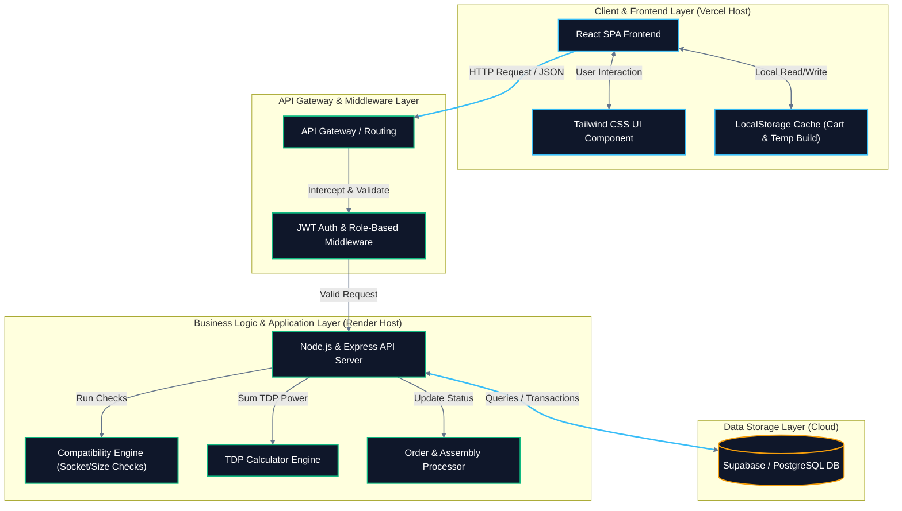
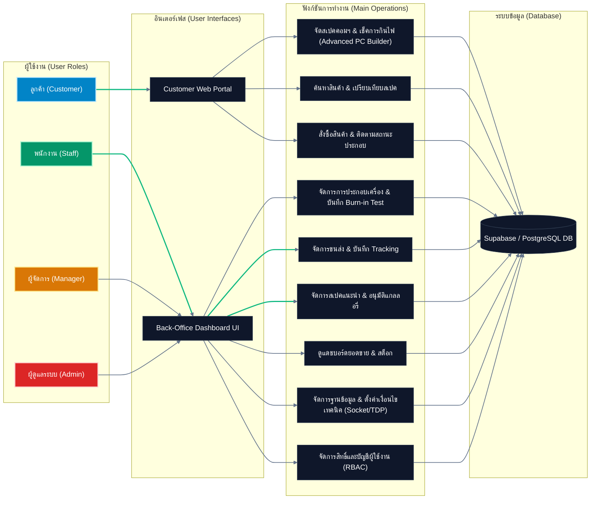

# เอกสารข้อกำหนดความต้องการของระบบ (System Requirement Specification - SRS)

## โครงการ: ComHub - แพลตฟอร์มอีคอมเมิร์ซสำหรับจัดสเปคและจำหน่ายอุปกรณ์คอมพิวเตอร์ครบวงจร
**เวอร์ชัน:** 1.0  
**ผู้จัดทำ:** นายธนกร สิงห์ก้อม และ นายหาญณรงค์ บุญยืน

---

## สารบัญ

*   [1. ภาพรวมโครงการ (Project Overview)](#1-ภาพรวมโครงการ-project-overview)
*   [2. เป้าหมายทางธุรกิจและขอบเขตระบบ (Business Goals & Scope)](#2-เป้าหมายทางธุรกิจและขอบเขตระบบ-business-goals--scope)
    *   [ขอบเขตระบบแยกตามสิทธิ์ผู้ใช้งาน (System Scope by Actors)](#ขอบเขตระบบแยกตามสิทธิ์ผู้ใช้งาน-system-scope-by-actors)
*   [3. ความต้องการด้านฟังก์ชันการทำงาน (Functional Requirements)](#3-ความต้องการด้านฟังก์ชันการทำงาน-functional-requirements)
    *   [3.1 ระบบสำหรับลูกค้า (Customer Frontend)](#31-ระบบสำหรับลูกค้า-customer-frontend)
    *   [3.2 ระบบสำหรับพนักงาน (Staff Back-office)](#32-ระบบสำหรับพนักงาน-staff-back-office)
    *   [3.3 ระบบสำหรับผู้จัดการ (Manager Back-office)](#33-ระบบสำหรับผู้จัดการ-manager-back-office)
    *   [3.4 ระบบสำหรับผู้ดูแลระบบ (Administrator System)](#34-ระบบสำหรับผู้ดูแลระบบ-administrator-system)
*   [4. ความต้องการด้านที่ไม่ใช่ฟังก์ชัน (Non-Functional Requirements)](#4-ความต้องการด้านที่ไม่ใช่ฟังก์ชัน-non-functional-requirements)
*   [5. สถาปัตยกรรมระบบ (System Architecture)](#5-สถาปัตยกรรมระบบ-system-architecture)
    *   [5.1 โครงสร้างสถาปัตยกรรมเชิงเทคนิคแบบ](#51-โครงสร้างสถาปัตยกรรมเชิงเทคนิคแบบ-3-tier-3-tier-technical-architecture)
    *   [5.2 แผนผังเส้นทางการใช้งานจำแนกตามบทบาทผู้ใช้ (Role-Based Access & Feature Flow)](#52-แผนผังเส้นทางการใช้งานจำแนกตามบทบาทผู้ใช้-role-based-access--feature-flow)
*   [6. แผนการดำเนินงาน 4 สัปดาห์ (Project Timeline)](#6-แผนการดำเนินงาน-4-สัปดาห์-project-timeline)
*   [7. เครื่องมือและเทคโนโลยีที่ใช้ (Tools & Technologies)](#7-เครื่องมือและเทคโนโลยีที่ใช้-tools--technologies)
*   [8. ความเสี่ยงและการจัดการความเสี่ยง (Risk Management)](#8-ความเสี่ยงและการจัดการความเสี่ยง-risk-management)

---

## 1. ภาพรวมโครงการ (Project Overview)
ในปัจจุบัน ความต้องการใช้งานคอมพิวเตอร์ประสิทธิภาพสูง ทั้งสำหรับกลุ่มเกมเมอร์ (Gaming) และคนทำงานเฉพาะทาง (Creators / Office) มีการเติบโตอย่างก้าวกระโดด อย่างไรก็ตาม ผู้ซื้อส่วนใหญ่ยังคงประสบปัญหาขาดความรู้ความเข้าใจในการเลือกชิ้นส่วนอุปกรณ์คอมพิวเตอร์ให้สามารถทำงานร่วมกันได้อย่างสมบูรณ์ (Hardware Compatibility) รวมถึงมีความยุ่งยากในการเปรียบเทียบข้อมูลจำเพาะเชิงลึกและเปรียบเทียบราคา

โครงการ **ComHub** จึงจัดตั้งขึ้นเพื่อพัฒนาเว็บแอปพลิเคชันอีคอมเมิร์ซที่รวมอุปกรณ์คอมพิวเตอร์ครบวงจร พร้อมระบบวิเคราะห์จัดสเปคคอมพิวเตอร์อัจฉริยะ (Advanced PC Builder) ที่ตรวจจับความเข้ากันได้ของชิ้นส่วนและการคำนวณกำลังไฟอัตโนมัติ เพื่อส่งมอบประสบการณ์ซื้อสินค้าที่ราบรื่น สะดวก และลดโอกาสการสั่งซื้อชิ้นส่วนผิดพลาด

---

## 2. เป้าหมายทางธุรกิจและขอบเขตระบบ (Business Goals & Scope)

###เป้าหมายทางธุรกิจ (Business Goals)
1. **ลดอัตราการคืนสินค้า (Return Rate):** ลดปัญหาการสั่งซื้ออุปกรณ์ไปแล้วใช้งานร่วมกันไม่ได้ด้วยระบบตรวจสอบความเข้ากันได้อัตโนมัติ (Compatibility Checker)
2. **เพิ่มยอดขายต่อคำสั่งซื้อ (Average Order Value):** กระตุ้นยอดขายผ่านฟังก์ชันแนะนำชิ้นส่วนและพาวเวอร์ซัพพลาย (PSU) ที่มีกำลังวัตต์เหมาะสม (Wattage Calculator)
3. **ยกระดับความเชื่อมั่นของแบรนด์ (Brand Trust):** ลูกค้าสามารถตรวจสอบกระบวนการทำงาน ขั้นตอนการประกอบเครื่อง และการทดสอบระบบ (Burn-in Test) ได้แบบเรียลไทม์

### ขอบเขตระบบแยกตามสิทธิ์ผู้ใช้งาน (System Scope by Actors)
ระบบ ComHub แบ่งการใช้งานออกเป็น 4 บทบาทหลัก ดังนี้:
*   **ลูกค้า (Customer):** สามารถเข้าถึงหน้าเว็บไซต์หลัก เลือกชมสินค้าตามหมวดหมู่ เปรียบเทียบสินค้า จัดสเปคคอมพิวเตอร์ บันทึกรายการโปรด รีวิวสินค้า สั่งซื้อสินค้า และติดตามสถานะการประกอบเครื่อง
*   **พนักงาน (Staff):** รับคำสั่งซื้อ อัปเดตสถานะการประกอบคอมพิวเตอร์ บันทึกผลการทดสอบระบบ (Burn-in Test) และบันทึกหมายเลขพัสดุจัดส่ง
*   **ผู้จัดการ (Manager):** จัดการเทมเพลตสเปคคอมพิวเตอร์แนะนำ คัดกรองและอนุมัติรูปภาพในแกลลอรี่คอมมูนิตี้ ตรวจสอบยอดขายและสต็อกสินค้าผ่านแดชบอร์ด
*   **ผู้ดูแลระบบ (Administrator):** จัดการบัญชีและสิทธิ์พนักงาน ควบคุมฐานข้อมูลสินค้าและระดับสต็อก ตั้งค่าตัวแปรเงื่อนไขเทคนิค (Compatibility Rules & TDP Watts)

---

## 3. ความต้องการด้านฟังก์ชันการทำงาน (Functional Requirements)

### 3.1 ระบบสำหรับลูกค้า (Customer Frontend)

| รหัสฟังก์ชัน | ฟังก์ชันหลัก (Feature) | รายละเอียดความต้องการ (Description) | ความสำคัญ (Priority) |
| :--- | :--- | :--- | :---: |
| **C-01** | Advanced PC Builder | สามารถจัดสเปคคอมพิวเตอร์ทีละชิ้นส่วน (CPU, Mainboard, GPU, RAM, SSD, PSU, Case) | High |
| **C-02** | Compatibility Checker | ระบบจะซ่อนหรือแจ้งเตือนเมื่อเลือกฮาร์ดแวร์ที่ไม่รองรับร่วมกัน (เช่น CPU Socket ไม่ตรงกับ Mainboard Socket, ขนาดเคสกับขนาดการ์ดจอ) | High |
| **C-03** | Wattage Calculator | คำนวณค่าไฟวัตต์รวม (TDP) ของสเปคปัจจุบัน แนะนำและกรองเฉพาะ PSU ที่มีวัตต์เพียงพอ | High |
| **C-04** | Pre-built Templates | เลือกเซ็ตคอมพิวเตอร์แนะนำจากร้าน ดึงชิ้นส่วนไปแต่งต่อใน Builder หรือกดสั่งซื้อทันที | Medium |
| **C-05** | Product Comparison | เปรียบเทียบคุณสมบัติเชิงเทคนิคของอุปกรณ์ได้สูงสุด 3 ชิ้นพร้อมแสดงผลแบบตาราง | Medium |
| **C-06** | Wishlist & Stock Alert | บันทึกรายการที่ชอบ และรับการแจ้งเตือนเมื่อสินค้าที่หมดกลับเข้าสต็อก | Medium |
| **C-07** | Review with Photos | เขียนรีวิว ให้คะแนน 1-5 ดาว และอัปโหลดภาพถ่ายสินค้าจริงประกอบการรีวิว | Low |
| **C-08** | PC Build Gallery | เข้าชมสเปคคอมพิวเตอร์และรูปเครื่องประกอบเสร็จของลูกค้ารายอื่นเพื่อหาแรงบันดาลใจ | Low |
| **C-09** | Order & Assembly Tracking| ติดตามสถานะออเดอร์และการประกอบ 4 ขั้นตอน: [รับออเดอร์] -> [กำลังประกอบ] -> [กำลังเทสระบบ] -> [จัดส่งแล้ว] | High |

### 3.2 ระบบสำหรับพนักงาน (Staff Back-office)

| รหัสฟังก์ชัน | ฟังก์ชันหลัก (Feature) | รายละเอียดความต้องการ (Description) | ความสำคัญ (Priority) |
| :--- | :--- | :--- | :---: |
| **S-01** | Build Assembly Management | ตรวจสอบใบสั่งซื้อที่ต้องการประกอบเครื่อง อัปเดตสถานะการประกอบแบบเรียลไทม์ | High |
| **S-02** | Burn-in Test Recording | บันทึกผลทดสอบการรันระบบเบื้องต้นและการทดสอบอุณหภูมิลงในระบบก่อนจัดส่ง | High |
| **S-03** | Order & Logistics Management| จัดพิมพ์ใบจัดส่งสินค้า และบันทึกหมายเลขพัสดุ (Tracking Number) เพื่อแจ้งให้ลูกค้าทราบ | High |

### 3.3 ระบบสำหรับผู้จัดการ (Manager Back-office)

| รหัสฟังก์ชัน | ฟังก์ชันหลัก (Feature) | รายละเอียดความต้องการ (Description) | ความสำคัญ (Priority) |
| :--- | :--- | :--- | :---: |
| **M-01** | Pre-built Management | เพิ่ม แก้ไข หรือลบเทมเพลตจัดสเปคแนะนำตามโปรโมชั่นหรือแท็กงบประมาณ | Medium |
| **M-02** | Gallery Moderation | ตรวจสอบและอนุมัติรูปถ่าย/รีวิวของลูกค้า ก่อนนำไปแสดงบน PC Build Gallery สาธารณะ | Medium |
| **M-03** | Dashboard & Reporting | ตรวจดูแดชบอร์ดยอดขาย ฮาร์ดแวร์ยอดนิยม และระดับสินค้าคงคลังที่ต้องซื้อเพิ่ม | High |

### 3.4 ระบบสำหรับผู้ดูแลระบบ (Administrator System)

| รหัสฟังก์ชัน | ฟังก์ชันหลัก (Feature) | รายละเอียดความต้องการ (Description) | ความสำคัญ (Priority) |
| :--- | :--- | :--- | :---: |
| **A-01** | Database Management | จัดการคลังข้อมูลสินค้าหลัก เพิ่ม/ลบ/แก้ไขข้อมูลรายการและจำนวนสินค้าในคลัง | High |
| **A-02** | Rules Settings | ตั้งค่าความเข้ากันได้ (Compatibility Rules mapping เช่น Socket matching และ Case size limitations) | High |
| **A-03** | Power Allocation Settings | ระบุและอัปเดตปริมาณการใช้พลังงาน (TDP Watts) ให้กับอุปกรณ์ทุกชิ้นในระบบ | High |
| **A-04** | Role & Access Control | สร้างบัญชีผู้ใช้ใหม่สำหรับ Staff/Manager และกำหนดสิทธิ์การเข้าถึงเมนูต่างๆ | High |

---

## 4. ความต้องการด้านที่ไม่ใช่ฟังก์ชัน (Non-Functional Requirements)

*   **ประสิทธิภาพ (Performance):** หน้าจอจัดสเปคและการตรวจสอบเงื่อนไขความเข้ากันได้ (Compatibility Checker) ต้องแสดงผลแจ้งเตือนภายในเวลาไม่เกิน 500 มิลลิวินาที (Sub-second response) หลังลูกค้ากดเลือกสินค้า
*   **ความปลอดภัยและการจำกัดสิทธิ์ (Security & Role-based Access):** การเข้าถึงหน้าจัดการหลังบ้านต้องมีการตรวจสอบสิทธิ์อย่างเข้มงวด แยกสิทธิ์การจัดการตามระดับของพนักงาน (Staff, Manager, Admin) ข้อมูลการเงินและสลิปการโอนเงินของลูกค้าต้องจัดเก็บในพื้นที่ที่ปลอดภัย
*   **ความน่าเชื่อถือและความพร้อมใช้งาน (Reliability & Availability):** แพลตฟอร์มต้องรองรับการจำลองการทำงานอย่างต่อเนื่องและจัดการการซิงค์ข้อมูลสต็อกได้อย่างแม่นยำเพื่อป้องกันการขายสินค้าเกินสต็อกจริง (Overselling)
*   **มาตรฐานอินเตอร์เฟสและฟอนต์ (UI/UX Standards):** แสดงผลแบบ Fullscreen Responsive รองรับการเปิดบน Desktop และ Mobile ได้อย่างไร้รอยต่อ โดยจับคู่ฟอนต์ `'IBM Plex Sans Thai'` สำหรับภาษาไทย และ `'Inter'` สำหรับตัวเลขและภาษาอังกฤษ เพื่อให้ดีไซน์ดูเป็นเว็บไอทีระดับพรีเมียม

---

## 5. สถาปัตยกรรมระบบ (System Architecture)

ระบบจัดโครงสร้างสถาปัตยกรรม โดยแบ่งแยกส่วนแสดงผล ส่วนประมวลผลคำสั่ง และส่วนฐานข้อมูลออกจากกันผ่าน REST APIs เพื่อให้สามารถรองรับการปรับขยาย (Scalability) ในอนาคต

### 5.1 โครงสร้างสถาปัตยกรรมเชิงเทคนิคแบบ

*(ดูไฟล์โค้ด Mermaid แยกต่างหากได้ที่ [architecture.mermaid](file:///d:/Work/Comkub/architecture.mermaid))*

### 5.2 แผนผังเส้นทางการใช้งานจำแนกตามบทบาทผู้ใช้ (Role-Based Access & Feature Flow)

แผนภาพนี้แสดงความเกี่ยวข้องระหว่างบทบาทของผู้ใช้งาน (Customer, Staff, Manager, Admin) อินเตอร์เฟสการเข้าใช้งาน (Interfaces) และฟังก์ชันการเข้าใช้งานเฉพาะเจาะจงที่แบ่งสิทธิ์ไว้ชัดเจน

*(ดูไฟล์โค้ด Mermaid แยกต่างหากได้ที่ [roles_flow.mermaid](file:///d:/Work/Comkub/roles_flow.mermaid))*

---

## 6. แผนการดำเนินงาน 4 สัปดาห์ (Project Timeline)

| สัปดาห์ที่ | ขั้นตอนการดำเนินงาน | รายละเอียดของงาน (Task Detail) |
| :---: | :--- | :--- |
| **สัปดาห์ที่ 1** | วิเคราะห์และออกแบบระบบ (Analysis & Design) | สรุปวิเคราะห์ข้อกำหนดความต้องการ (Requirement Gathering), ร่างแบบหน้าจอ UI (Figma Mockups), ออกแบบโครงสร้างข้อมูล JSON, จัดแบ่งบทบาทและงานในทีมพัฒนา |
| **สัปดาห์ที่ 2** | พัฒนาส่วนหน้าบ้าน (Frontend Development) | สร้าง Component ต่างๆ ด้วย React SPA, วางโครงร่างหน้าเว็บและ CSS ด้วย Tailwind CSS, พัฒนาหน้า Home, หน้าสั่งซื้อสินค้า และโมดูล Advanced PC Builder |
| **สัปดาห์ที่ 3** | พัฒนาส่วนหลังบ้าน (Backend Development) | สร้าง REST API Server ด้วย Node.js / Express, ทำระบบจำลองการเข้าสู่ระบบและแบ่งสิทธิ์ (Role-based Authentication), เชื่อมต่อ API รับส่งข้อมูลกับส่วนหน้าบ้าน |
| **สัปดาห์ที่ 4** | การทดสอบและนำเสนอ (Testing & Deployment) | ทำการทดสอบจำลองกระบวนการ UAT ตาม Flow การใช้งานจริงของแต่ละ Actor, แก้ไขข้อบกพร่อง (Bugs), เตรียมสไลด์และฝึกซ้อมนำเสนอผลงานโครงงาน |

---

## 7. เครื่องมือและเทคโนโลยีที่ใช้ (Tools & Technologies)

*   **FrontEnd Framework:** React + Vite (เพื่อความรวดเร็วในการคอมไพล์และโหลดข้อมูลอย่างมีประสิทธิภาพ)
*   **Styling Engine:** Tailwind CSS (สำหรับทำ Responsive Design และจัดแต่ง UI)
*   **BackEnd API Engine:** Node.js + Express (เขียนด้วย TypeScript เพื่อเพิ่ม Type Safety ในฝั่ง API)
*   **Database:** PostgreSQL (Supabase Cloud Database) และ LocalStorage ในการเก็บข้อมูลฝั่งผู้ใช้งานชั่วคราว
*   **Version Control & Collaboration:** Git, GitHub และ SourceTree เพื่อจัดการ Commit History และทำ DevOps Workflow เบื้องต้น

---

## 8. ความเสี่ยงและการจัดการความเสี่ยง (Risk Management)

| รหัสความเสี่ยง | คำอธิบายความเสี่ยง (Risk Description) | แนวทางการแก้ไขและจัดการ (Mitigation Strategy) |
| :--- | :--- | :--- |
| **R-01** | ข้อมูลการจับคู่ Compatibility ซับซ้อน ทำให้ระบบโหลดช้า | ทำการ Caching ข้อมูลเงื่อนไขเทคนิคไว้ที่ฝั่ง Client (LocalStorage) เพื่อทำการวิเคราะห์ก่อนส่งคำขอไป Backend |
| **R-02** | แอดมินกรอกสเปคพลังงาน (TDP) ของอุปกรณ์ผิดพลาด | ทำระบบกรอกฟอร์ม Validation ฝั่งแอดมิน เพื่อบังคับให้กรอกเป็นตัวเลขบวก และมีระบบแจ้งเตือนกรณีข้อมูล TDP ผิดปกติ |
| **R-03** | สมาชิกในทีมทำการ Push โค้ดทับกันใน GitHub | กำหนดนโยบาย Git Workflow อย่างชัดเจน (เช่น ห้ามแก้ไขสาขา main โดยตรง, แยกใช้สาขา `feature/[task-slug]` และทำการรีวิวผ่าน Pull Request) |
