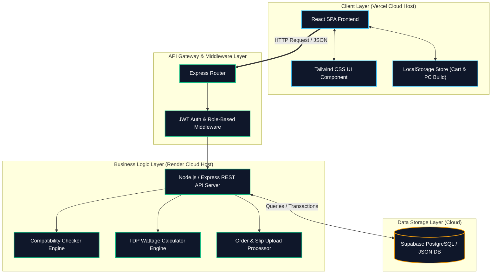

# เอกสารข้อกำหนดความต้องการของระบบ (System Requirement Specification - SRS)

## โครงการ: ComHub - แพลตฟอร์มอีคอมเมิร์ซสำหรับจัดสเปคและจำหน่ายอุปกรณ์คอมพิวเตอร์ครบวงจร
**เวอร์ชัน:** 1.1 (MVP Final Release)  
**วันที่อัปเดตล่าสุด:** 22 กรกฎาคม 2026  
**วิชา:** CSI204 — วิศวกรรมซอฟต์แวร์ (Software Engineering)  
**ผู้จัดทำ:** นายธนกร สิงห์ก้อม และ นายหาญณรงค์ บุญยืน  
**Public Live System URL:** [https://comhub-frontend.vercel.app](https://comhub-frontend.vercel.app)

---

## สารบัญ

<div class="srs-toc-container">

*   [1. ภาพรวมโครงการ (Project Overview)](#1-ภาพรวมโครงการ-project-overview)
*   [2. เป้าหมายทางธุรกิจและขอบเขตระบบ (Business Goals & Scope)](#2-เป้าหมายทางธุรกิจและขอบเขตระบบ-business-goals--scope)
    *   [เป้าหมายทางธุรกิจ (Business Goals)](#เป้าหมายทางธุรกิจ-business-goals)
    *   [ขอบเขตระบบแยกตามสิทธิ์ผู้ใช้งาน (System Scope by Actors - MVP Version)](#ขอบเขตระบบแยกตามสิทธิ์ผู้ใช้งาน-system-scope-by-actors---mvp-version)
*   [3. ความต้องการด้านฟังก์ชันการทำงาน (Functional Requirements)](#3-ความต้องการด้านฟังก์ชันการทำงาน-functional-requirements)
    *   [3.1 ระบบสำหรับลูกค้า (Customer Frontend)](#31-ระบบสำหรับลูกค้า-customer-frontend)
    *   [3.2 ระบบสำหรับพนักงานและผู้ดูแลระบบ (Staff / Admin Back-office)](#32-ระบบสำหรับพนักงานและผู้ดูแลระบบ-staff--admin-back-office)
*   [4. ความต้องการด้านที่ไม่ใช่ฟังก์ชัน (Non-Functional Requirements)](#4-ความต้องการด้านที่ไม่ใช่ฟังก์ชัน-non-functional-requirements)
*   [5. สถาปัตยกรรมระบบและแผนภาพ UML (System Architecture & UML Diagrams)](#5-สถาปัตยกรรมระบบและแผนภาพ-uml-system-architecture--uml-diagrams)
    *   [5.1 โครงสร้างสถาปัตยกรรมเชิงเทคนิคแบบ 3-Tier](#51-โครงสร้างสถาปัตยกรรมเชิงเทคนิคแบบ-3-tier-3-tier-technical-architecture)
    *   [5.2 แผนภาพ UML (Use Case, Class & Sequence Diagrams)](#52-แผนภาพ-uml-use-case-class--sequence-diagrams)
*   [6. แผนการดำเนินงาน 4 สัปดาห์ตามกระบวนการ SDLC (Project Timeline)](#6-แผนการดำเนินงาน-4-สัปดาห์ตามกระบวนการ-sdlc-project-timeline)
*   [7. เครื่องมือ เทคโนโลยี และการทดสอบระบบ (Tools, Technologies & UAT)](#7-เครื่องมือ-เทคโนโลยี-และการทดสอบระบบ-tools-technologies--uat)
*   [8. ความเสี่ยงและการจัดการความเสี่ยง (Risk Management)](#8-ความเสี่ยงและการจัดการความเสี่ยง-risk-management)

</div>

---

## 1. ภาพรวมโครงการ (Project Overview)

ComHub คือแพลตฟอร์มอีคอมเมิร์ซสำหรับจัดสเปคและจำหน่ายอุปกรณ์คอมพิวเตอร์ครบวงจร ที่ช่วยให้ลูกค้าสามารถเลือกประกอบคอมพิวเตอร์ได้ด้วยตนเองผ่านระบบ **PC Builder** ซึ่งตรวจสอบความเข้ากันได้ของฮาร์ดแวร์ (**Compatibility Checker**) และคำนวณกำลังไฟที่ต้องใช้ (**Wattage Calculator**) โดยอัตโนมัติ พร้อมทั้งมีระบบหลังบ้านที่รองรับการบริหารจัดการคลังสินค้า อนุมัติสลิปชำระเงิน ติดตามสถานะออเดอร์ แดชบอร์ดวิเคราะห์ยอดขาย และระบบจัดการสิทธิ์ผู้ใช้งานแบบ Role-Based Access Control (RBAC) 

เอกสาร SRS ฉบับนี้จัดทำขึ้นเพื่อประกอบวิชา **CSI204 — วิศวกรรมซอฟต์แวร์ (Software Engineering)** โดยปรับปรุงให้ตรงตามสถานะการพัฒนาปัจจุบัน (MVP Release) รองรับการใช้งานจริงบนสภาพแวดล้อม Vercel และ Render Cloud

---

## 2. เป้าหมายทางธุรกิจและขอบเขตระบบ (Business Goals & Scope)

### เป้าหมายทางธุรกิจ (Business Goals)

1. พัฒนาระบบอีคอมเมิร์ซสำหรับซื้อขายและเปรียบเทียบสเปคอุปกรณ์คอมพิวเตอร์แบบครบวงจร
2. สร้างระบบจัดสเปคคอมพิวเตอร์ (PC Builder) ที่มี **Compatibility Checker** ตรวจสอบ Socket, ขนาดเคส/การ์ดจอ, ชนิด RAM และระบบ **Wattage Calculator** คำนวณกำลังไฟ TDP อัตโนมัติพร้อมเผื่อ Buffer 20% ($TDP \times 1.2$)
3. พัฒนาระบบหลังบ้านครบวงจร ได้แก่ ระบบตรวจสอบและอนุมัติสลิปโอนเงิน (พร้อมระบบคืนสต็อกอัตโนมัติหาก Reject), ระบบกรอกเลขพัสดุ Tracking, แดชบอร์ดวิเคราะห์ยอดขาย และระบบจัดการสิทธิ์ผู้ใช้ (RBAC)

### ขอบเขตระบบแยกตามสิทธิ์ผู้ใช้งาน (System Scope by Actors - MVP Version)

ตามข้อกำหนดใน [project-scope.md](./markdown/project-scope.md) โครงสร้างระบบในเวอร์ชัน MVP ได้ทำการจัดกลุ่มผู้ใช้งานออกเป็น **2 บทบาทหลัก (2 Main Actors)** เพื่อความยืดหยุ่นและมีประสิทธิภาพสูงสุด:

```
                          ┌───────────────────────────┐
                          │   ComHub System Actors    │
                          └─────────────┬─────────────┘
                                        │
                    ┌───────────────────┴───────────────────┐
                    ▼                                       ▼
         ┌─────────────────────┐                 ┌─────────────────────┐
         │  Customer (ลูกค้า)  │                 │ Staff / Admin (ดูแล)│
         └─────────────────────┘                 └─────────────────────┘
```

#### 👤 1. ลูกค้า (Customer)

- **สมัครสมาชิกและล็อกอิน (Register & Login)**
  - สมัครสมาชิกด้วยอีเมล ล็อกอินเพื่อรับ JWT Token สำหรับจัดการตะกร้าสินค้า รายการโปรด และติดตามออเดอร์
- **จัดสเปคคอมพิวเตอร์ (PC Builder)**
  - เลือกอุปกรณ์คอมพิวเตอร์ 7 หมวดหมู่หลัก (CPU, Mainboard, RAM, GPU, Storage, PSU, Case) ผ่านแผง Bento Grid
  - สามารถสลับเปลี่ยนชิ้นส่วน ถอดชิ้นส่วน และดูคำนวณราคารวมได้แบบ Real-time
- **ตรวจสอบความเข้ากันได้ (Compatibility Checker)**
  - แสดง Warning Alert สีแดงทันทีหากอุปกรณ์ไม่ตรงกัน เช่น Socket CPU ไม่ตรงกับ Mainboard หรือ RAM Type ไม่รองรับ
- **คำนวณกำลังไฟ (Wattage Calculator)**
  - แสดงกำลังไฟรวม (Total TDP Watts) และกรองแนะนำ PSU ที่มีขนาดวัตต์เพียงพอ ($TDP \times 1.2$)
- **เปรียบเทียบสินค้า (Product Comparison)**
  - เลือกสินค้าประเภทเดียวกันมาเปรียบเทียบสเปคเทคนิค Side-by-Side ในตารางเปรียบเทียบ
- **จัดการรายการโปรด (Wishlist & Stock Alert)**
  - กดหัวใจบันทึกสินค้าลง Wishlist พร้อมสวิตช์เปิด/ปิดแจ้งเตือนเมื่อสินค้ากลับเข้าสต็อก
- **เขียนรีวิวสินค้า (Review Submission)**
  - ให้คะแนน 1-5 ดาว พร้อมพิมพ์ข้อความรีวิวสินค้า (มีระบบป้องกันการส่งรีวิวซ้ำ 409 Conflict)
- **ตะกร้าสินค้าและชำระเงิน (Cart & Checkout)**
  - เพิ่มสินค้าลงตะกร้า เลือกรายการที่จะชำระ กรอกที่อยู่จัดส่ง และอัปโหลดสลิปโอนเงิน (ระบบบีบอัดภาพเป็น WebP $<100\text{KB}$ อัตโนมัติ)
- **ติดตามสถานะออเดอร์ (Order Tracking Timeline)**
  - ติดตามสถานะออเดอร์ผ่าน Stepper 5 ขั้นตอน พร้อมประวัติวันเวลา และเลขพัสดุ Tracking Number

#### 🟡 2. พนักงานและผู้ดูแลระบบ (Staff / Admin)

- **ล็อกอินผู้ดูแลระบบ (Admin Auth Guard)**
  - ล็อกอินเข้าใช้งาน Admin Panel ป้องกันการสุ่มเข้า URL ด้วย 403 Forbidden
- **จัดการคลังสินค้า (Product CRUD)**
  - เพิ่ม แก้ไข ราคา สต็อก สเปคเทคนิค (JSONB) และสลับสถานะซ่อนสินค้า (`is_active=false`)
- **ตรวจสอบและอนุมัติสลิปโอนเงิน (Payment Verification)**
  - เปิดดูสลิปชำระเงิน กด **Approve** เพื่อเปลี่ยนสถานะเป็น `Paid` หรือกด **Reject** เพื่อคืนสต็อกเข้าคลังอัตโนมัติ
- **จัดการออเดอร์และส่งมอบพัสดุ (Order Dispatch & Tracking)**
  - เปลี่ยนสถานะออเดอร์เป็น `Shipped` และกรอกหมายเลขพัสดุ Tracking Number เพื่อแจ้งลูกค้า
- **ดู Dashboard รายงานยอดขาย (Sales Dashboard)**
  - ดูกราฟสรุปยอดขายรวมสะสม และตาราง Highlight สินค้าที่มีสต็อกต่ำ ($\le 3$ ชิ้น)
- **จัดการสิทธิ์และบัญชีผู้ใช้ (Role & Access Control)**
  - ค้นหาบัญชีผู้ใช้และปรับเปลี่ยนสิทธิ์ระหว่าง Customer และ Admin

---

## 3. ความต้องการด้านฟังก์ชันการทำงาน (Functional Requirements)

ความต้องการด้านฟังก์ชันการทำงานระบุรหัสความต้องการอย่างเป็นทางการ ดังนี้:

- **SYS-01 ถึง SYS-04:** ระบบการยืนยันตัวตน, จัดการ Session ด้วย JWT Token และการควบคุมสิทธิ์ RBAC
- **C-01 ถึง C-12:** ระบบค้นหา กรอง เปรียบเทียบสินค้า, ระบบ PC Builder, Compatibility Checker, Wattage Calculator, ตะกร้าสินค้า, การอัปโหลดสลิป WebP และการติดตามพัสดุ
- **A-01 ถึง A-06:** ระบบ Admin Dashboard, การจัดการคลังสินค้า CRUD, การอนุมัติสลิปโอนเงิน, การจัดการ Tracking Number และการเปลี่ยน Role ผู้ใช้

*(ดูรายละเอียดตาราง FR Matrix ฉบับเต็มได้ที่ [project-scope.md §1](./markdown/project-scope.md))*

---

## 4. ความต้องการด้านที่ไม่ใช่ฟังก์ชัน (Non-Functional Requirements)

1. **Performance Requirement:** หน้าเว็บตอบสนองรวดเร็ว Response Time API $< 500\text{ms}$ รองรับ Client-side Caching บน LocalStorage
2. **Security Requirement:** 
   - เข้ารหัสรหัสผ่านด้วย `bcrypt`
   - ยืนยันตัวตนด้วย JWT Token (HMAC Signature)
   - ป้องกัน XSS Injection ด้วย HTML Escaping
   - ป้องกัน File Upload Vulnerability ด้วย Mime-type / File Extension Validation
   - ป้องกัน Parameter Tampering ด้วยการคำนวณราคาสินค้าใหม่บน Backend
3. **Usability Requirement:** ออกแบบตามหลัก Responsive Design รองรับหน้าจอตั้งแต่ 320px (Mobile) จนถึง 4K Desktop ในธีม Dark Mode 
4. **Reliability & Data Integrity:** ใช้ Atomic Database Transactions ป้องกัน Race Condition กรณีสั่งซื้อสต็อกชิ้นสุดท้ายพร้อมกัน

---

## 5. สถาปัตยกรรมระบบและแผนภาพ UML (System Architecture & UML Diagrams)

### 5.1 โครงสร้างสถาปัตยกรรมเชิงเทคนิคแบบ 3-Tier

ระบบถูกออกแบบเป็น **3-Tier Architecture** เพื่อแยกส่วนแสดงผล ประมวลผล และจัดเก็บข้อมูลอย่างชัดเจน:



### 5.2 แผนภาพ UML (Use Case, Class & Sequence Diagrams)

เอกสารออกแบบ UML Diagrams ฉบับสมบูรณ์จัดทำไว้ที่ [UML-Diagrams.md](./markdown/UML-Diagrams.md) ประกอบด้วย:
1. **Use Case Diagram:** แสดงขอบเขตการเข้าถึงฟังก์ชันระหว่าง Customer และ Admin
2. **Class Diagram:** แสดงโครงสร้างคลาส อุตริบิวต์ และความสัมพันธ์ของ Data Models
3. **Sequence Diagrams:**
   - *3.1 PC Builder & Compatibility Check Sequence Flow*
   - *3.2 Checkout, Slip Upload & Admin Verification Sequence Flow*

---

## 6. แผนการดำเนินงาน 4 สัปดาห์ตามกระบวนการ SDLC (Project Timeline)

*(ดูรายละเอียดตารางดำเนินงาน SDLC 7 ขั้นตอนฉบับเต็มได้ที่ [sdlc-planning.md](./markdown/sdlc-planning.md))*

| สัปดาห์ | ขั้นตอน SDLC | รายละเอียดงานหลัก (Key Deliverables) |
|:---:|:---|:---|
| **W1** | **1. Planning & 2. Analysis** | กำหนดขอบเขตโครงการ, วิเคราะห์ User Persona, เขียน SRS, ออกแบบ Use Case & Class Diagram |
| **W2** | **3. Design & 4. Development** | ออกแบบ UI Wireframes ([wireframe-prototype.md](./markdown/wireframe-prototype.md)), สร้าง React Frontend Components, ออกแบบ API Schema |
| **W3** | **4. Development** | พัฒนา Express REST API, พัฒนา Compatibility Engine & Wattage Calculator, ระบบอัปโหลดสลิป WebP |
| **W4** | **5. Testing, 6. Deploy & 7. Maintenance** | ดำเนินการทดสอบ UAT 35 ชุดการทดสอบ ([WORKSHOP_7_UAT_SPECIFICATION.md](./docs/WORKSHOP_7_UAT_SPECIFICATION.md)), Deploy บน Vercel & Render, บันทึก Issue Log |

---

## 7. เครื่องมือ เทคโนโลยี และการทดสอบระบบ (Tools, Technologies & UAT)

### 💻 Frontend & Backend Tech Stack
- **Frontend:** React.js, Vite, TailwindCSS, Lucide Icons, LocalStorage Persistence (Deployed on Vercel)
- **Backend API:** Node.js, Express.js, TypeScript, JWT (JSON Web Token), bcrypt (Deployed on Render)
- **Database & Storage:** Supabase PostgreSQL (Transaction Pooler Port 6543) & JSON Data Persistence
- **Client Compression:** HTML5 Canvas WebP Compression ($<100\text{KB}$)

### 🧪 สรุปผลการทดสอบระบบ (UAT Summary - Workshop #7)
ระบบผ่านการทดสอบ **User Acceptance Testing (UAT) รวมทั้งสิ้น 35 ชุดการทดสอบ** ( Pass Rate **100%** ) ครอบคลุม:
- Customer Persona Functional Tests (12 ชุด)
- Staff / Admin Persona Functional Tests (6 ชุด)
- **Security & Vulnerability Tests (8 ชุด):** ทดสอบและป้องกัน Malicious File Upload, DoS File Bomb, Parameter Tampering, Unauthenticated Route, XSS Injection, Race Condition, JWT Tampering และ Data Exposure
- Data Validation & Boundary Edge Cases (5 ชุด)
- UI/UX & Performance Under Load Tests (4 ชุด)

*(ดูรายงานแบบฟอร์ม UAT ฉบับสมบูรณ์ได้ที่ [UAT_REPORT_TEMPLATE.md](./docs/UAT_REPORT_TEMPLATE.md))*

---

## 8. ความเสี่ยงและการจัดการความเสี่ยง (Risk Management)

| รหัสความเสี่ยง | คำอธิบายความเสี่ยง (Risk Description) | แนวทางการแก้ไขและจัดการ (Mitigation Strategy) |
| :--- | :--- | :--- |
| **R-01** | ข้อมูลการจับคู่ Compatibility ซับซ้อน ทำให้ระบบโหลดช้า | ทำ Caching ข้อมูลเงื่อนไขเทคนิคไว้ที่ฝั่ง Client (LocalStorage) เพื่อวิเคราะห์ก่อนยิง API |
| **R-02** | ผู้ใช้แนบสลิปไฟล์ขนาดใหญ่เกินไป หรือแนบไฟล์สคริปต์ | ทำ Client-side WebP Image Compression บีบอัดรูปก่อนส่ง และตรวจ Mime-type ฝั่ง Backend API |
| **R-03** | สมาชิกในทีม Push โค้ดทับกันใน GitHub | กำหนดนโยบาย Git Workflow แยกใช้ Feature Branch และตรวจสอบผ่าน Pull Request ก่อน Merge เข้า `master` |
