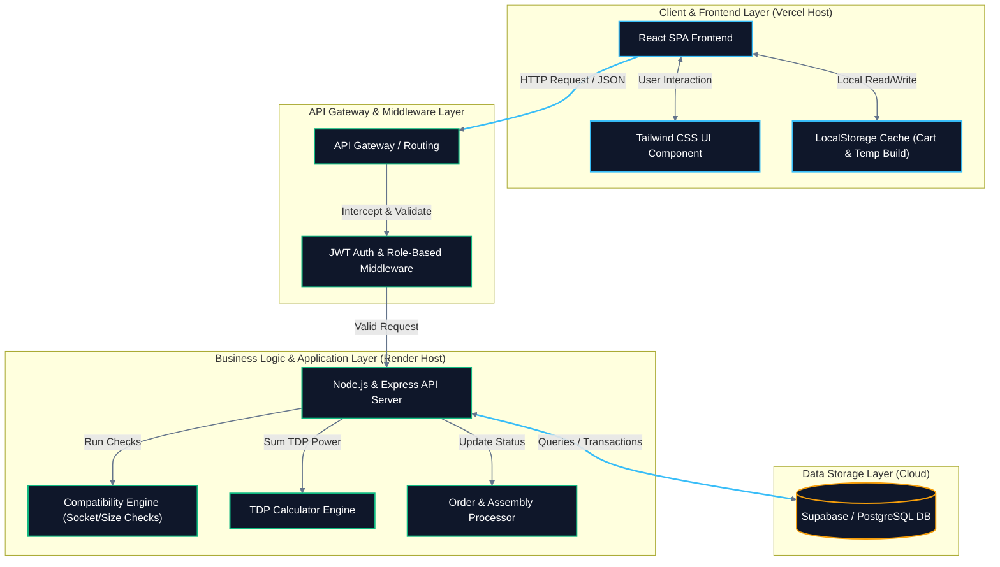
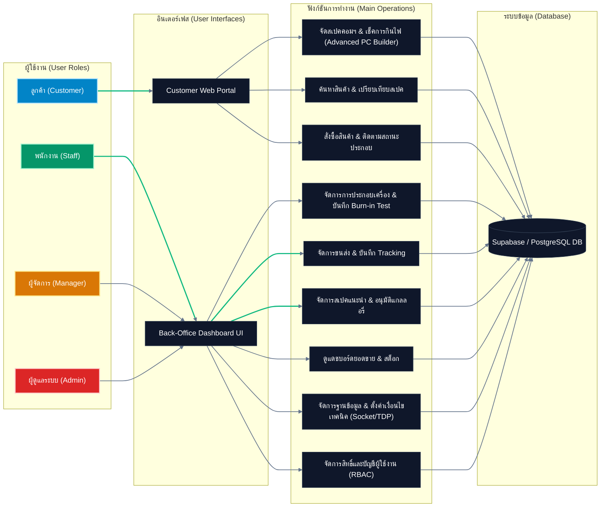

# เอกสารข้อกำหนดความต้องการของระบบ (System Requirement Specification - SRS)

## โครงการ: ComHub - แพลตฟอร์มอีคอมเมิร์ซสำหรับจัดสเปคและจำหน่ายอุปกรณ์คอมพิวเตอร์ครบวงจร
**เวอร์ชัน:** 1.0  
**ผู้จัดทำ:** นายธนกร สิงห์ก้อม และ นายหาญณรงค์ บุญยืน

---

## สารบัญ

*   [1. ภาพรวมโครงการ (Project Overview)](#1-ภาพรวมโครงการ-project-overview)
*   [2. เป้าหมายทางธุรกิจและขอบเขตระบบ (Business Goals & Scope)](#2-เป้าหมายทางธุรกิจและขอบเขตระบบ-business-goals--scope)
    *   [เป้าหมายทางธุรกิจ (Business Goals)](#เป้าหมายทางธุรกิจ-business-goals)
    *   [ขอบเขตระบบแยกตามสิทธิ์ผู้ใช้งาน (System Scope by Actors)](#ขอบเขตระบบแยกตามสิทธิ์ผู้ใช้งาน-system-scope-by-actors)
*   [3. ความต้องการด้านฟังก์ชันการทำงาน (Functional Requirements)](#3-ความต้องการด้านฟังก์ชันการทำงาน-functional-requirements)
    *   [3.1 ระบบสำหรับลูกค้า (Customer Frontend)](#31-ระบบสำหรับลูกค้า-customer-frontend)
    *   [3.2 ระบบสำหรับพนักงาน (Staff Back-office)](#32-ระบบสำหรับพนักงาน-staff-back-office)
    *   [3.3 ระบบสำหรับผู้จัดการ (Manager Back-office)](#33-ระบบสำหรับผู้จัดการ-manager-back-office)
    *   [3.4 ระบบสำหรับผู้ดูแลระบบ (Administrator System)](#34-ระบบสำหรับผู้ดูแลระบบ-administrator-system)
*   [4. ความต้องการด้านที่ไม่ใช่ฟังก์ชัน (Non-Functional Requirements)](#4-ความต้องการด้านที่ไม่ใช่ฟังก์ชัน-non-functional-requirements)
*   [5. สถาปัตยกรรมระบบ (System Architecture)](#5-สถาปัตยกรรมระบบ-system-architecture)
    *   [5.1 โครงสร้างสถาปัตยกรรมเชิงเทคนิคแบบ 3-Tier](#51-โครงสร้างสถาปัตยกรรมเชิงเทคนิคแบบ-3-tier-3-tier-technical-architecture)
    *   [5.2 แผนผังเส้นทางการใช้งานจำแนกตามบทบาทผู้ใช้ (Role-Based Access & Feature Flow)](#52-แผนผังเส้นทางการใช้งานจำแนกตามบทบาทผู้ใช้-role-based-access--feature-flow)
*   [6. แผนการดำเนินงาน 4 สัปดาห์ (Project Timeline)](#6-แผนการดำเนินงาน-4-สัปดาห์-project-timeline)
*   [7. เครื่องมือและเทคโนโลยีที่ใช้ (Tools & Technologies)](#7-เครื่องมือและเทคโนโลยีที่ใช้-tools--technologies)
*   [8. ความเสี่ยงและการจัดการความเสี่ยง (Risk Management)](#8-ความเสี่ยงและการจัดการความเสี่ยง-risk-management)

---

## 1. ภาพรวมโครงการ (Project Overview)

ComHub คือแพลตฟอร์มอีคอมเมิร์ซสำหรับจัดสเปคและจำหน่ายอุปกรณ์คอมพิวเตอร์ครบวงจร ที่ช่วยให้ลูกค้าสามารถเลือกประกอบคอมพิวเตอร์ได้ด้วยตนเองผ่านระบบ PC Builder ซึ่งตรวจสอบความเข้ากันได้ของฮาร์ดแวร์ (Compatibility Checker) และคำนวณกำลังไฟที่ต้องใช้ (Wattage Calculator) โดยอัตโนมัติ พร้อมทั้งมีระบบหลังบ้านที่รองรับการบริหารจัดการคิวงานประกอบเครื่อง การทดสอบ Burn-in แดชบอร์ดวิเคราะห์ยอดขาย และระบบจัดการสิทธิ์ผู้ใช้งานแบบ Role-Based Access Control (RBAC) ครบทั้ง 4 บทบาท ได้แก่ ลูกค้า (Customer), พนักงานประกอบเครื่อง (Staff), ผู้จัดการร้าน (Manager) และผู้ดูแลระบบ (Admin)

เอกสารนี้จัดทำขึ้นเพื่อประกอบวิชา **CSI204 — วิศวกรรมซอฟต์แวร์ (Software Engineering)** โดยระบุข้อกำหนดความต้องการของระบบทั้งด้านฟังก์ชันการทำงาน (Functional Requirements) และด้านที่ไม่ใช่ฟังก์ชัน (Non-Functional Requirements) รวมถึงสถาปัตยกรรมระบบ แผนการดำเนินงาน และการบริหารความเสี่ยงของโครงการ

## 2. เป้าหมายทางธุรกิจและขอบเขตระบบ (Business Goals & Scope)

### เป้าหมายทางธุรกิจ (Business Goals)

1. เพื่อพัฒนาระบบอีคอมเมิร์ซสำหรับซื้อขายและเปรียบเทียบสเปคอุปกรณ์คอมพิวเตอร์ที่ตอบโจทย์กลุ่มผู้ใช้ทั้ง 4 บทบาท (Customer, Staff, Manager, Admin)
2. เพื่อสร้างระบบจัดสเปคคอมพิวเตอร์ (PC Builder) ที่มี Compatibility Checker ตรวจสอบ Socket, ขนาดเคส/การ์ดจอ, ชนิด RAM และระบบ Wattage Calculator คำนวณกำลังไฟ TDP อัตโนมัติพร้อมเผื่อ 20%
3. เพื่อพัฒนาระบบหลังบ้านครบวงจร ได้แก่ ระบบจัดคิวประกอบเครื่อง, บันทึกผลทดสอบ Burn-in Test, แดชบอร์ดวิเคราะห์ยอดขาย และระบบจัดการสิทธิ์ผู้ใช้ (RBAC)

### ขอบเขตระบบแยกตามสิทธิ์ผู้ใช้งาน (System Scope by Actors)
ระบบ ComHub แบ่งการใช้งานออกเป็น 4 บทบาทหลัก ดังนี้:

#### 👤 ลูกค้า (Customer)

- **สมัครสมาชิก (Register)**
  - สร้างบัญชีใหม่ : ลงทะเบียนด้วยอีเมลและรหัสผ่านเพื่อเปิดใช้งานฟีเจอร์บันทึกประวัติ
- **ล็อกอินเข้าสู่ระบบ (Login)**
  - เข้าสู่ระบบ : ตรวจสอบสิทธิ์ด้วย JWT Token เพื่อดึงสเปคบันทึกส่วนตัวและประวัติการสั่งซื้อ
- **จัดสเปคคอมพิวเตอร์ (PC Builder)**
  - เลือกชิ้นส่วน : เลือกอุปกรณ์ทีละชิ้นจาก 7 หมวดหมู่หลัก (CPU, Mainboard, GPU, RAM, SSD, Case, PSU) ผ่านกล่อง Bento Grid
  - เปลี่ยนชิ้นส่วน : สลับเปลี่ยนอุปกรณ์ที่เลือกไว้ในแต่ละหมวดหมู่ได้ตลอดเวลา
  - ลบชิ้นส่วน : ถอดอุปกรณ์ที่ไม่ต้องการออกจากสเปคปัจจุบัน
  - ดูสรุปสเปค : แสดงรายการชิ้นส่วนทั้งหมดที่เลือกพร้อมราคารวม
- **ตรวจสอบความเข้ากันได้ (Compatibility Checker)**
  - ตรวจสอบ Socket : ระบบแจ้งเตือนทันทีหาก CPU และ Mainboard มี Socket ไม่ตรงกัน
  - ตรวจสอบขนาดเคส : ระบบเตือนหากขนาด Mainboard ใหญ่เกินเคส
  - ตรวจสอบขนาดการ์ดจอ : ระบบเตือนหากความยาว GPU เกินขีดจำกัดที่เคสรองรับ
  - ตรวจสอบชนิด RAM : ระบบบล็อกการเลือก RAM ที่ชนิดไม่ตรงกับ Mainboard (เช่น DDR4 กับ DDR5)
- **คำนวณกำลังไฟ (Wattage Calculator)**
  - ดูผลคำนวณ TDP : แสดงกำลังไฟรวม (Watts) ของอุปกรณ์ที่เลือกทั้งหมด
  - แนะนำ PSU : กรองและแนะนำเฉพาะ PSU ที่มีกำลังวัตต์มากกว่าผลรวม TDP × 1.2 (เผื่อ 20%)
- **เซ็ตสเปคแนะนำ (Pre-built Templates)**
  - ดูเซ็ตแนะนำ : เรียกดูรายชื่อเซ็ตคอมสำเร็จรูปของร้านแยกตามช่วงงบประมาณ
  - สั่งซื้อเซ็ตทันที : กดหยิบสเปคทั้งชุดใส่ตะกร้าเพื่อสั่งซื้อ
  - ดึงเซ็ตไปปรับแต่ง : โหลดสเปคเข้า PC Builder เพื่อสลับเปลี่ยนชิ้นส่วนที่ต้องการ
- **เปรียบเทียบสินค้า (Product Comparison)**
  - เพิ่มสินค้าเข้าเปรียบเทียบ : เลือกสินค้าประเภทเดียวกันได้สูงสุด 3 ชิ้น
  - ดูตารางเปรียบเทียบ : แสดงสเปคเชิงเทคนิคและราคาเทียบกันแบบตาราง
  - ลบสินค้าจากการเปรียบเทียบ : ถอดสินค้าที่ไม่ต้องการออกจากรายการเปรียบเทียบ
- **บันทึกสินค้าโปรด (Wishlist & Stock Alert)**
  - เพิ่มสินค้าเข้า Wishlist : กดหัวใจเพื่อบันทึกชิ้นส่วนที่สนใจไว้ในรายการโปรด
  - ลบสินค้าจาก Wishlist : ยกเลิกการบันทึกสินค้าที่ไม่สนใจแล้ว
  - เปิดแจ้งเตือนสต็อก : ตั้งค่ารับการแจ้งเตือนเมื่อสินค้าที่หมดกลับเข้าสต็อก
  - ปิดแจ้งเตือนสต็อก : ยกเลิกการรับแจ้งเตือนสินค้านั้นๆ
- **เขียนรีวิว (Review with Photos)**
  - เขียนรีวิวใหม่ : ให้คะแนน 1-5 ดาว พร้อมเขียนข้อความวิจารณ์สินค้า
  - แนบรูปภาพ : อัปโหลดรูปถ่ายสินค้าจริงประกอบรีวิว (บีบอัดเป็น WebP อัตโนมัติ)
  - ดูรีวิวสินค้า : อ่านรีวิวและดูรูปถ่ายจากลูกค้าท่านอื่น
- **แกลเลอรี่คอมมูนิตี้ (PC Build Gallery)**
  - แชร์สเปคสู่แกลเลอรี่ : โพสต์สเปคคอมประกอบเสร็จของตนเองพร้อมรูปถ่ายเคส
  - ดูโพสต์คนอื่น : ส่องดูเคสจัดสเปคและงบประมาณของลูกค้าท่านอื่น
  - โคลนสเปค : กดคัดลอกสเปคจากโพสต์คนอื่นเข้า PC Builder เพื่อสั่งซื้อหรือปรับแต่งต่อ
  - กดถูกใจ : กด Like โพสต์ที่ชื่นชอบ
- **ตะกร้าสินค้าและสั่งซื้อ (Cart & Checkout)**
  - เพิ่มสินค้าลงตะกร้า : หยิบชิ้นส่วนเข้าตะกร้า (บันทึกลง LocalStorage)
  - แก้ไขจำนวน : ปรับจำนวนสินค้าในตะกร้า
  - ลบสินค้าจากตะกร้า : ถอดสินค้าที่ไม่ต้องการออก
  - กรอกที่อยู่จัดส่ง : ระบุที่อยู่สำหรับจัดส่งสินค้า
  - เลือกบริการประกอบ : สลับเปิด/ปิดตัวเลือก "ให้ร้านประกอบและเทสเครื่องให้"
  - ใส่คูปองส่วนลด : กรอกรหัสคูปองเพื่อรับส่วนลด
  - อัปโหลดสลิปโอนเงิน : แนบภาพสลิปหลักฐาน (ระบบบีบอัดเป็น WebP อัตโนมัติก่อนส่งขึ้น Supabase)
- **ติดตามสถานะประกอบ (Assembly Tracking)**
  - ดูสถานะออเดอร์ : ติดตาม 4 ขั้นตอน [รับออเดอร์] → [กำลังประกอบ] → [เทสระบบ] → [จัดส่งแล้ว]
  - ดูประวัติล็อก : เปิดดูไทม์ไลน์วันเวลาเปลี่ยนสถานะแต่ละขั้นตอน
  - ดูผลทดสอบ Burn-in : ดูอุณหภูมิ CPU/GPU และโน้ตจากช่างที่บันทึกผลทดสอบ
  - ดูเลข Tracking : ดูหมายเลขพัสดุเพื่อติดตามกับบริษัทขนส่ง

#### 👷 พนักงาน (Staff)

- **ล็อกอินเข้าสู่ระบบพนักงาน (Login)**
  - เข้าสู่ระบบ : ตรวจสอบสิทธิ์เข้าใช้ระบบหลังบ้านด้วย JWT Token
- **จัดการคิวงานประกอบ (Build Management)**
  - ดูรายการคิวประกอบ : แสดงออเดอร์ที่ลูกค้าชำระเงินแล้วและเลือกบริการประกอบ เรียงตามลำดับเวลา
  - ดูรายการอุปกรณ์ (BOM) : แสดงใบรายการชิ้นส่วนทั้งหมดที่ต้องหยิบมาประกอบ
  - อัปเดตสถานะเป็น "กำลังประกอบ" : เปลี่ยนสถานะออเดอร์เมื่อเริ่มงาน
  - อัปเดตสถานะเป็น "กำลังเทสระบบ" : เปลี่ยนสถานะเมื่อเริ่มทำ Burn-in Test
- **บันทึกผล Burn-in Test**
  - กรอกอุณหภูมิ CPU : บันทึกค่าความร้อนขณะเทสความเสถียร (°C)
  - กรอกอุณหภูมิ GPU : บันทึกค่าความร้อนการ์ดจอขณะเทส (°C)
  - ประเมินผล Pass/Fail : เลือกสถานะผ่าน/ไม่ผ่านการทดสอบ
  - เขียนโน้ตหมายเหตุ : บันทึกรายละเอียดเพิ่มเติม เช่น พัดลมมีเสียงรบกวน
- **ออกใบจัดส่ง (Logistics)**
  - พิมพ์ใบนำส่งพัสดุ : จัดพิมพ์เอกสารปะหน้ากล่องพัสดุ
  - กรอก Tracking Number : บันทึกหมายเลขพัสดุเข้าประวัติเพื่อแจ้งลูกค้า
  - อัปเดตสถานะเป็น "จัดส่งแล้ว" : เปลี่ยนสถานะออเดอร์เมื่อส่งของเรียบร้อย

#### 📊 ผู้จัดการ (Manager)

- **ล็อกอินเข้าสู่ระบบผู้จัดการ (Login)**
  - เข้าสู่ระบบ : ตรวจสอบสิทธิ์เข้าหน้ารายงานทางธุรกิจและจัดการโปรโมชั่น
- **จัดการเทมเพลตแนะนำ (Pre-built Management)**
  - สร้างเทมเพลตใหม่ : สร้างชุดสเปคคอมแนะนำพร้อมตั้งชื่อและแท็กช่วงงบประมาณ
  - เพิ่มชิ้นส่วนเข้าเทมเพลต : ค้นหาและเลือกอุปกรณ์จากคลังสต็อกเพื่อผูกลงเซ็ต
  - แก้ไขเทมเพลต : เปลี่ยนชื่อ คำอธิบาย หรือสลับชิ้นส่วนในเซ็ตที่มีอยู่
  - ลบเทมเพลต : ลบเซ็ตแนะนำที่ไม่ต้องการออกจากระบบ
- **ตรวจสอบแกลเลอรี่ (Gallery Moderation)**
  - ดูรายการรอตรวจ : แสดงรูปถ่ายรีวิว/แกลเลอรี่ที่อยู่ในสถานะ Pending
  - อนุมัติเผยแพร่ (Approve) : กดอนุมัติให้รูปภาพแสดงบนเว็บสาธารณะ
  - ปฏิเสธ (Reject) : กดซ่อนรูปภาพที่ไม่เหมาะสม
  - ปักหมุดโพสต์ : ตั้งค่าปักหมุดโพสต์จัดสเปคที่น่าสนใจขึ้นหน้าแรก
  - ยกเลิกปักหมุด : ถอดโพสต์ที่ปักหมุดไว้ออก
- **แดชบอร์ดยอดขาย (Sales Dashboard)**
  - ดูกราฟยอดขาย : แสดงสถิติยอดขายรวมสะสมจากออเดอร์สำเร็จ
  - ดูสินค้ายอดนิยม : แสดงรายการฮาร์ดแวร์ที่มียอดสั่งซื้อสูงสุด
  - ดูเตือนสต็อกต่ำ : แสดงรายการสินค้าที่มีจำนวนคงเหลือ ≤ 3 ชิ้น

#### 🔐 ผู้ดูแลระบบ (Admin)

- **ล็อกอินเข้าสู่ระบบแอดมิน (Login)**
  - เข้าสู่ระบบ : ตรวจสอบสิทธิ์เพื่อเข้าถึงเมนูตั้งค่าระดับลึกสุดของระบบ
- **จัดการคลังสินค้า (Database CRUD)**
  - เพิ่มสินค้า : สร้างรายการสินค้าใหม่พร้อมกรอกข้อมูลราคา สต็อก และสเปคเทคนิค (JSONB)
  - แก้ไขสินค้า : อัปเดตชื่อ ราคา จำนวนสต็อก หรือคุณสมบัติเทคนิคของสินค้า
  - ปิดขายสินค้า (Soft Delete) : สลับสถานะ is_active เป็น false เพื่อซ่อนจากหน้าร้านแต่ยังเก็บประวัติ
  - เปิดขายสินค้าอีกครั้ง : สลับ is_active กลับเป็น true เพื่อนำกลับมาขายใหม่
  - ดูรายการสินค้าทั้งหมด : แสดงรายการสินค้าพร้อมสถานะ Active/Inactive
- **จัดการสิทธิ์ผู้ใช้ (Role & Access Control)**
  - สร้างบัญชี Staff/Manager : เพิ่มบัญชีพนักงานหรือผู้จัดการใหม่เข้าระบบ
  - แก้ไขสิทธิ์ : เปลี่ยนบทบาท (Role) ของผู้ใช้ระหว่าง Staff/Manager
  - ลบบัญชี : ยกเลิกบัญชีพนักงานที่ไม่ใช้งานแล้ว
- **อนุมัติสลิปโอนเงิน (Payment Review)**
  - ดูสลิปรอตรวจ : แสดงรายการออเดอร์ที่อัปโหลดสลิปแล้วรอการตรวจสอบ
  - อนุมัติการชำระเงิน (Approved) : ยืนยันสลิปถูกต้อง ส่งคิวต่อให้ช่างประกอบ
  - ปฏิเสธการชำระเงิน (Rejected) : ปฏิเสธสลิปปลอม *(Stock Rollback ยังไม่ implement อัตโนมัติ — gap feature, ดู [prd.md §7](./markdown/prd.md))*

## 3. ความต้องการด้านฟังก์ชันการทำงาน (Functional Requirements)

> ดู [FR/NFR Matrix ฉบับสมบูรณ์](./markdown/project-scope.md) สำหรับตารางฟังก์ชัน (SYS-XX, C-XX, S-XX, M-XX, A-XX) และข้อกำหนดคุณภาพทั้งหมด — **project-scope.md** คือแหล่งข้อมูลหลัก

## 4. ความต้องการด้านที่ไม่ใช่ฟังก์ชัน (Non-Functional Requirements)

> ดู [project-scope.md §2 NFR](./markdown/project-scope.md) สรุปสั้น: Performance < 500ms, bcrypt + JWT RBAC, LocalStorage Reliability, Dark Mode + IBM Plex/Inter, WebP 80% Cloud

---

## 5. สถาปัตยกรรมระบบ (System Architecture)

ระบบจัดโครงสร้างสถาปัตยกรรม โดยแบ่งแยกส่วนแสดงผล ส่วนประมวลผลคำสั่ง และส่วนฐานข้อมูลออกจากกันผ่าน REST APIs เพื่อให้สามารถรองรับการปรับขยาย (Scalability) ในอนาคต

### 5.1 โครงสร้างสถาปัตยกรรมเชิงเทคนิคแบบ 3-Tier (3-Tier Technical Architecture)

*(ดูไฟล์โค้ด Mermaid แยกต่างหากได้ที่ [architecture.mermaid](./architecture.mermaid))*

### 5.2 แผนผังเส้นทางการใช้งานจำแนกตามบทบาทผู้ใช้ (Role-Based Access & Feature Flow)

แผนภาพนี้แสดงความเกี่ยวข้องระหว่างบทบาทของผู้ใช้งาน (Customer, Staff, Manager, Admin) อินเตอร์เฟสการเข้าใช้งาน (Interfaces) และฟังก์ชันการเข้าใช้งานเฉพาะเจาะจงที่แบ่งสิทธิ์ไว้ชัดเจน

*(ดูไฟล์โค้ด Mermaid แยกต่างหากได้ที่ [roles_flow.mermaid](./roles_flow.mermaid))*

---

## 6. แผนการดำเนินงาน 4 สัปดาห์ (Project Timeline)

| สัปดาห์ | ขั้นตอน SDLC | กิจกรรม (Activities) | รายละเอียดโดยย่อ (Brief Description) | ระยะเวลา |
|:---:|:---|:---|:---|:---:|
| **1** | Planning + Analysis | วิเคราะห์และออกแบบระบบ | สรุป Requirement (FR/NFR), จัดทำ UI Mockup บน Figma, ออกแบบโครงสร้างข้อมูล Data Dictionary 10 ตาราง, เขียน UML Use Case & Class Diagram, วิเคราะห์ User Persona, แผนบริหารความเสี่ยง | 7 วัน |
| **2** | Design + Development | พัฒนาส่วนหน้าบ้าน (Frontend) | ออกแบบ API JSON Schema, สร้าง Component ต่างๆ ด้วย React SPA, จัดโครงร่างหน้าเว็บด้วย Tailwind CSS, พัฒนาหน้า Home/Builder/Cart/Checkout/Tracking/Gallery/Community | 7 วัน |
| **3** | Development | พัฒนาส่วนหลังบ้าน (Backend & Database) | ติดตั้ง PostgreSQL (Supabase), สร้าง REST API Server ด้วย Node.js/Express + TypeScript, ระบบ JWT Auth + RBAC Middleware, เชื่อมต่อ Compatibility Logic & TDP Calculator, ระบบอัปโหลดรูปภาพ Supabase Storage | 7 วัน |
| **4** | Testing + Deployment + Maintenance | ทดสอบและนำเสนอ | ทำการทดสอบ UAT ตาม Flow จริงทุก Actor, ทดสอบ Security (RBAC/JWT), ทดสอบ Performance (< 500ms), แก้บั๊ก, Deploy ขึ้น Vercel, เตรียมสไลด์นำเสนอผลงาน | 7 วัน |

---

## 7. เครื่องมือและเทคโนโลยีที่ใช้ (Tools & Technologies)

### 💻 Frontend

| เทคโนโลยี | หน้าที่ |
|:---|:---|
| React + Vite | สร้าง SPA, Hot Module Replacement, คอมไพล์เร็ว |
| Tailwind CSS | จัดแต่ง UI, Responsive Design, Dark Mode Theme |
| LocalStorage | เก็บข้อมูลตะกร้าสินค้าและสเปคจัดค้างชั่วคราวฝั่ง Client |
| HTML5 Canvas API | บีบอัดรูปภาพเป็น WebP ก่อนอัปโหลด |

### ⚙️ Backend

| เทคโนโลยี | หน้าที่ |
|:---|:---|
| Node.js + Express | เขียน REST API Server |
| TypeScript | เพิ่ม Type Safety ให้ API |
| JWT (JSON Web Token) | ระบบยืนยันตัวตนและจัดการ Session |
| bcrypt | เข้ารหัสรหัสผ่านผู้ใช้ (Password Hashing) |

### 🗄️ Database

| เทคโนโลยี | หน้าที่ |
|:---|:---|
| PostgreSQL (Supabase Cloud) | ฐานข้อมูลหลัก 10 ตาราง (users, products, orders, order_items, reviews, prebuilt_templates, template_items, wishlist_items, assembly_records, order_logs) |
| Supabase Storage | จัดเก็บไฟล์รูปภาพสลิปและรีวิวบนคลาวด์ |
| JSONB Column | เก็บสเปคเทคนิคของสินค้าแบบยืดหยุ่น (socket, form_factor, tdp, supported_ram) |

### 🎨 Design Tool

| เครื่องมือ | หน้าที่ |
|:---|:---|
| Google Stitch | ใช้ออกแบบหน้า UI / Wireframe |
| Figma | ใช้สำหรับการ Customize UI / Wireframe ที่ import มาจาก Google Stitch |
| mermaid | ใช้ออกแบบ Diagram ต่างๆ |

### 🔀 Version Control

| เครื่องมือ | หน้าที่ |
|:---|:---|
| Git | ระบบควบคุมเวอร์ชัน |
| GitHub | โฮสต์โค้ด, Collaboration, Pull Request |

### ☁️ Hosting & Deployment

| เครื่องมือ | หน้าที่ |
|:---|:---|
| Vercel (Frontend) | Static Web Hosting สำหรับ React SPA |
| Vercel (Backend) | Serverless Functions สำหรับ Express API |

---

## 8. ความเสี่ยงและการจัดการความเสี่ยง (Risk Management)

| รหัสความเสี่ยง | คำอธิบายความเสี่ยง (Risk Description) | แนวทางการแก้ไขและจัดการ (Mitigation Strategy) |
| :--- | :--- | :--- |
| **R-01** | ข้อมูลการจับคู่ Compatibility ซับซ้อน ทำให้ระบบโหลดช้า | ทำการ Caching ข้อมูลเงื่อนไขเทคนิคไว้ที่ฝั่ง Client (LocalStorage) เพื่อทำการวิเคราะห์ก่อนส่งคำขอไป Backend |
| **R-02** | แอดมินกรอกสเปคพลังงาน (TDP) ของอุปกรณ์ผิดพลาด | ทำระบบกรอกฟอร์ม Validation ฝั่งแอดมิน เพื่อบังคับให้กรอกเป็นตัวเลขบวก และมีระบบแจ้งเตือนกรณีข้อมูล TDP ผิดปกติ |
| **R-03** | สมาชิกในทีมทำการ Push โค้ดทับกันใน GitHub | กำหนดนโยบาย Git Workflow อย่างชัดเจน (เช่น ห้ามแก้ไขสาขา main โดยตรง, แยกใช้สาขา `feature/[task-slug]` และทำการรีวิวผ่าน Pull Request) |
