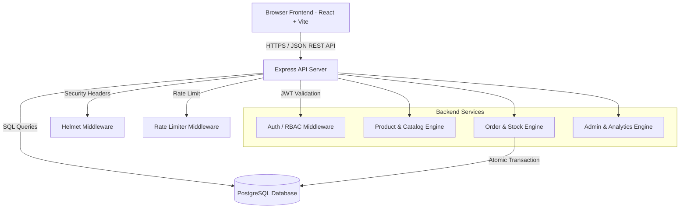
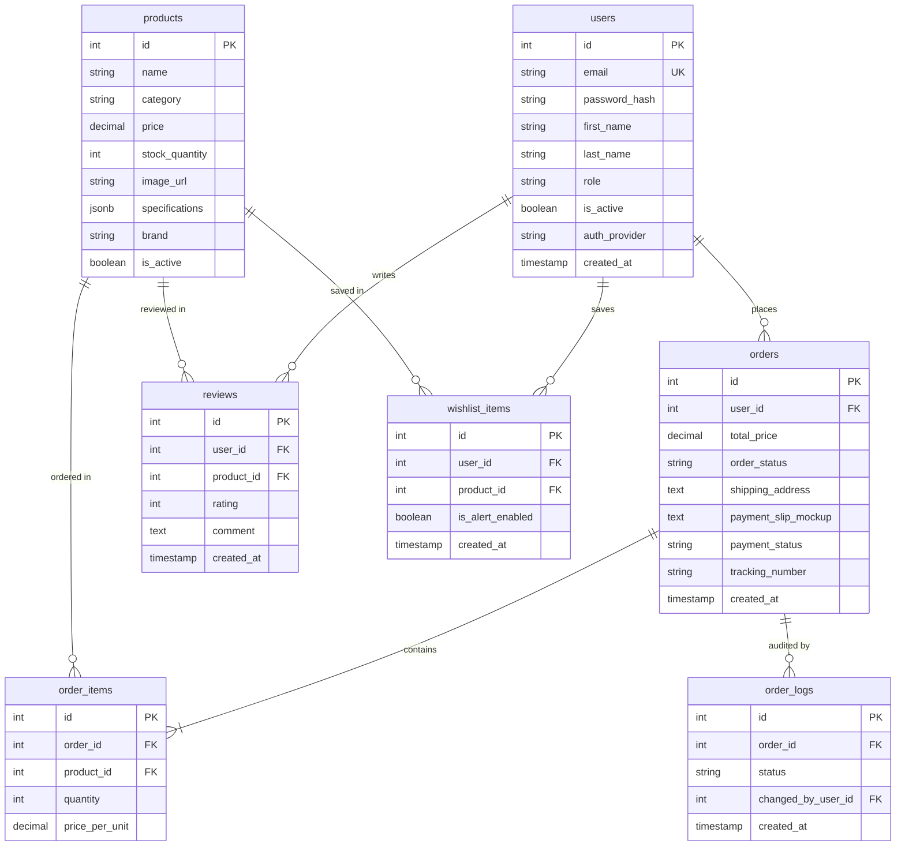

# 🏗️ ComHub System Architecture Document

## 1. System Overview
ComHub is an E-Commerce platform specialized in Computer Hardware, PC Parts, and Custom PC Assembly. The application is built using a modern decoupled architecture:

- **Frontend:** React (Vite) + Tailwind CSS + Lucide Icons
- **Backend:** Node.js + Express + TypeScript
- **Database:** PostgreSQL (7 relational tables)
- **Deployment:** Vercel Serverless / Static + Supabase PostgreSQL

---

## 2. Component Diagram

---

## 3. Database Entity Relationship (ER) Diagram

---

## 4. Security Architecture

1. **Authentication:** Native JWT authentication (`HS256`, 7-day expiration). Passwords hashed using `bcrypt` (10 rounds). Minimum password length enforced at 8 characters.
2. **Access Control (RBAC):** Role-based authorization (`Customer` vs `Admin`). Admin endpoints protected via `requireRole('Admin')` middleware.
3. **HTTP Security:** `helmet` security headers enabled. Strict CORS policy configuring permitted origins.
4. **Brute Force Protection:** `express-rate-limit` restricting sensitive authentication routes (`/api/auth/login`, `/api/auth/register`) to 5 requests per 15 minutes.
5. **Data Protection:** Parameterized SQL queries preventing SQL injection vulnerabilities.

---

## 5. Performance Optimizations

1. **Gzip / Brotli Compression:** `compression` middleware compressing API responses.
2. **Database Indexing:** B-Tree and GIN indexes on query fields (`category`, `is_active`, `specifications` JSONB, full-text vector on `name`).
3. **Client-side Optimization:** Client-side WebP image compression reducing uploaded slip sizes to $<100\text{ KB}$ before transmission.
4. **Vite Bundle Optimization:** Manual chunking separating vendor modules (`react`, `lucide-react`) for optimal HTTP caching.
