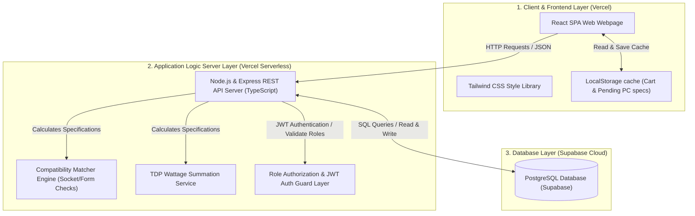

# ข้อมูลภาพรวมโครงการโดยละเอียด: ComHub (Project Codebase Overview) - MVP Version

เอกสารนี้รวบรวมรายละเอียดเชิงสถาปัตยกรรม การออกแบบระบบ และโครงสร้างความต้องการทั้งหมดของโครงการ **ComHub** (แพลตฟอร์มอีคอมเมิร์ซสำหรับจัดสเปคและจำหน่ายอุปกรณ์คอมพิวเตอร์ครบวงจร) เพื่อแสดงภาพรวมเชิงลึกสำหรับผู้พัฒนาและสอดคล้องกับวิชา **csi 204**

> **⚠️ Target Architecture — ยังไม่ได้ implement ทั้งหมด:** เอกสารนี้อธิบายสถาปัตยกรรมเป้าหมาย (Target Architecture) ของระบบ ไม่ใช่สถานะที่ implement จริงในปัจจุบัน สถานะปัจจุบัน: repo มีเฉพาะโฟลเดอร์ `FrontEnd/` ที่เขียนด้วย JavaScript (`.jsx`) — ยังไม่มี TypeScript, ยังไม่มี `backend/` directory, และยังไม่มี API/Supabase integration ใดๆ
> **📝 หมายเหตุ MVP Scope:** ระบบได้ปรับลดเป็น 2 บทบาทหลัก (Customer และ Admin) ตัด Staff และ Manager workflows, Pre-built Templates, Gallery, Burn-in Testing ออก

---

## 1. ข้อมูลแนะนำโครงการ (Project Summary)

ระบบ **ComHub (MVP)** ได้รับการพัฒนาขึ้นเพื่อแก้ปัญหาผู้บริโภคสินค้าไอทีที่ไม่ทราบข้อมูลการจัดสเปคคอมพิวเตอร์ให้สามารถจับคู่ทำงานร่วมกันได้อย่างสมบูรณ์ โดยโปรเจ็คนี้ได้รวมเอาระบบขายสินค้าออนไลน์ (E-Commerce) เข้ากับเครื่องมือจัดสเปคคอมพิวเตอร์อัจฉริยะ (Advanced PC Builder) ที่เช็คความเข้ากันได้ของพอร์ต/ซ็อกเก็ตและคำนวณกำลังการใช้พลังงานไฟฟ้าของชิ้นส่วนแบบกึ่งเรียลไทม์ (< 500ms) ตลอดจนมีระบบหลังบ้านสำหรับ Admin ในการจัดการสินค้า อนุมัติสลิปโอนเงิน อัปเดตสถานะออเดอร์ และดู Dashboard ภาพรวมธุรกิจ

---

## 2. โครงสร้างสถาปัตยกรรมระบบ (System Architecture)

ระบบการทำงานทำงานแบบ **3-Tier Architecture** ซึ่งแยกส่วนการทำงานออกจากกันผ่านเครือข่ายอินเทอร์เน็ต เพื่อให้ระบบมีความทนทานและพร้อมรับการปรับปรุงในอนาคต

> **📝 MVP หมายเหตุ:** สลิปโอนเงินและรูปสินค้าเก็บเป็น **Base64 WebP** (บีบอัดฝั่ง Client) ไม่พึ่งพา Cloud Storage Bucket ในเวอร์ชัน MVP

---

## 3. รายละเอียดสิทธิ์และการไหลของข้อมูลผู้ใช้ (Role-Based Features & Flow)

ระบบ MVP นี้รองรับผู้ใช้ **2 บทบาทหลัก (Actors)** ตาม `project-scope.md` (ตัด Staff และ Manager ออก):

### 3.1 ลูกค้า (Customer)
- **การเข้าชม (Catalog):** ค้นหา กรอง และจัดหมวดหมู่สินค้าไอที เปรียบเทียบสเปคเชิงลึกได้สูงสุด 3 อุปกรณ์พร้อมกัน (Client-side)
- **การจัดสเปค (Advanced PC Builder):** จัดสเปคคอมพิวเตอร์ทีละหมวดหมู่ (7 หมวด: CPU, Mainboard, GPU, RAM, SSD, Case, PSU) โดยระบบจะตรวจสอบความเข้ากันได้ทันที และแนะนำ PSU ที่วัตต์เพียงพอ
- **Wishlist & Review:** เพิ่มสินค้าโปรด (ไม่มี Stock Alert ใน MVP) และเขียนรีวิว 1-5 ดาว พร้อมข้อความ (ไม่มีการอัปโหลดรูป)
- **การสั่งซื้อ (Cart & Checkout):** เพิ่มสินค้าลงตะกร้า (LocalStorage), กรอกที่อยู่จัดส่ง, อัปโหลดสลิปโอนเงินแบบ Mockup (บีบอัด WebP 80% → Base64)
- **การติดตามออเดอร์ (Order Tracking):** ดูสถานะออเดอร์ 5 ขั้นตอน `[Pending Payment] → [Paid] → [Processing] → [Shipped] → [Delivered]` พร้อมประวัติล็อกและเลข Tracking Number

### 3.2 ผู้ดูแลระบบ (Admin)
- **ฐานข้อมูลสินค้า (Product CRUD - A-01):** เพิ่ม/แก้ไข/Soft Delete (`is_active`) ข้อมูลสินค้าและสเปคเทคนิค (JSONB) พร้อมอัปโหลดรูป WebP
- **การอนุมัติสลิป (Payment Review - A-02):** ตรวจสอบสลิปโอนเงินที่ลูกค้าอัปโหลด กด Approve/Reject เปลี่ยนสถานะออเดอร์เป็น `Paid` หรือ `Cancelled`
- **การจัดการออเดอร์ (Order Management - A-03):** ดู/อัปเดตสถานะออเดอร์ (Paid → Processing → Shipped → Delivered), กรอก Tracking Number, ยกเลิกออเดอร์
- **การควบคุมผู้ใช้ (Role & Access Control - A-04):** สร้างบัญชี Admin เพิ่มเติม, แก้ไขสิทธิ์ระหว่าง `Customer` และ `Admin`, ลบบัญชี
- **Dashboard (A-05):** ดูยอดขายรวม, สินค้ายอดนิยม, และเตือนสต็อกต่ำ (≤ 3 ชิ้น)

---

## 4. โครงสร้างข้อมูลและแบบจำลอง Entity (Data Model Specification)

ฐานข้อมูลใช้ **PostgreSQL (Supabase)** และประกอบด้วย **7 ตารางตาม MVP Scope** (ดูรายละเอียดใน `data-dictionary.md` และ `database-schema.md`):

1. **`users` (ข้อมูลผู้ใช้และสิทธิ์):**
   - ฟิลด์หลัก: `id`, `email`, `password_hash`, `first_name`, `last_name`, `role` (`Customer`/`Admin`), `auth_provider` (`native`), `created_at`
2. **`products` (รายละเอียดสินค้าไอที):**
   - ฟิลด์หลัก: `id`, `name`, `category` (CPU/Mainboard/GPU/RAM/SSD/Case/PSU), `price`, `stock_quantity`, `image_url`, `is_active` (Soft Delete: true = ขายปกติ, false = ปิดขาย/เลิกจำหน่าย)
   - ฟิลด์สเปคเช็ค Compatibility: `specifications` (JSONB) - เก็บโครงสร้างคุณสมบัติเฉพาะทางแบบยืดหยุ่น (เช่น `socket`, `form_factor`, `gpu_length_mm`, `max_gpu_length_mm`, `tdp`, `wattage`, `ram_type`, `supported_ram`)
3. **`orders` (คำสั่งซื้อและสถานะการชำระเงิน):**
   - ฟิลด์หลัก: `id`, `user_id`, `total_price`, `order_status` (5 ขั้น: `pending_payment` → `paid` → `processing` → `shipped` → `delivered` / เพิ่ม `cancelled`), `shipping_address`, `payment_slip_mockup` (Base64 WebP), `payment_status` (`pending`/`approved`/`rejected`), `tracking_number`, `created_at`
4. **`order_items` (รายการชิ้นส่วนในออเดอร์):**
   - ฟิลด์หลัก: `id`, `order_id`, `product_id`, `quantity`, `price_per_unit` (snapshot ราคา ณ เวลาสั่งซื้อ)
5. **`reviews` (การแสดงความคิดเห็นและดาว):**
   - ฟิลด์หลัก: `id`, `order_id`, `product_id`, `rating` (1-5), `comment`, `created_at` (MVP: ไม่มีการอัปโหลดรูปภาพ)
6. **`wishlist_items` (รายการสินค้าโปรด):**
   - ฟิลด์หลัก: `id`, `user_id`, `product_id`, `created_at` (MVP: ไม่มี Stock Alert)
7. **`order_logs` (ประวัติการเปลี่ยนสถานะออเดอร์):**
   - ฟิลด์หลัก: `id`, `order_id`, `status` (เช่น `Payment Approved`, `Processing`, `Shipped`), `changed_by_user_id` (Admin ที่กด), `created_at`

> **Client-side State (ไม่มีตารางใน DB):** Cart Items, Product Comparison List ทั้งคู่จัดเก็บใน LocalStorage / Session ใช้ JWT + httpOnly cookie แบบ stateless

---

## 5. ตรรกะการประมวลผลจัดสเปคคอมพิวเตอร์ (Core Engines Logic)

### 5.1 Compatibility Checker (ระบบตรวจสอบความเข้ากันได้)
เมื่อลูกค้ากดเลือกสินค้าในโมดูล PC Builder หน้าบ้านจะประเมินผล Logic ทันทีดังนี้:
1. **CPU & Mainboard Socket check:**
   - กรองแสดงเฉพาะบอร์ดที่มี Socket ตรงกับ CPU ที่เลือก
   - `Motherboard.specifications.socket == CPU.specifications.socket` (เช่น 'LGA1700' == 'LGA1700')
2. **Motherboard & Case Form Factor check:**
   - เคสคอมพิวเตอร์ที่เลือกต้องมีขนาดใหญ่พอที่จะรับฟอร์มแฟคเตอร์ของบอร์ดได้
   - `Case.specifications.form_factor` รองรับ `Motherboard.specifications.form_factor` (เช่น เคส ATX รองรับบอร์ด ATX/Micro-ATX/Mini-ITX)
3. **GPU & Case Length check:**
   - ความยาวของการ์ดจอต้องไม่ยาวเกินกว่าขนาดสูงสุดที่เคสรองรับ
   - `GPU.specifications.gpu_length <= Case.specifications.max_gpu_length`
4. **RAM & CPU & Motherboard Compatibility check (ระบบตรวจเช็คชนิดแรม):**
   - แรมและเมนบอร์ดต้องใช้พอร์ตหน่วยความจำชนิดเดียวกัน และ CPU ต้องมี Memory Controller ที่รองรับ
   - `Motherboard.specifications.ram_type == RAM.specifications.ram_type`
   - `CPU.specifications.supported_ram` (Array) ต้องมีค่า `RAM.specifications.ram_type` บรรจุอยู่ภายใน (เช่น `['DDR4', 'DDR5']` ครอบคลุม `'DDR5'`)

### 5.2 Wattage Calculator (ระบบคำนวณกำลังไฟวัตต์)
1. ดำเนินการรวบรวมค่า Thermal Design Power (TDP) ของชิ้นส่วนที่กินไฟหลักทั้งหมด
   - `TDP_Total = CPU.specifications.tdp + GPU.specifications.tdp + (แผงแรม/พัดลม/Storage ค่าคงตัวประมาณ 50W)`
2. ระบบจะคำนวณแถบวัดพลังงานไฟฟ้าสะสมและทำการกรองแสดงเฉพาะ PSU ที่มีกำลังวัตต์ผ่านเกณฑ์ความปลอดภัย
   - `PSU.specifications.wattage >= TDP_Total * 1.2` (คิดค่าเผื่อความปลอดภัย 20% เพื่อป้องกันไฟกระชาก)
