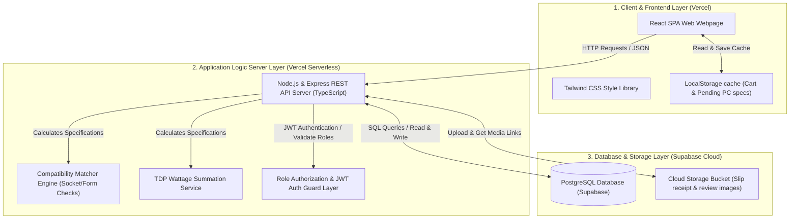

# ข้อมูลภาพรวมโครงการโดยละเอียด: ComHub (Project Codebase Overview)

เอกสารนี้รวบรวมรายละเอียดเชิงสถาปัตยกรรม การออกแบบระบบ และโครงสร้างความต้องการทั้งหมดของโครงการ **ComHub** (แพลตฟอร์มอีคอมเมิร์ซสำหรับจัดสเปคและจำหน่ายอุปกรณ์คอมพิวเตอร์ครบวงจร) เพื่อแสดงภาพรวมเชิงลึกสำหรับผู้พัฒนาและสอดคล้องกับวิชา **csi 204**

> **⚠️ Target Architecture — ยังไม่ได้ implement ทั้งหมด:** เอกสารนี้อธิบายสถาปัตยกรรมเป้าหมาย (Target Architecture) ของระบบ ไม่ใช่สถานะที่ implement จริงในปัจจุบัน สถานะปัจจุบัน: repo มีเฉพาะโฟลเดอร์ `FrontEnd/` ที่เขียนด้วย JavaScript (`.jsx`) — ยังไม่มี TypeScript, ยังไม่มี `backend/` directory, และยังไม่มี API/Supabase integration ใดๆ

---

## 1. ข้อมูลแนะนำโครงการ (Project Summary)

ระบบ **ComHub** ได้รับการพัฒนาขึ้นเพื่อแก้ปัญหาผู้บริโภคสินค้าไอทีที่ไม่ทราบข้อมูลการจัดสเปคคอมพิวเตอร์ให้สามารถจับคู่ทำงานร่วมกันได้อย่างสมบูรณ์ โดยโปรเจ็คนี้ได้รวมเอาระบบขายสินค้าออนไลน์ (E-Commerce) เข้ากับเครื่องมือจัดสเปคคอมพิวเตอร์อัจฉริยะ (Advanced PC Builder) ที่เช็คความเข้ากันได้ของพอร์ต/ซ็อกเก็ตและคำนวณกำลังการใช้พลังงานไฟฟ้าของชิ้นส่วนแบบกึ่งเรียลไทม์ ตลอดจนมีระบบหลังบ้านในการควบคุมคุณภาพการจัดเตรียมประกอบเครื่องพิกัด UAT ก่อนส่งของ

---

## 2. โครงสร้างสถาปัตยกรรมระบบ (System Architecture)

ระบบการทำงานทำงานแบบ **3-Tier Architecture** ซึ่งแยกส่วนการทำงานออกจากกันผ่านเครือข่ายอินเทอร์เน็ต เพื่อให้ระบบมีความทนทานและพร้อมรับการปรับปรุงในอนาคต

---

## 3. รายละเอียดสิทธิ์และการไหลของข้อมูลผู้ใช้ (Role-Based Features & Flow)

ระบบนี้รองรับผู้ใช้แบ่งออกเป็น 4 บทบาทหลัก (Actors) ที่มีสิทธิ์และฟังก์ชันการใช้งานดังนี้:

### 3.1 ลูกค้า (Customer)
- **การเข้าชม (Catalog):** ค้นหา กรอง และจัดหมวดหมู่สินค้าไอที เปรียบเทียบสเปคเชิงลึกได้สูงสุด 3 อุปกรณ์พร้อมกัน
- **การจัดสเปค (Advanced PC Builder):** จัดสเปคคอมพิวเตอร์ทีละหมวดหมู่ โดยระบบจะตรวจสอบความเข้ากันได้ทันที และแนะนำ PSU ที่วัตต์เพียงพอ
- **แกลเลอรี่คอมมูนิตี้ (Build Gallery):** เข้าชมภาพคอมพิวเตอร์ประกอบเสร็จของลูกค้ารายอื่นเพื่อหาแรงบันดาลใจ และกดเลือกสเปคนั้นๆ ไปแต่งต่อใน PC Builder ได้
- **การสั่งซื้อ (Checkout):** สั่งซื้อชิ้นส่วนหรือแบบให้ร้านประกอบให้ แนบหลักฐานสลิปการโอนเงิน และดูสถานะการประกอบ 4 ขั้นตอน: `[รับออเดอร์] -> [กำลังประกอบ] -> [กำลังเทสระบบ] -> [จัดส่งแล้ว]`

### 3.2 พนักงาน (Staff)
- **การจัดประกอบ (Assembly Management):** ดูเฉพาะใบสั่งซื้อที่เลือกตัวเลือก "ให้ร้านประกอบให้" เพื่อเข้าจัดการเตรียมประกอบ
- **ผลทดสอบความร้อน (Burn-in Test Recording):** ลงบันทึกอุณหภูมิและการประเมินการทำงานความเสถียรขั้นต้น (Burn-in Test) ลงระบบ
- **การจัดส่ง (Logistics):** ลงบันทึกเลขพัสดุ (Tracking Number) และเปลี่ยนสถานะคำสั่งซื้อเป็น "จัดส่งแล้ว" เพื่อแสดงผลให้ลูกค้าเห็น

### 3.3 ผู้จัดการ (Manager)
- **การตลาด (Pre-built Templates):** เพิ่ม/แก้ไข/ลบชุดคอมพิวเตอร์แนะนำของร้าน เพื่อให้ลูกค้ากดซื้อหรือจัดแต่งต่อได้ทันที
- **การอนุมัติสื่อ (Moderation):** ตรวจสอบและอนุมัติรูปถ่ายเคสคอมพิวเตอร์ประกอบเสร็จและรีวิวจากทางบ้าน ป้องกันภาพไม่เหมาะสมขึ้นโชว์หน้าเว็บบอร์ดสาธารณะ
- **รายงานสรุป (Dashboard):** ติดตามสรุปรายงานยอดขายสินค้า, ชิ้นส่วนสินค้าที่มียอดขายสูงสุด, และระดับสินค้าใกล้หมดสต็อก

### 3.4 ผู้ดูแลระบบ (Administrator)
- **ฐานข้อมูล (Database CRUD):** เพิ่ม ลด แก้ไข ข้อมูลสต็อกสินค้าหลักในระบบ
- **ข้อมูลสเปคสินค้า (Product Specifications):** ป้อนค่าข้อมูลสเปคของอุปกรณ์แต่ละชิ้น (เช่น socket, form factor, ค่า TDP) ผ่านฟังก์ชัน CRUD ปกติ โดยระบบจะคำนวณ Compatibility และ TDP ให้อัตโนมัติจากข้อมูลนี้ ไม่ต้องมีผู้ดูแลระบบมาตั้งค่ากฎแยกต่างหาก
- **การควบคุมผู้ใช้ (Access Control):** ควบคุมและเพิ่มบัญชีผู้ใช้งานให้พนักงานระดับ Staff และ Manager

---

## 4. โครงสร้างข้อมูลและแบบจำลอง Entity (Data Model Specification)

ฐานข้อมูลใช้ **PostgreSQL (Supabase)** ซึ่งประกอบด้วยตารางข้อมูลหลักที่เชื่อมโยงกันดังนี้:

1. **`Users` (ข้อมูลผู้ใช้และสิทธิ์):**
   - ฟิลด์หลัก: `id`, `email`, `password_hash`, `first_name`, `last_name`, `role` (Customer/Staff/Manager/Admin), `created_at`
2. **`Products` (รายละเอียดสินค้าไอที):**
   - ฟิลด์หลัก: `id`, `name`, `category` (CPU/GPU/RAM/MB/CASE/PSU/STORAGE), `price`, `stock_quantity`, `image_url`, `is_active` (สถานะการเปิดใช้งาน/ขายสินค้า: true = ขายปกติ, false = ปิดขาย/เลิกจำหน่าย)
   - ฟิลด์สเปคเช็ค Compatibility: `specifications` (JSONB) - เก็บโครงสร้างคุณสมบัติเฉพาะทางแบบยืดหยุ่น (เช่น socket, form_factor, gpu_length, max_gpu_length, tdp, wattage)
3. **`Orders` & `OrderItems` (คำสั่งซื้อสินค้าและจัดสเปค):**
   - ฟิลด์หลัก: `id`, `user_id`, `total_price`, `coupon_code`, `discount_amount`, `payment_status` (Pending/Approved/Rejected), `order_status` (Pending/Assembling/Testing/Shipped), `shipping_address`, `payment_slip_url`, `is_assembled` (ต้องการให้ร้านประกอบให้หรือไม่), `tracking_number`, `created_at`
4. **`Reviews` (การแสดงความคิดเห็นและรูปถ่าย):**
   - ฟิลด์หลัก: `id`, `order_id`, `product_id`, `rating` (1-5), `comment`, `review_image_url`, `status` (Pending/Approved)
5. **`PrebuiltTemplates` & `TemplateItems` (ชุดจัดสเปคแนะนำและการเชื่อมโยงชิ้นส่วน):**
   - `PrebuiltTemplates` (ตารางหลัก): `id`, `template_name`, `price_range_tag`, `description`, `created_at`
   - `TemplateItems` (ตารางเชื่อม Many-to-Many): `id`, `template_id`, `product_id`, `quantity`
6. **`WishlistItems` (รายการสินค้าโปรดและการแจ้งเตือนสต็อก):**
   - ฟิลด์หลัก: `id`, `user_id`, `product_id`, `is_alert_enabled` (ต้องการรับแจ้งเตือนเมื่อของเติมคลังหรือไม่), `created_at`
7. **`AssemblyRecords` (การบันทึกการประกอบและผล Burn-in):**
   - ฟิลด์หลัก: `id`, `order_id`, `staff_id`, `cpu_temperature`, `gpu_temperature`, `burn_in_status` (Pass/Fail), `notes`, `tested_at`
8. **`OrderLogs` (ประวัติการเปลี่ยนสถานะการสั่งซื้อ/ประกอบ):**
   - ฟิลด์หลัก: `id`, `order_id`, `status` (Pending/Assembling/Testing/Shipped), `changed_by_user_id` (ID ของ User ที่ทำการสลับสถานะ), `created_at`
9. **`GalleryPosts` (โพสต์ผลงานคอมพิวเตอร์ประกอบแกลเลอรี่สาธารณะ):**
   - ฟิลด์หลัก: `id`, `user_id`, `order_id` (เชื่อมโยงเพื่อดึงรายการสเปคสินค้าที่สั่งประกอบไปแสดงผลและให้เพื่อนคัดลอกต่อได้), `title` (ชื่อหัวข้อสเปคคอมฯ), `description` (รายละเอียดคำอธิบาย/รีวิว), `image_url` (ลิงก์รูปถ่ายเคสประกอบเสร็จใน Supabase), `status` (Pending/Approved/Pinned), `likes_count` (จำนวนไลก์), `created_at`

---

## 5. ตรรกะการประมวลผลจัดสเปคคอมพิวเตอร์ (Core Engines Logic)

### 5.1 Compatibility Checker (ระบบตรวจสอบความเข้ากันได้)
เมื่อลูกค้ากดเลือกสินค้าในโมดูล PC Builder หน้าบ้านจะประเมินผล Logic ทันทีดังนี้:
1. **CPU & Mainboard Socket check:**
   - กรองแสดงเฉพาะบอร์ดที่มี Socket ตรงกับ CPU ที่เลือก
   - `Motherboard.specifications.socket == CPU.specifications.socket` (เช่น 'LGA1700' == 'LGA1700')
2. **Motherboard & Case Form Factor check:**
   - เคสคอมพิวเตอร์ที่เลือกต้องมีขนาดใหญ่พอที่จะรับฟอร์มแฟคเตอร์ของบอร์ดได้
   - `Case.specifications.form_factor` รองรับ `Motherboard.specifications.form_factor` (เช่น เคส ATX รองรับบอร์ด ATX/Micro-ATX/Mini-ITX)
3. **GPU & Case Length check:**
   - ความยาวของการ์ดจอต้องไม่ยาวเกินกว่าขนาดสูงสุดที่เคสรองรับ
   - `GPU.specifications.gpu_length <= Case.specifications.max_gpu_length`
4. **RAM & CPU & Motherboard Compatibility check (ระบบตรวจเช็คชนิดแรม):**
   - แรมและเมนบอร์ดต้องใช้พอร์ตหน่วยความจำชนิดเดียวกัน และ CPU ต้องมี Memory Controller ที่รองรับ
   - `Motherboard.specifications.ram_type == RAM.specifications.ram_type`
   - `CPU.specifications.supported_ram` (Array) ต้องมีค่า `RAM.specifications.ram_type` บรรจุอยู่ภายใน (เช่น `['DDR4', 'DDR5']` ครอบคลุม `'DDR5'`)

### 5.2 Wattage Calculator (ระบบคำนวณกำลังไฟวัตต์)
1. ดำเนินการรวบรวมค่า Thermal Design Power (TDP) ของชิ้นส่วนที่กินไฟหลักทั้งหมด
   - `TDP_Total = CPU.specifications.tdp + GPU.specifications.tdp + (แผงแรม/พัดลม/Storage ค่าคงตัวประมาณ 50W)`
2. ระบบจะคำนวณแถบวัดพลังงานไฟฟ้าสะสมและทำการกรองแสดงเฉพาะ PSU ที่มีกำลังวัตต์ผ่านเกณฑ์ความปลอดภัย
   - `PSU.specifications.wattage >= TDP_Total * 1.2` (คิดค่าเผื่อความปลอดภัย 20% เพื่อป้องกันไฟกระชาก)
