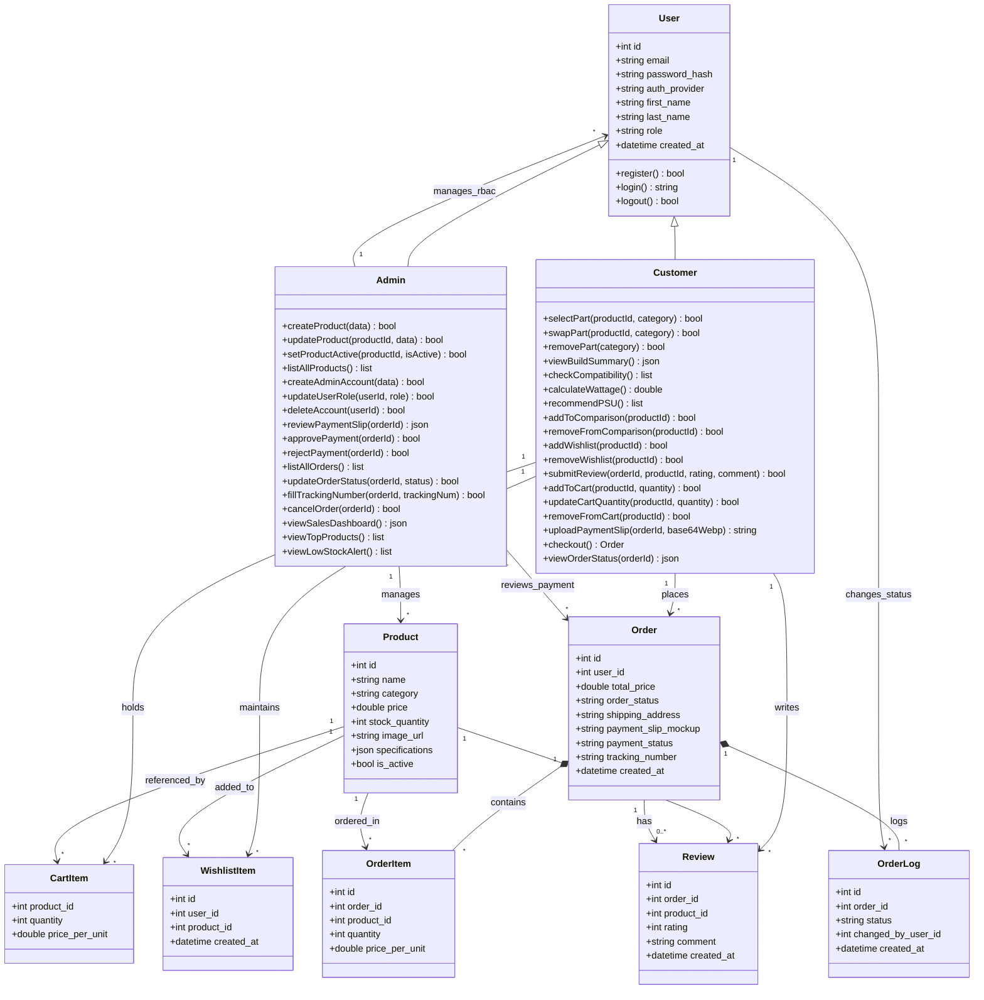

# แผนภาพ UML Diagrams (ระบบ ComHub) - MVP Version

หน้านี้รวมแผนภาพ UML ทั้งหมดของโครงการ ComHub แบบ **embed inline** เพื่อให้แสดงผลเป็นแผนภาพจริงทันทีบน GitHub และหน้าแสดงผล Markdown Preview ใน VS Code (โดยกดปุ่ม `Ctrl + Shift + V` หรือคลิกไอคอน Preview รูปแว่นขยายที่มุมขวาบน)

> **📝 หมายเหตุ MVP Scope:** แผนภาพทั้งสองครอบคลุมเพียง **2 Actors** (Customer, Admin) ตาม `project-scope.md` ตัด Staff, Manager, Gallery, Templates, Burn-in, Coupon, Stock Alert, Review Photos ออกจากเวอร์ชันก่อน
>
> **📂 Source of truth:** ไฟล์ต้นฉบับที่ใช้แก้ไข diagram อยู่ที่ [`usecasediagram.mermaid`](./usecasediagram.mermaid) และ [`classdiagram.mermaid`](./classdiagram.mermaid) — โค้ดด้านล่างในไฟล์นี้เป็น mirror ที่ใช้เพื่อแสดงผลบน GitHub เท่านั้น หากมีการแก้ไข ควรแก้ที่ไฟล์ต้นฉบับด้วยเสมอ

---

## 1. Use Case Diagram (แผนภาพแสดงสิทธิ์การเข้าใช้ฟังก์ชัน)

แสดง **2 Actors** (Customer, Admin) และฟังก์ชันการใช้งานที่แต่ละบทบาทเข้าถึงได้ ครอบคลุมทั้ง Functional IDs: SYS-01..04, C-01, C-02, C-03, C-05, C-06, C-07, C-09, C-10, A-01..A-05

```mermaid
%% ComHub - Use Case Diagram (MVP Version)
%% MVP Scope: 2 Actors (Customer, Admin)
graph LR
    classDef actor fill:#0f172a,stroke:#38bdf8,stroke-width:2px,color:#fff;
    classDef baseUC fill:#0369a1,stroke:#bae6fd,stroke-width:1.5px,color:#fff;
    classDef subUC fill:#0f172a,stroke:#10b981,stroke-width:1.2px,color:#fff;
    classDef adminUC fill:#b91c1c,stroke:#fecaca,stroke-width:1.5px,color:#fff;

    Customer["ลูกค้า<br>(Customer)"]:::actor
    Admin["ผู้ดูแลระบบ<br>(Admin)"]:::actor

    subgraph ComHub_System ["ระบบ ComHub (System Boundary)"]

        subgraph Customer_Flow ["1. ลูกค้า (Customer)"]
            C_Register("สมัครสมาชิก<br>(Register)"):::baseUC
            C_Login("ล็อกอินเข้าสู่ระบบ<br>(Login)"):::baseUC
            C_Builder("จัดสเปคคอมพิวเตอร์<br>(PC Builder)"):::baseUC
            C_Compat("ตรวจสอบความเข้ากันได้<br>(Compatibility Checker)"):::baseUC
            C_Wattage("คำนวณกำลังไฟ<br>(Wattage Calculator)"):::baseUC
            C_Compare("เปรียบเทียบสินค้า<br>(Product Comparison)"):::baseUC
            C_Wishlist("บันทึกสินค้าโปรด<br>(Wishlist)"):::baseUC
            C_Review("เขียนรีวิว<br>(Review 1-5 ดาว)"):::baseUC
            C_Cart("ตะกร้าสินค้าและสั่งซื้อ<br>(Cart & Checkout)"):::baseUC
            C_Track("ติดตามสถานะออเดอร์<br>(Order Tracking)"):::baseUC

            C_SelectPart("เลือกชิ้นส่วน (7 หมวด)"):::subUC
            C_SwapPart("เปลี่ยนชิ้นส่วน"):::subUC
            C_RemovePart("ลบชิ้นส่วน"):::subUC
            C_ViewSummary("ดูสรุปสเปค"):::subUC

            C_CheckSocket("ตรวจสอบ Socket"):::subUC
            C_CheckCaseSize("ตรวจสอบขนาดเคส"):::subUC
            C_CheckGpuSize("ตรวจสอบขนาดการ์ดจอ"):::subUC
            C_CheckRamType("ตรวจสอบชนิด RAM (DDR4/DDR5)"):::subUC

            C_ViewTDP("ดูผลคำนวณ TDP"):::subUC
            C_RecommendPSU("แนะนำ PSU (TDP × 1.2)"):::subUC

            C_AddCompare("เพิ่มสินค้าเข้าเปรียบเทียบ"):::subUC
            C_ViewCompareTable("ดูตารางเปรียบเทียบ"):::subUC
            C_RemoveCompare("ลบสินค้าจากการเปรียบเทียบ"):::subUC

            C_AddWishlist("เพิ่มสินค้าเข้า Wishlist"):::subUC
            C_RemoveWishlist("ลบสินค้าจาก Wishlist"):::subUC

            C_WriteReview("เขียนรีวิวใหม่ (1-5 ดาว + ข้อความ)"):::subUC
            C_ViewReview("ดูรีวิวสินค้า"):::subUC

            C_AddCart("เพิ่มสินค้าลงตะกร้า (LocalStorage)"):::subUC
            C_EditQty("แก้ไขจำนวน"):::subUC
            C_RemoveCart("ลบสินค้าจากตะกร้า"):::subUC
            C_FillAddress("กรอกที่อยู่จัดส่ง"):::subUC
            C_UploadSlip("อัปโหลดสลิปโอนเงิน (WebP + Base64)"):::subUC

            C_ViewStatus("ดูสถานะ 5 ขั้น"):::subUC
            C_ViewLogHistory("ดูประวัติล็อก"):::subUC
            C_ViewTrackingNo("ดูเลข Tracking"):::subUC

            C_Builder -.->|"«include»"| C_SelectPart
            C_SwapPart -.->|"«extend»"| C_Builder
            C_RemovePart -.->|"«extend»"| C_Builder
            C_Builder -.->|"«include»"| C_ViewSummary

            C_Compat -.->|"«include»"| C_CheckSocket
            C_Compat -.->|"«include»"| C_CheckCaseSize
            C_Compat -.->|"«include»"| C_CheckGpuSize
            C_Compat -.->|"«include»"| C_CheckRamType
            C_Builder -.->|"«include»"| C_Compat

            C_Wattage -.->|"«include»"| C_ViewTDP
            C_Wattage -.->|"«include»"| C_RecommendPSU
            C_Builder -.->|"«include»"| C_Wattage

            C_Compare -.->|"«include»"| C_AddCompare
            C_Compare -.->|"«include»"| C_ViewCompareTable
            C_Compare -.->|"«extend»"| C_RemoveCompare

            C_Wishlist -.->|"«include»"| C_AddWishlist
            C_Wishlist -.->|"«extend»"| C_RemoveWishlist

            C_Review -.->|"«include»"| C_WriteReview
            C_Review -.->|"«include»"| C_ViewReview

            C_Cart -.->|"«include»"| C_AddCart
            C_EditQty -.->|"«extend»"| C_Cart
            C_RemoveCart -.->|"«extend»"| C_Cart
            C_Cart -.->|"«include»"| C_FillAddress
            C_Cart -.->|"«include»"| C_UploadSlip

            C_Track -.->|"«include»"| C_ViewStatus
            C_Track -.->|"«extend»"| C_ViewLogHistory
            C_Track -.->|"«extend»"| C_ViewTrackingNo
        end

        subgraph Admin_Flow ["2. ผู้ดูแลระบบ (Admin)"]
            A_Login("ล็อกอินเข้าสู่ระบบแอดมิน<br>(Login)"):::baseUC
            A_Database("จัดการคลังสินค้า<br>(Product CRUD)"):::adminUC
            A_Access("จัดการสิทธิ์ผู้ใช้<br>(Role & Access Control)"):::adminUC
            A_Payment("อนุมัติสลิปโอนเงิน<br>(Payment Review)"):::adminUC
            A_Order("จัดการออเดอร์<br>(Order Management)"):::adminUC
            A_Dashboard("แดชบอร์ดยอดขาย<br>(Dashboard & Reports)"):::adminUC

            A_AddProduct("เพิ่มสินค้า"):::subUC
            A_EditProduct("แก้ไขสินค้า"):::subUC
            A_SoftDelete("ปิดขายสินค้า (Soft Delete)"):::subUC
            A_ReEnable("เปิดขายสินค้าอีกครั้ง"):::subUC
            A_ViewAll("ดูรายการสินค้าทั้งหมด"):::subUC
            A_UploadImg("อัปโหลดรูป WebP"):::subUC

            A_ManageAccounts("สร้างบัญชี Admin"):::subUC
            A_EditPermission("แก้ไขสิทธิ์ (Customer ↔ Admin)"):::subUC
            A_DeleteAccount("ลบบัญชี"):::subUC

            A_ViewPending("ดูสลิปรอตรวจ"):::subUC
            A_ApprovePay("อนุมัติการชำระเงิน (Approved)"):::subUC
            A_RejectPay("ปฏิเสธการชำระเงิน (Rejected)"):::subUC

            A_ViewOrders("ดูรายการออเดอร์ทั้งหมด"):::subUC
            A_UpdateStatus("อัปเดตสถานะ (Paid → Shipped)"):::subUC
            A_FillTracking("กรอก Tracking Number"):::subUC
            A_CancelOrder("ยกเลิกออเดอร์"):::subUC

            A_SalesChart("ดูยอดขายรวม"):::subUC
            A_TopProduct("ดูสินค้ายอดนิยม"):::subUC
            A_LowStock("ดูเตือนสต็อกต่ำ (≤ 3)"):::subUC

            A_Database -.->|"«include»"| A_ViewAll
            A_Database -.->|"«extend»"| A_AddProduct
            A_Database -.->|"«extend»"| A_EditProduct
            A_Database -.->|"«extend»"| A_SoftDelete
            A_Database -.->|"«extend»"| A_ReEnable
            A_AddProduct -.->|"«include»"| A_UploadImg
            A_EditProduct -.->|"«extend»"| A_UploadImg

            A_Access -.->|"«include»"| A_ManageAccounts
            A_Access -.->|"«extend»"| A_EditPermission
            A_Access -.->|"«extend»"| A_DeleteAccount

            A_Payment -.->|"«include»"| A_ViewPending
            A_Payment -.->|"«extend»"| A_ApprovePay
            A_Payment -.->|"«extend»"| A_RejectPay

            A_Order -.->|"«include»"| A_ViewOrders
            A_Order -.->|"«extend»"| A_UpdateStatus
            A_Order -.->|"«extend»"| A_FillTracking
            A_Order -.->|"«extend»"| A_CancelOrder

            A_Dashboard -.->|"«include»"| A_SalesChart
            A_Dashboard -.->|"«include»"| A_TopProduct
            A_Dashboard -.->|"«include»"| A_LowStock
        end
    end

    Customer ~~~ Admin

    Customer ---> C_Register
    Customer ---> C_Login
    Customer ---> C_Builder

    Customer ---> C_Compat
    Customer ---> C_Wattage
    Customer ---> C_Compare
    Customer ---> C_Wishlist
    Customer ---> C_Review
    Customer ---> C_Cart
    Customer ---> C_Track

    Admin ---> A_Login
    Admin ---> A_Database
    Admin ---> A_Access
    Admin ---> A_Payment
    Admin ---> A_Order
    Admin ---> A_Dashboard
```

---

## 2. Class Diagram (แผนภาพโครงสร้างข้อมูลและความสัมพันธ์)

แสดงโครงสร้าง Class และความสัมพันธ์ของข้อมูลใน 7 ตาราง MVP (users, products, orders, order_items, reviews, wishlist_items, order_logs) พร้อม CartItem (Client-side / LocalStorage)

