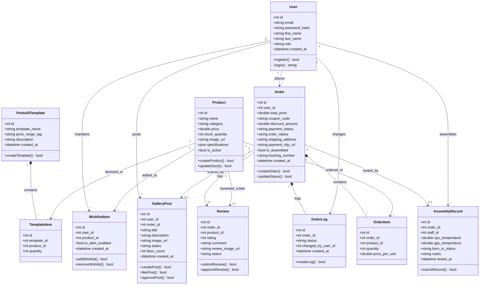

# แผนภาพ UML Diagrams (ระบบ ComHub)

หน้านี้รวมแผนภาพ UML Use Case Diagram และ Class Diagram ของโครงการ ComHub ซึ่งสามารถดูภาพ Render ได้ทันทีผ่านหน้าแสดงผล Markdown Preview ใน VS Code (โดยกดปุ่ม `Ctrl + Shift + V` หรือคลิกไอคอน Preview รูปแว่นขยายที่มุมขวาบน)

---

## 1. Use Case Diagram (แผนภาพแสดงสิทธิ์การเข้าใช้ฟังก์ชัน)

```mermaid
graph LR
    %% Styling Configuration
    classDef actor fill:#0f172a,stroke:#38bdf8,stroke-width:2px,color:#fff;
    classDef baseUC fill:#0369a1,stroke:#bae6fd,stroke-width:1.5px,color:#fff;
    classDef subUC fill:#0f172a,stroke:#10b981,stroke-width:1.2px,color:#fff;
    classDef staffUC fill:#047857,stroke:#a7f3d0,stroke-width:1.5px,color:#fff;
    classDef managerUC fill:#b45309,stroke:#fde68a,stroke-width:1.5px,color:#fff;
    classDef adminUC fill:#b91c1c,stroke:#fecaca,stroke-width:1.5px,color:#fff;
  
    %% Actors
    Customer["ลูกค้า<br>(Customer)"]:::actor
    Staff["พนักงาน<br>(Staff)"]:::actor
    Manager["ผู้จัดการ<br>(Manager)"]:::actor
    Admin["ผู้ดูแลระบบ<br>(Admin)"]:::actor

    %% System Boundary
    subgraph ComHub_System ["ระบบ ComHub (System Boundary)"]
      
        %% --- CUSTOMER WORKFLOW ---
        subgraph Customer_Flow ["1. ฟังก์ชันฝั่งลูกค้า (Customer Use Cases)"]
            %% Base Use Cases
            C_Register("สมัครสมาชิก"):::baseUC
            C_Login("เข้าสู่ระบบ"):::baseUC
            C_Profile("จัดการข้อมูลส่วนตัว"):::baseUC
            C_Browse("ค้นหา & ดูสินค้า"):::baseUC
            C_Compare("เปรียบเทียบสเปคสินค้า"):::baseUC
            C_Builder("จัดสเปคคอมพิวเตอร์<br>(PC Builder)"):::baseUC
            C_Cart("จัดการตะกร้าสินค้า"):::baseUC
            C_Order("สั่งซื้อสินค้า"):::baseUC
            C_Pay("ชำระเงิน"):::baseUC
            C_Track("ติดตามสถานะการประกอบ"):::baseUC
            C_Review("รีวิวสินค้า & ให้คะแนน"):::baseUC
            C_Wishlist("จัดการรายการโปรด (Wishlist)"):::baseUC
          
            %% Included/Extended Use Cases
            C_Verify("ยืนยันตัวตน<br>(อีเมล/เบอร์โทร)"):::subUC
            C_EditProfile("แก้ไขข้อมูลส่วนตัว"):::subUC
            C_SelectPart("เลือกสินค้าทีละหมวดหมู่"):::subUC
            C_CheckCompat("คำนวณความเข้ากันได้"):::subUC
            C_CalcTDP("คำนวณกำลังไฟ (TDP)"):::subUC
            C_SumPrice("คำนวณราคารวม"):::subUC
            C_Coupon("ใช้โค้ดส่วนลด"):::subUC
            C_Address("เลือกที่อยู่จัดส่ง"):::subUC
            C_SelectPay("เลือกวิธีชำระเงิน"):::subUC
            C_UploadSlip("อัปโหลดภาพสลิป WebP"):::subUC
            C_UploadReviewImg("แนบรูปถ่ายประกอบรีวิว"):::subUC
          
            %% Relations inside Customer
            C_Register -.->|"<<include>>"| C_Verify
            C_Profile -.->|"<<include>>"| C_EditProfile
            C_Builder -.->|"<<include>>"| C_SelectPart
            C_Builder -.->|"<<include>>"| C_CheckCompat
            C_Builder -.->|"<<include>>"| C_CalcTDP
            C_Builder -.->|"<<include>>"| C_SumPrice
            C_Cart -.->|"<<include>>"| C_SumPrice
            C_Cart -.->|"<<extend>>"| C_Coupon
            C_Order -.->|"<<include>>"| C_Address
            C_Pay -.->|"<<include>>"| C_SelectPay
            C_Pay -.->|"<<include>>"| C_UploadSlip
            C_Review -.->|"<<extend>>"| C_UploadReviewImg
        end
      
        %% --- STAFF WORKFLOW ---
        subgraph Staff_Flow ["2. ฟังก์ชันฝั่งพนักงาน (Staff Use Cases)"]
            S_CheckOrder("ตรวจสอบคำสั่งซื้อ"):::staffUC
            S_Assembly("จัดการการประกอบคอมฯ"):::staffUC
            S_BurnIn("บันทึกผลการทดสอบระบบ"):::staffUC
            S_Logistics("จัดการขนส่ง & พัสดุ"):::staffUC
          
            S_CheckSpec("ตรวจสอบสเปคของเครื่อง"):::subUC
            S_UpdateStep("อัปเดตขั้นตอน (4 ขั้นตอน)"):::subUC
            S_TempRecord("บันทึกอุณหภูมิ & ความเสถียร"):::subUC
            S_Bill("ออกใบจัดส่งสินค้า"):::subUC
            S_Tracking("กรอกหมายเลขพัสดุ (Tracking)"):::subUC
          
            S_CheckOrder -.->|"<<include>>"| S_CheckSpec
            S_Assembly -.->|"<<include>>"| S_UpdateStep
            S_BurnIn -.->|"<<include>>"| S_TempRecord
            S_Logistics -.->|"<<include>>"| S_Bill
            S_Logistics -.->|"<<include>>"| S_Tracking
        end
      
        %% --- MANAGER WORKFLOW ---
        subgraph Manager_Flow ["3. ฟังก์ชันฝั่งผู้จัดการ (Manager Use Cases)"]
            M_Templates("จัดการเทมเพลตแนะนำ"):::managerUC
            M_Moderation("คัดกรองแกลเลอรี่รีวิว"):::managerUC
            M_Dashboard("ตรวจสอบแดชบอร์ดร้าน"):::managerUC
          
            M_EditParts("เพิ่ม/แก้ไขชิ้นส่วนเทมเพลต"):::subUC
            M_ApproveImg("ตรวจสอบ & อนุมัติรูปภาพ"):::subUC
            M_Pin("ปักหมุดสเปคเด่นขึ้นหน้าแรก"):::subUC
            M_AnalyzeSales("วิเคราะห์ยอดขาย/สินค้าขายดี"):::subUC
            M_AlertStock("ตรวจสอบสต็อกใกล้หมด"):::subUC
          
            M_Templates -.->|"<<include>>"| M_EditParts
            M_Moderation -.->|"<<include>>"| M_ApproveImg
            M_Moderation -.->|"<<extend>>"| M_Pin
            M_Dashboard -.->|"<<include>>"| M_AnalyzeSales
            M_Dashboard -.->|"<<include>>"| M_AlertStock
        end
      
        %% --- ADMIN WORKFLOW ---
        subgraph Admin_Flow ["4. ฟังก์ชันฝั่งผู้ดูแลระบบ (Admin Use Cases)"]
            A_Products("จัดการฐานข้อมูลสินค้า"):::adminUC
            A_Specs("ตั้งค่ากฎเทคนิคระบบ"):::adminUC
            A_Users("จัดการผู้ใช้งานหลังบ้าน (RBAC)"):::adminUC
          
            A_CRUD("เพิ่ม/ลด/แก้ไขข้อมูลในสต็อก"):::subUC
            A_Socket("ตั้งคู่แอตทริบิวต์ Socket"):::subUC
            A_TDP("ระบุค่ากินไฟ TDP ทุกลำดับ"):::subUC
            A_CreateStaff("สร้างบัญชีพนักงาน Staff/Manager"):::subUC
            A_SetMenu("กำหนดสิทธิ์การเข้าถึงเมนู"):::subUC
          
            A_Products -.->|"<<include>>"| A_CRUD
            A_Specs -.->|"<<include>>"| A_Socket
            A_Specs -.->|"<<include>>"| A_TDP
            A_Users -.->|"<<include>>"| A_CreateStaff
            A_Users -.->|"<<include>>"| A_SetMenu
        end
      
    end

    %% Actor Connections to Base Use Cases (Left to Center)
    Customer ---> C_Register
    Customer ---> C_Login
    Customer ---> C_Profile
    Customer ---> C_Browse
    Customer ---> C_Compare
    Customer ---> C_Builder
    Customer ---> C_Cart
    Customer ---> C_Order
    Customer ---> C_Pay
    Customer ---> C_Track
    Customer ---> C_Review
    Customer ---> C_Wishlist

    %% Staff Connections (Right to Center)
    S_CheckOrder ---> Staff
    S_Assembly ---> Staff
    S_BurnIn ---> Staff
    S_Logistics ---> Staff

    %% Manager Connections (Right to Center)
    M_Templates ---> Manager
    M_Moderation ---> Manager
    M_Dashboard ---> Manager

    %% Admin Connections (Right to Center)
    A_Products ---> Admin
    A_Specs ---> Admin
    A_Users ---> Admin
```

---

## 2. Class Diagram (แผนภาพโครงสร้างข้อมูลและความสัมพันธ์)

