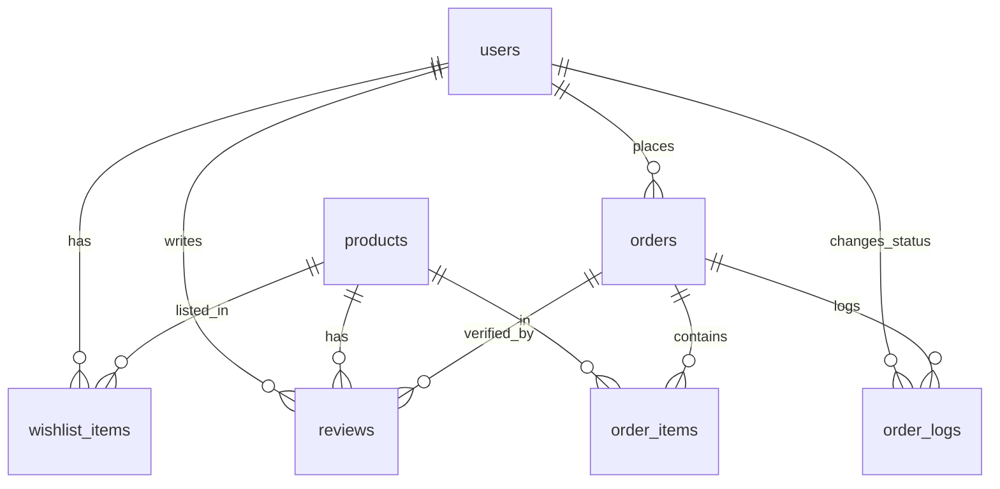

# Database Schema Design - ComHub MVP

**Tech Stack:** PostgreSQL (raw SQL with `pg` library)
**Version:** 1.1 - MVP Scope (aligned with `data-dictionary.md`)
**Last Updated:** 2026

---

## 📋 Table of Contents
1. [Overview](#overview)
2. [ER Diagram](#er-diagram)
3. [Tables Schema](#tables-schema)
4. [Relationships](#relationships)
5. [Indexes](#indexes)
6. [Sample Queries](#sample-queries)

---

## Overview

**Total Tables:** 7 tables (MVP aligned with `data-dictionary.md`)
**Roles:** Customer, Admin
**Authentication:** Native (email/password) + Google OAuth 2.0

> **📝 หมายเหตุ MVP Scope:** Cart, Product Comparison, และ Session (refresh token) จัดเก็บที่ **Client-side (LocalStorage / JWT)** ไม่มีตารางใน DB / สลิปโอนเงินเก็บเป็น **Base64 WebP ในตาราง `orders`** ไม่แยกตาราง `payments` / ตัดตาราง `prebuilt_templates`, `template_items`, `assembly_records`, `gallery_posts` ออกจาก scope เดิม

### Database Structure:
```
Auth & Users (1 table)
└── users

Product Catalog (1 table)
└── products (specs stored as JSONB)

Customer Features (2 tables)
├── wishlist_items
└── reviews

Orders (3 tables)
├── orders (payment slip embedded as Base64 WebP)
├── order_items
└── order_logs (audit trail)
```

---

## ER Diagram



---

## Tables Schema

### 1. users
```sql
CREATE TABLE users (
    id SERIAL PRIMARY KEY,
    email VARCHAR(255) UNIQUE NOT NULL,
    password_hash VARCHAR(255),                       -- NULL for Google OAuth users
    first_name VARCHAR(100) NOT NULL,
    last_name VARCHAR(100) NOT NULL,
    role VARCHAR(50) NOT NULL DEFAULT 'Customer'
        CHECK (role IN ('Customer', 'Admin')),
    auth_provider VARCHAR(20) NOT NULL DEFAULT 'native'
        CHECK (auth_provider IN ('native', 'google')),
    google_id VARCHAR(255) UNIQUE,                    -- Google User ID (NULL for native)
    created_at TIMESTAMP NOT NULL DEFAULT CURRENT_TIMESTAMP
);

CREATE INDEX idx_users_email ON users(email);
CREATE INDEX idx_users_google_id ON users(google_id);
CREATE INDEX idx_users_role ON users(role);
```

**Notes:**
- `password_hash` is NULL when `auth_provider = 'google'`
- Only 2 roles in MVP: `Customer`, `Admin` (no Staff/Manager)

---

### 2. products
```sql
CREATE TABLE products (
    id SERIAL PRIMARY KEY,
    name VARCHAR(255) NOT NULL,
    category VARCHAR(50) NOT NULL
        CHECK (category IN ('CPU', 'Mainboard', 'GPU', 'RAM', 'SSD', 'Case', 'PSU')),
    price DECIMAL(10, 2) NOT NULL CHECK (price >= 0),
    stock_quantity INT NOT NULL DEFAULT 0 CHECK (stock_quantity >= 0),
    image_url VARCHAR(500),                           -- WebP image URL
    specifications JSONB NOT NULL DEFAULT '{}',       -- Flexible tech specs
    is_active BOOLEAN NOT NULL DEFAULT TRUE           -- Soft delete flag
);

CREATE INDEX idx_products_category ON products(category);
CREATE INDEX idx_products_active ON products(is_active);
CREATE INDEX idx_products_specs ON products USING GIN (specifications);
CREATE INDEX idx_products_name ON products USING GIN (to_tsvector('simple', name));
```

**Example JSONB structure (`specifications`):**
```json
{
  "socket": "LGA1700",
  "tdp": 125,
  "supported_ram": ["DDR4", "DDR5"],
  "cores": 16,
  "threads": 24,
  "boost_clock_ghz": 5.2
}
```

**Notes:**
- 7 categories tied to PC Builder scope (`CPU`, `Mainboard`, `GPU`, `RAM`, `SSD`, `Case`, `PSU`)
- Compatibility Checker และ Wattage Calculator ใช้ JSONB นี้เป็นหลัก
- `is_active = false` = Soft Delete (Admin ปิดขาย แต่ยังเก็บประวัติออเดอร์)

---

### 3. orders
```sql
CREATE TABLE orders (
    id SERIAL PRIMARY KEY,
    user_id INT NOT NULL REFERENCES users(id) ON DELETE RESTRICT,
    total_price DECIMAL(10, 2) NOT NULL CHECK (total_price >= 0),
    order_status VARCHAR(50) NOT NULL DEFAULT 'pending_payment'
        CHECK (order_status IN (
            'pending_payment',
            'paid',
            'processing',
            'shipped',
            'delivered',
            'cancelled'
        )),
    shipping_address TEXT NOT NULL,
    payment_slip_mockup TEXT,                         -- Base64 encoded WebP image (mockup)
    payment_status VARCHAR(50) NOT NULL DEFAULT 'pending'
        CHECK (payment_status IN ('pending', 'approved', 'rejected')),
    tracking_number VARCHAR(100),
    created_at TIMESTAMP NOT NULL DEFAULT CURRENT_TIMESTAMP
);

CREATE INDEX idx_orders_user ON orders(user_id);
CREATE INDEX idx_orders_status ON orders(order_status);
CREATE INDEX idx_orders_payment_status ON orders(payment_status);
CREATE INDEX idx_orders_created ON orders(created_at DESC);
```

**Notes:**
- Order Status flow (5 ขั้น MVP): `pending_payment` → `paid` → `processing` → `shipped` → `delivered`
- `payment_slip_mockup` = Base64 WebP (บีบอัดฝั่ง client, ไม่ใช่การอัปโหลดจริง — SYS-04)
- Slip เก็บใน `orders` โดยตรง (ไม่แยกตาราง `payments` ตาม data-dictionary)

---

### 4. order_items
```sql
CREATE TABLE order_items (
    id SERIAL PRIMARY KEY,
    order_id INT NOT NULL REFERENCES orders(id) ON DELETE CASCADE,
    product_id INT NOT NULL REFERENCES products(id) ON DELETE RESTRICT,
    quantity INT NOT NULL DEFAULT 1 CHECK (quantity > 0),
    price_per_unit DECIMAL(10, 2) NOT NULL CHECK (price_per_unit >= 0)
);

CREATE INDEX idx_order_items_order ON order_items(order_id);
CREATE INDEX idx_order_items_product ON order_items(product_id);
```

**Notes:**
- `price_per_unit` = snapshot ราคา ณ ตอนสั่งซื้อ (ป้องกันปัญหาราคาสินค้าเปลี่ยนภายหลัง)

---

### 5. reviews
```sql
CREATE TABLE reviews (
    id SERIAL PRIMARY KEY,
    order_id INT NOT NULL REFERENCES orders(id) ON DELETE CASCADE,
    product_id INT NOT NULL REFERENCES products(id) ON DELETE CASCADE,
    rating INT NOT NULL CHECK (rating BETWEEN 1 AND 5),
    comment TEXT,
    created_at TIMESTAMP NOT NULL DEFAULT CURRENT_TIMESTAMP
);

CREATE INDEX idx_reviews_product ON reviews(product_id);
CREATE INDEX idx_reviews_order ON reviews(order_id);
CREATE INDEX idx_reviews_rating ON reviews(rating);
```

**Notes:**
- ไม่มีการอัปโหลดรูปภาพใน MVP (C-07 "No Photos")
- ผูก `order_id` เพื่อบังคับว่ารีวิวได้เฉพาะสินค้าที่ซื้อจริง (Review Guard)

---

### 6. wishlist_items
```sql
CREATE TABLE wishlist_items (
    id SERIAL PRIMARY KEY,
    user_id INT NOT NULL REFERENCES users(id) ON DELETE CASCADE,
    product_id INT NOT NULL REFERENCES products(id) ON DELETE CASCADE,
    created_at TIMESTAMP NOT NULL DEFAULT CURRENT_TIMESTAMP,
    UNIQUE(user_id, product_id)
);

CREATE INDEX idx_wishlist_user ON wishlist_items(user_id);
CREATE INDEX idx_wishlist_product ON wishlist_items(product_id);
```

**Notes:**
- MVP: **ไม่มี Stock Alert** (ตัด `is_alert_enabled` ออก)
- UNIQUE constraint ป้องกัน user เพิ่มสินค้าซ้ำ

---

### 7. order_logs (Audit Trail)
```sql
CREATE TABLE order_logs (
    id SERIAL PRIMARY KEY,
    order_id INT NOT NULL REFERENCES orders(id) ON DELETE CASCADE,
    status VARCHAR(100) NOT NULL,                     -- e.g. 'Payment Approved', 'Processing', 'Shipped'
    changed_by_user_id INT NOT NULL REFERENCES users(id) ON DELETE RESTRICT,
    created_at TIMESTAMP NOT NULL DEFAULT CURRENT_TIMESTAMP
);

CREATE INDEX idx_order_logs_order ON order_logs(order_id);
CREATE INDEX idx_order_logs_created ON order_logs(created_at DESC);
```

**Notes:**
- Audit trail: ทุกครั้งที่ Admin กดอนุมัติสลิป/สลับสถานะ ให้ insert log อัตโนมัติ
- ใช้แสดง Timeline บนหน้า Customer Order Tracking (C-09)

---

## Relationships Summary

```
users (1) ──< wishlist_items (M)
users (1) ──< reviews (M) — via order
users (1) ──< orders (M)
users (1) ──< order_logs (M) — as changed_by

products (1) ──< wishlist_items (M)
products (1) ──< reviews (M)
products (1) ──< order_items (M)

orders (1) ──< order_items (M)
orders (1) ──< order_logs (M)
orders (1) ──< reviews (M)
```

**Client-side only (no DB tables):**
- **Cart Items:** LocalStorage
- **Product Comparison list:** LocalStorage
- **Session/Refresh Token:** JWT + httpOnly cookie (stateless)

---

## Indexes Strategy

- **All foreign keys have indexes** (see per-table sections above)
- **JSONB GIN index** on `products.specifications` for Compatibility Checker/Wattage
- **Full-text search** on `products.name` for product search
- **Composite indexes** for dashboard queries (below)

### Additional Indexes (Reports)
```sql
-- Dashboard: sales trend
CREATE INDEX idx_orders_status_date ON orders(order_status, created_at DESC);

-- Dashboard: popular products
CREATE INDEX idx_order_items_product_created ON order_items(product_id) INCLUDE (quantity);

-- Wishlist / Recent activity
CREATE INDEX idx_wishlist_created ON wishlist_items(created_at DESC);
CREATE INDEX idx_reviews_created ON reviews(created_at DESC);
```

---

## Sample Queries

### 1. Login (get user with role)
```sql
SELECT id, email, first_name, last_name, role, auth_provider, password_hash
FROM users
WHERE email = $1;
```

### 2. Product search with category filter
```sql
SELECT id, name, category, price, stock_quantity, image_url, specifications
FROM products
WHERE is_active = TRUE
  AND category = $1
  AND to_tsvector('simple', name) @@ plainto_tsquery('simple', $2)
ORDER BY id DESC
LIMIT 20 OFFSET $3;
```

### 3. Compatibility check (CPU ↔ Motherboard socket)
```sql
SELECT
    cpu.id AS cpu_id,
    cpu.name AS cpu_name,
    cpu.specifications->>'socket' AS cpu_socket,
    mb.id AS mb_id,
    mb.name AS mb_name,
    mb.specifications->>'socket' AS mb_socket,
    (cpu.specifications->>'socket' = mb.specifications->>'socket') AS compatible
FROM products cpu, products mb
WHERE cpu.id = $1 AND mb.id = $2;
```

### 4. Wattage Calculator (TDP total)
```sql
SELECT SUM((specifications->>'tdp')::INT) AS total_tdp
FROM products
WHERE id = ANY($1::INT[]);  -- selected part IDs
```

### 5. Create order from LocalStorage cart (Client sends product_ids + quantities)
```sql
BEGIN;

-- 1. Create order
INSERT INTO orders (user_id, total_price, order_status, shipping_address, payment_slip_mockup, payment_status)
VALUES ($1, $2, 'pending_payment', $3, $4, 'pending')
RETURNING id;

-- 2. Insert order items (snapshot price)
INSERT INTO order_items (order_id, product_id, quantity, price_per_unit)
SELECT $5, p.id, x.quantity, p.price
FROM UNNEST($6::INT[], $7::INT[]) AS x(product_id, quantity)
JOIN products p ON p.id = x.product_id AND p.is_active = TRUE;

-- 3. Decrement stock (Overselling Prevention)
UPDATE products p
SET stock_quantity = stock_quantity - x.quantity
FROM UNNEST($6::INT[], $7::INT[]) AS x(product_id, quantity)
WHERE p.id = x.product_id
  AND p.stock_quantity >= x.quantity;

-- 4. Log initial status
INSERT INTO order_logs (order_id, status, changed_by_user_id)
VALUES ($5, 'Pending Payment', $1);

COMMIT;
```

### 6. Admin: Approve payment (A-02)
```sql
BEGIN;

UPDATE orders
SET payment_status = 'approved',
    order_status   = 'paid'
WHERE id = $1;

INSERT INTO order_logs (order_id, status, changed_by_user_id)
VALUES ($1, 'Payment Approved', $2);   -- $2 = admin user_id

COMMIT;
```

### 7. Admin: Reject payment + Stock Rollback
```sql
BEGIN;

UPDATE orders
SET payment_status = 'rejected',
    order_status   = 'cancelled'
WHERE id = $1;

-- Rollback stock
UPDATE products p
SET stock_quantity = stock_quantity + oi.quantity
FROM order_items oi
WHERE oi.order_id = $1 AND oi.product_id = p.id;

INSERT INTO order_logs (order_id, status, changed_by_user_id)
VALUES ($1, 'Payment Rejected', $2);

COMMIT;
```

### 8. Dashboard: Sales summary (A-05)
```sql
SELECT
    COUNT(*)             AS total_orders,
    SUM(total_price)     AS total_revenue,
    AVG(total_price)     AS avg_order_value
FROM orders
WHERE order_status IN ('paid', 'processing', 'shipped', 'delivered')
  AND created_at >= CURRENT_DATE - INTERVAL '30 days';
```

### 9. Dashboard: Low stock alert (A-05)
```sql
SELECT id, name, category, stock_quantity
FROM products
WHERE stock_quantity <= 3 AND is_active = TRUE
ORDER BY stock_quantity ASC;
```

### 10. Customer: Order tracking timeline (C-09)
```sql
SELECT o.id, o.order_status, o.tracking_number,
       ol.status AS log_status, ol.created_at AS log_time
FROM orders o
LEFT JOIN order_logs ol ON ol.order_id = o.id
WHERE o.id = $1 AND o.user_id = $2
ORDER BY ol.created_at ASC;
```

---

## Migration Files

**Create these files in `migrations/` folder (aligned with 7 MVP tables):**

```
migrations/
├── 001_create_users.sql
├── 002_create_products.sql
├── 003_create_orders.sql
├── 004_create_order_items.sql
├── 005_create_reviews.sql
├── 006_create_wishlist_items.sql
└── 007_create_order_logs.sql
```

**Run all migrations:**
```bash
psql -U postgres -d comhub -f migrations/001_create_users.sql
psql -U postgres -d comhub -f migrations/002_create_products.sql
# ... repeat for all
```

Or via Node script:
```javascript
// scripts/migrate.js
const { Pool } = require('pg');
const fs = require('fs');
const path = require('path');

const pool = new Pool({ connectionString: process.env.DATABASE_URL });

async function runMigrations() {
  const files = fs.readdirSync('./migrations').sort();
  for (const file of files) {
    console.log(`Running ${file}...`);
    const sql = fs.readFileSync(path.join('./migrations', file), 'utf8');
    await pool.query(sql);
  }
  console.log('✅ All migrations completed');
  await pool.end();
}
runMigrations().catch(console.error);
```

---

## Seed Data (7 PC Builder Categories)

Category ถูกเก็บเป็น string enum ในตาราง `products` โดยตรง ไม่ต้องมีตาราง `categories` แยก:

```sql
-- Example products (one per category)
INSERT INTO products (name, category, price, stock_quantity, specifications) VALUES
('Intel Core i7-14700K',       'CPU',       15900.00, 20, '{"socket":"LGA1700","tdp":125,"supported_ram":["DDR4","DDR5"]}'),
('ASUS ROG STRIX Z790-E',      'Mainboard', 14500.00, 12, '{"socket":"LGA1700","ram_type":"DDR5","form_factor":"ATX"}'),
('NVIDIA RTX 4070 SUPER',      'GPU',       25900.00, 15, '{"tdp":220,"length_mm":304}'),
('G.SKILL Trident Z5 32GB',    'RAM',       6900.00,  30, '{"ram_type":"DDR5","capacity_gb":32}'),
('Samsung 990 Pro 1TB NVMe',   'SSD',       4290.00,  40, '{"interface":"PCIe 4.0","capacity_gb":1000}'),
('Fractal Design North',       'Case',      6890.00,  10, '{"max_gpu_length_mm":355,"form_factor":["ATX","mATX"]}'),
('Corsair RM850x 850W 80+Gold','PSU',       4890.00,  18, '{"wattage":850,"efficiency":"80+ Gold"}');
```

---

## Notes

1. **JSONB for specs**
   - เก็บสเปคที่หลากหลายในคอลัมน์เดียว ยืดหยุ่นกว่า EAV
   - GIN index ทำให้ Compatibility Checker/Wattage Calculator ตอบสนอง < 500ms

2. **Soft Delete**
   - `products.is_active = false` ซ่อนสินค้าจากหน้าร้าน แต่ยังใช้ประวัติออเดอร์ได้
   - Admin เปิดขายอีกครั้งได้ผ่าน A-01

3. **Client-side State**
   - Cart, Comparison เก็บ LocalStorage ตาม NFR
   - ก่อน checkout ต้องเช็คสต็อกที่ Backend เพื่อป้องกัน Overselling

4. **Stock Rollback**
   - หัก stock ตอนสร้าง order → คืน stock อัตโนมัติเมื่อ `payment_status = 'rejected'` หรือ `cancelled`

5. **Audit Trail**
   - ทุกการเปลี่ยน `order_status` ต้อง insert `order_logs` (ผูก `changed_by_user_id` เพื่อความโปร่งใส)

---

## Next Steps

1. ✅ Database Schema (7 MVP tables) — aligned with `data-dictionary.md`
2. ⏭️ API Endpoints Design
3. ⏭️ Backend Project Structure
4. ⏭️ Sample Controllers & Routes
